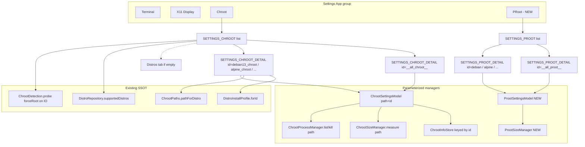
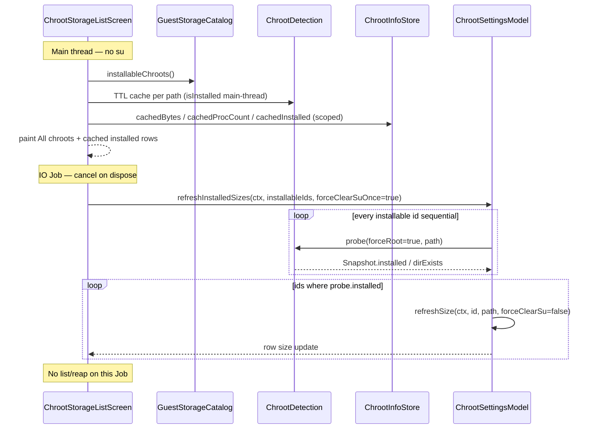
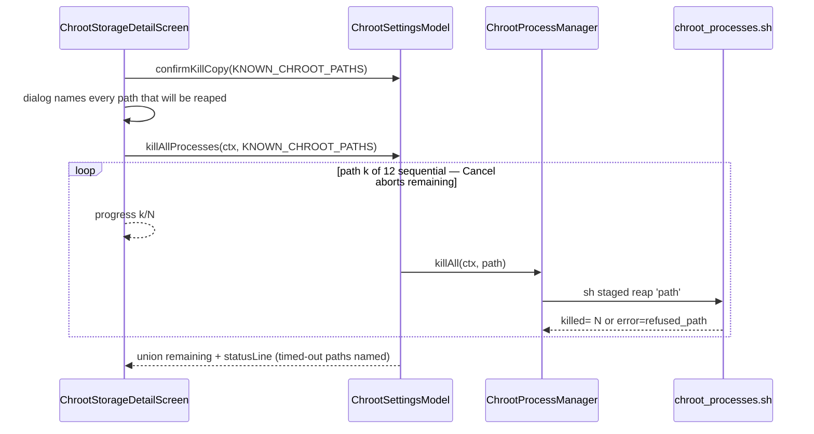

# Plan: Multi-distro Chroot & PRoot storage settings

| Field | Value |
| --- | --- |
| **Author** | FluxLinux |
| **Date** | 2026-08-16 |
| **Updated** | 2026-08-16 (PR5 residual gate) |
| **Status** | **IMPLEMENTED (code APPROVE — device smoke PARTIAL)** |
| **Repo** | `/home/abhaybyte/repos/fluxlinux` |
| **Audience** | Implementers of Settings storage pages + chroot/proot size/process managers |
| **Flavor / package** | Ivarna (`com.ivarna.fluxlinux`) |
| **APK policy** | `:app:assembleIvarnaRelease` + `adb install -r` only. Do **not** uninstall the existing APK. |
| **Scope lock** | Contract + landed implementation. Do not re-open path SSOT / kill allowlist / uninstall factories. |

**How to use this file:** this is the implementation contract. Debian Settings → Chroot is the **detail** template (parameterized). Settings → Chroot is list → detail for every installed chroot plus a universal aggregate. Settings → PRoot is the container-size counterpart. Working tree already has unrelated in-progress UI (Home session card, X11 chrome, `FluxSwitch`). This work **must not** collide with Settings App list, navigation back-stack, or `GlassSettingCard`.

**Reviews:**
1. Plan review (design-doc loop) — contracts closed before implementation.
2. Implementation audit (`/tmp/grok-1000/grok-review-4d581296.md`) — 3 major / 5 minor / 1 nit. **REVISE**.
3. Pass-2 approval gate (`/tmp/grok-1000/grok-review-8fac1b65.md`) — 3 majors + 5 minors **FIXED**. Implementation **APPROVE**. Device **PARTIALLY VERIFIED**. Residuals R1–R3 opened.
4. PR5 residual gate (`/tmp/grok-1000/grok-review-4c5c0a9d.md`) — R1–R3 **FIXED** in production + tests. Implementation **APPROVE**. Device still **PARTIALLY VERIFIED** (S8/S9 consistent with a kill, not independently live-proven). Non-blocking: `ls -l` PID parse is toybox-ISO-specific.

**References:**  
[`ChrootSettingsScreen.kt`](../../app/src/main/kotlin/com/ivarna/fluxlinux/ui/screens/ChrootSettingsScreen.kt), [`ChrootSettingsModel.kt`](../../app/src/main/kotlin/com/ivarna/fluxlinux/core/chroot/ChrootSettingsModel.kt), [`ChrootDetection.kt`](../../app/src/main/kotlin/com/ivarna/fluxlinux/core/chroot/ChrootDetection.kt), [`ChrootInfoStore.kt`](../../app/src/main/kotlin/com/ivarna/fluxlinux/core/chroot/ChrootInfoStore.kt), [`ChrootProcessManager.kt`](../../app/src/main/kotlin/com/ivarna/fluxlinux/core/chroot/ChrootProcessManager.kt), [`ChrootSizeManager.kt`](../../app/src/main/kotlin/com/ivarna/fluxlinux/core/chroot/ChrootSizeManager.kt), [`ChrootPaths.kt`](../../app/src/main/kotlin/com/ivarna/fluxlinux/core/root/ChrootPaths.kt), [`MainActivity.kt`](../../app/src/main/kotlin/com/ivarna/fluxlinux/MainActivity.kt), [`SettingsScreen.kt`](../../app/src/main/kotlin/com/ivarna/fluxlinux/ui/screens/SettingsScreen.kt), [`DistroRepository.kt`](../../app/src/main/kotlin/com/ivarna/fluxlinux/core/data/DistroRepository.kt), [`DistroInstallProfile.kt`](../../app/src/main/kotlin/com/ivarna/fluxlinux/core/install/DistroInstallProfile.kt), [`TerminalLauncher.kt`](../../app/src/main/kotlin/com/ivarna/fluxlinux/core/terminal/TerminalLauncher.kt), [`docs/plan/ui-home-x11-contrast-perf.md`](../plan/ui-home-x11-contrast-perf.md), [`docs/ui_design.md`](../ui_design.md), [`docs/ui_ux_design.md`](../ui_ux_design.md).

---

## Implementation status (2026-08-16 pass 2)

Code is **APPROVE**. Ivarna release `app-ivarna-release.apk` **154,189,691** bytes, mtime **14:42:31**. Device `com.ivarna.fluxlinux` `lastUpdateTime=14:42:51`, host PID **18740**, serial **Y5WWBMJVOZSK4HU8**. JVM: **33** classes / **317** tests, 0 fail. Do **not** treat the worker S-table as a completed PR5 device pass.

### Closed (pass-1 issues)

| ID | Issue | Status |
|---|---|---|
| Bug 1 | PRESENT / INSTALLED + `loadCached` OR `cachedDir` | **FIXED** — `resolveStatus`; `installed = cachedInstalled` only; badge does not use `markerOk` |
| Bug 2 | Universal Cancel ignored remaining reaps | **FIXED** — `runMultiPathKill` checks `isCancelled` before **and** after each `killSingle`; JVM fake-path test |
| Bug 3 | PRoot uninstall/`gone` wiped cache | **FIXED** (production) — transient errors skip `saveInstallInfo`; uninstalling keeps `dirExists` if the dir is still there |
| Minor 4 | 90s PRoot walk timeout | **FIXED** |
| Minor 5 | merge test reimplemented locally | **FIXED** — `mergeRemaining` / `mergeProcs` |
| Minor 6 | List `0 running` before Scan | **FIXED** — `— running` |
| Minor 7 | Universal Refresh all skipped live scan | **FIXED** — `scanAllProcesses` |
| Minor 8 | Universal ACTIVE/READY | **FIXED** — `$installedCount INSTALLED` |
| Nit 9 | `SessionRegistry.session` nullable for tests | **accepted** — factories untouched |

### Residuals

| ID | Issue | Status |
|---|---|---|
| **R1** | Mid-walk disappearance test never walked | **FIXED** — `onFileVisitForTest` hook inside `walkTopDown`; tests delete during visit and keep prefs |
| **R2** | Kill gated on `count > 0` | **FIXED** — `isKillEnabled(rootOk, busy)`; UI uses it |
| **R3** | Cancel cleared `busy` while reap could restart | **FIXED** — `ChrootKillCoordinator` session/generation; `busy` until `endSession` |
| **R4** | `chroot_processes.sh` `collect_pids` uses `ls -l` + 10-field split (toybox ISO dates work; 3-token `ls` dates would collect 0 PIDs) | **OPEN** (non-blocking on this device) |

### Device smoke (plan IDs)

| ID | Result | Notes |
|---|---|---|
| S1 | SOURCE-CODE SUPPORTED | Four App cards + specified subtitles |
| S2 | SOURCE-CODE SUPPORTED | List landing + amber warning; device has 12 dirs |
| S3 | **N/A** | Fixture has 12 installed chroots. Empty CTA exists in code |
| S4 | SOURCE-CODE SUPPORTED | Universal `N INSTALLED`; 12 known paths |
| S5 | SOURCE-CODE SUPPORTED | Debian (Rooted) `/data/local/tmp/chrootDebian13`; `du` 2.8 GB |
| S6 | SOURCE-CODE SUPPORTED | Alpine (Rooted) `/data/local/tmp/chrootAlpine`; `du` 1.4 GB |
| S7 | **ADB-VERIFIED** (bytes) | 12-path `du` sum **30,168,982,561** ≈ 28.1 GB. OpenSUSE **chroot** 8.73 GB ≠ PRoot `opensuse` |
| S8 | **PARTIALLY VERIFIED** | Widgets exist. Worker “0 running” is **not** Scan ≥ 1 + live kill |
| S9 | **PARTIALLY VERIFIED** | 12-path confirm + Cancel loop unit-tested. No device mid-reap cancel |
| S10 | SOURCE-CODE SUPPORTED | BackHandler: detail → list → Settings → **Home** |
| S11 | SOURCE-CODE SUPPORTED | PRoot list; app-storage copy; no Kill |
| S12 | SOURCE-CODE SUPPORTED + ADB path | HOST PATH is the **container**. UI 4.9 GB vs `du` 1.49 GB is walk-follows-usr-merge-symlinks (plan: order-of-magnitude) |
| S13 | **N/A / TEST-ONLY** | JVM keep-cache test PASS. `opensuse` fixture intact — not a device PASS |
| S14 | SOURCE-CODE SUPPORTED | Additive Settings/PRoot only |
| S15 | UNVERIFIED (device) / CODE SUPPORTED | `colorScheme` tokens; do not treat `uimode` claim as independent |
| S16 | UNVERIFIED (device) / CODE SUPPORTED | Same |

PR 1–4 are in the working tree (uncommitted). PR 5 is **not** done until S8/S9 are live (open a chroot shell, Scan ≥ 1, kill, host pid survives; universal confirm + Cancel mid-reap) and S13 stays N/A unless someone consents to destroying the opensuse fixture.

---

## Overview

Settings → Chroot is a **Debian-only** management page. It hardcodes catalog id `debian13_chroot` and host path `ChrootPaths.CHROOT_PATH` (`/data/local/tmp/chrootDebian13`) even though the catalog already ships **12 installable chroot cards** (Alpine, Arch, Chimera, Debian, Deepin, Fedora, Kali, Manjaro, openSUSE, Parrot, Ubuntu, Void) with distinct host paths. Users who install Fedora/Alpine/… chroot cannot see size, root status, or kill orphans for those roots. There is also **no Settings card** for PRoot storage, which lives inside app `filesDir` and is the complementary disk-use surface.

This plan parameterizes the existing chroot size/process stack by **distro id + host path**, splits Settings → Chroot into **list → detail**, adds a **universal** aggregate entry (sum of *installed* sizes + kill/scan over **all 12 known** catalog paths), and adds a **PRoot** Settings card that mirrors list → detail + universal **container size** (no host-wide process kill). List membership uses the same probe as Home/Distros (`ChrootDetection.probe` / `isDistroInstalledOnFs`), but Settings **must not** call that probe on the main thread — first paint is TTL + scoped prefs; an IO job then sequentially `probe(forceRoot=true)` every installable chroot path (see Issue 1). Debian install/launch/uninstall, Home/Distros cards, and Terminal sessions stay untouched.

---

## Background & Motivation

### Why this change is needed

A rooted device can hold several sibling chroots under `/data/local/tmp/chroot*`. Each survives app uninstall. The only UI that can measure them and SIGKILL orphans currently names Debian in the subtitle, the kill confirm, and `ChrootInfoStore` prefs keys. Every other rooted card is invisible on this page.

PRoot containers live under `$PREFIX/var/lib/proot-distro/containers/<prootName>/` and **are** removed with the app. Users still need a place to see per-distro and total size without opening a shell and running `du`. Distro Settings uninstall already deletes a single container; it does not show disk use.

### Pain points (today)

1. Settings → Chroot always talks about Debian, even when the device has Alpine/Fedora/… installed and Debian is absent.
2. Size cache is a single unscoped SharedPreferences blob (`flux_chroot_prefs` / `chroot_size_bytes`). A second distro cannot keep its own last-good size.
3. Kill confirm always prints `/data/local/tmp/chrootDebian13`. Killing Fedora orphans from this page is impossible.
4. Empty-state “Install chroot” always opens the Debian (`debian13_chroot`) wizard.
5. No PRoot size surface. App storage can grow by several GB with no Settings readout.

### Current state (inspected 2026-08-16)

#### Settings hub — three App cards, no PRoot

`SettingsScreen.kt` 138–155: Terminal / X11 Display / Chroot. Chroot subtitle is still “Auto-detect, rootfs size, kill orphan processes”. Click → `onNavigateToChrootSettings` → `Screen.SETTINGS_CHROOT`.

#### Chroot detail is the route itself

`MainActivity.kt` 51–64 `Screen` enum has `SETTINGS_CHROOT` only (no list, no detail arg, no PRoot).

`MainActivity.kt` 862–876: `ChrootSettingsScreen` with `onNavigateToInstall` resolving **only** `debian13_chroot` into `INSTALL_WIZARD`.

`MainActivity.kt` 495–517 `BackHandler`: `SETTINGS_CHROOT` → `SETTINGS` → `HOME`. There is no list/detail stack to preserve.

#### Detail page hardcodes Debian

`ChrootSettingsScreen.kt`:

| Line | Hardcode |
|------|----------|
| 67–69 | Signature has no `distroId` / path |
| 150 | Kill copy: `ChrootPaths.CHROOT_PATH` |
| 211 | Subtitle: `// Root-level Debian — outside app storage` |
| 238 | Uninstall-survives warning (correct for chroot; keep) |
| 357 | Host path: `ChrootDetection.chrootPath()` → Debian |
| 450 | Process footer: `root=${ChrootPaths.CHROOT_PATH}` |

Contrast is already correct: cream `secondary`, not `primary` as fill (204–208, 572–573).

#### Managers already accept a path — callers do not pass it

- `ChrootSizeManager.measure(ctx, path = ChrootPaths.CHROOT_PATH)` — script `chroot_size.sh` takes `CHROOT_PATH`.
- `ChrootProcessManager.list/killAll(ctx, path = ChrootPaths.CHROOT_PATH)` — script `chroot_processes.sh` takes `CHROOT_PATH`.
- `ChrootDetection.probe/isInstalled(path = ChrootPaths.CHROOT_PATH)` — per-path TTL cache already exists.
- `ChrootSettingsModel` **does not** take a path. `refreshSize` always calls `ChrootDetection.probe()` / `ChrootSizeManager.measure(ctx)` with defaults. Hint string is literally `"Debian rootfs · binds excluded (sdcard/mnt/dev)"` (`ChrootSettingsModel.kt` 141).
- `ChrootInfoStore` keys are global (`KEY_BYTES = "chroot_size_bytes"`, …). One cache for the whole app.

`chroot_processes.sh` match rule (line 31): `readlink /proc/PID/root` **equals** `CHROOT_PATH` exactly. PID 1 and the helper itself are skipped. This is already the safe kill primitive; we only need to pass the right path (or a set of paths).

#### Catalog vs path map (complete for installable cards)

`ChrootPaths.pathForDistro` (`ChrootPaths.kt` 44–58) and `DistroInstallProfile.BY_ID` (`DistroInstallProfile.kt` 574–600) agree. **Do not invent names.**

| Catalog id | `chrootSupported` | Host path constant | Absolute path |
|---|---|---|---|
| `debian13_chroot` | true | `DEBIAN_CHROOT_PATH` | `/data/local/tmp/chrootDebian13` |
| `alpine_chroot` | true | `ALPINE_CHROOT_PATH` | `/data/local/tmp/chrootAlpine` |
| `fedora_chroot` | true | `FEDORA_CHROOT_PATH` | `/data/local/tmp/chrootFedora` |
| `void_chroot` | true | `VOID_CHROOT_PATH` | `/data/local/tmp/chrootVoid` |
| `opensuse_chroot` | true | `OPENSUSE_CHROOT_PATH` | `/data/local/tmp/chrootOpenSUSE` |
| `deepin_chroot` | true | `DEEPIN_CHROOT_PATH` | `/data/local/tmp/chrootDeepin` |
| `chimera_chroot` | true | `CHIMERA_CHROOT_PATH` | `/data/local/tmp/chrootChimera` |
| `manjaro_chroot` | true | `MANJARO_CHROOT_PATH` | `/data/local/tmp/chrootManjaro` |
| `ubuntu_chroot` | true | `UBUNTU_CHROOT_PATH` | `/data/local/tmp/chrootUbuntu` |
| `kali_chroot` | true | `KALI_CHROOT_PATH` | `/data/local/tmp/chrootKali` |
| `parrot_chroot` | true | `PARROT_CHROOT_PATH` | `/data/local/tmp/chrootParrot` |
| `archlinux_chroot` | true | `ARCH_CHROOT_PATH` | `/data/local/tmp/chrootArch` |

Alias (profile + `pathForDistro` only, **not** a Distro card): `debian_chroot` → same path as `debian13_chroot`. List derivation must use catalog cards so Debian appears once.

`pathForDistro` `else` → `CHROOT_PATH` (Debian). Coming-soon ids (`adelie`, `artix`, `backbox`, `centos_stream`, `gentoo`, `openkylin`, `rocky`) have `chrootSupported = true` but **no** `DistroInstallProfile` and **no** dedicated path. `TerminalLauncher.isDistroInstalledOnFs` returns `false` when `forId` is null. Those cards must never enter the storage list (`chrootPathOrNull` is null). Uncatalogued leftover dirs (`/data/local/tmp/chrootSomethingElse`) are **out of v1**; catalogued leftovers on the 12 known paths stay killable via universal scan.

`ChrootPaths.CHROOT_PATH` remains the Debian historical default for unscoped APIs (helper, legacy builders). Settings must stop using it as “the” chroot.

#### Installed-state SSOT (Home / Distros / Terminal)

```139:146:app/src/main/kotlin/com/ivarna/fluxlinux/core/terminal/TerminalLauncher.kt
    fun isDistroInstalledOnFs(ctx: Context, distroId: String): Boolean {
        val profile = com.ivarna.fluxlinux.core.install.DistroInstallProfile.forId(distroId)
            ?: return false
        return when (profile.method) {
            "chroot" -> isChrootInstalled(profile.chrootPath ?: return false)
            else -> isProotInstalled(ctx, profile.prootName)
        }
    }
```

- Chroot: `ChrootDetection.isInstalled(path)` — app-visible `.flux_configured` / shell, else per-path TTL, else root `test -e` (never on main thread). Empty leftover dir is **not** installed (`ChrootDetectionTest.emptyDir_isNotInstalled`).
- PRoot: `File(ctx.filesDir, "usr/var/lib/proot-distro/containers/$prootName/rootfs")` + `guestRootfsHasShell`.
- Home (`HomeScreen.kt` 146–151) and Distros (`DistroScreen.kt` 67–70) both call this. Settings storage uses the same **definition** of installed (`probe().installed` = marker ‖ shell), but **must not** invoke `isDistroInstalledOnFs` / `isChrootInstalled` on the main thread without a warm cache (`DesktopLauncher.kt` 138–139). Empty leftover dir is **not** installed (`ChrootDetectionTest.emptyDir_isNotInstalled`).

`DistroRepositoryTest.installableCards_splitEvenlyBetweenProotAndChroot`: 12 proot + 12 chroot, no card is both.

#### PRoot storage (no size helper today)

| Catalog id | `prootName` | On-disk container |
|---|---|---|
| `debian` | `debian` | `filesDir/usr/var/lib/proot-distro/containers/debian/` |
| `alpine` | `alpine` | `…/containers/alpine/` |
| `fedora` | `fedora` | `…/containers/fedora/` |
| `void` | `void` | `…/containers/void/` |
| `opensuse` | `opensuse` | `…/containers/opensuse/` |
| `deepin` | `deepin` | `…/containers/deepin/` |
| `chimera` | `chimera` | `…/containers/chimera/` |
| `manjaro` | `manjaro` | `…/containers/manjaro/` |
| `ubuntu` | `ubuntu` | `…/containers/ubuntu/` |
| `kali` | `kali` | `…/containers/kali/` |
| `parrot` | `parrot` | `…/containers/parrot/` |
| `archlinux` | `archlinux` | `…/containers/archlinux/` |

SSOT for the name is `DistroInstallProfile.prootName`, **not** `GuestZshrcRepair.resolveProotName` (heuristic `removeSuffix("_chroot")`).

Uninstall (`UninstallSessionFactory.kt` 67–88): `proot-distro remove $NAME` then `rm -rf $PREFIX/var/lib/proot-distro/containers/$NAME`. Size walks must treat a disappearing tree as “gone / uninstalling”, never as 0 bytes cached as a real measurement.

**No safe PRoot process-kill API exists.** `stop_gui.sh` / `stop_guest_gui.sh` explicitly “Does NOT pkill proot”. A host-wide `pkill proot` would murder every guest PTY and the host session. This plan **does not** add one.

#### Contrast / glass (do not regress)

Dark scheme (`Theme.kt` 22–33): `primary = FluxDarkGrey` (#1A1C1E) is a **filled surface**, not an accent. Readable accent is `secondary` (cream in dark, dark grey in light). `ChrootSettingsScreen` already uses `colorScheme.secondary` / `onBackground` / `onSurfaceVariant`. New list/detail pages must use those **tokens**, not `BrandCream` literals. `GlassSettingCard` (`GlassCard.kt` 434–459) is the shared card; do not restyle it.

---

## Goals & Non-Goals

### Goals (acceptance)

1. Settings → Chroot opens a **list**. Installed rows (size) come from the two-phase probe of every `installableChroots()` path. The **All chroots** row is always present. Not a Debian-only page.
2. Tapping an installed row opens a **detail page** with the **same complete semantics** as today’s Debian page: status (`INSTALLED` / `PRESENT` / `NOT INSTALLED`), root access, linux storage + refresh, host path, processes + scan + sample, kill-all with confirm that **names the path**, refresh all. Contrast = `colorScheme` tokens only.
3. **Universal** chroot: total measured bytes (sum of **installed**; show measuring / partial), installed count, process count. Kill/scan unions **all 12 `KNOWN_CHROOT_PATHS`**. Confirm names every path that will be reaped. Cached proc on the list; live list/reap only on detail or Refresh/Scan/Kill, with `k/N` + Cancel.
4. Settings App group gains a **PRoot** card (sibling of Terminal / X11 / Chroot). List → detail + universal **container size**. Copy states the container is **inside app storage** and is removed with the app. **No** process kill.
5. Chroot uninstall-survives warning stays on list, universal, and every chroot detail.
6. Empty installed-chroot list: CTA to Distros (lands on the **PRoot** method tab; subtitle “Switch to the Chroot tab”). Empty PRoot list: Distros (already PRoot). Not a hardcoded Debian wizard.
7. Back: detail → list → Settings. System Back matches the in-app back affordance. Null / vanished `storageTargetId` pops to the list.
8. Existing Debian chroot install / launch / uninstall, Home/Distros cards, Terminal sessions, and current detail widgets keep working. The current page **becomes** the detail for `debian13_chroot`.
9. JVM unit tests for path map, `installedRows(predicate)`, size aggregation, process-root matching, `formatStorageBytes`, prefs migration (`FakePrefsContext`), path-refuse filter, uninstall-title matcher.
10. Device smoke on a connected phone: Ivarna release, `adb install -r`, checklist below (S1 needs PR3).

### Non-goals

- New distros, new host paths, or coming-soon installers.
- Changing chroot/proot **install**, **launch**, **uninstall**, or GUI start/stop scripts (except the tiny `chroot_processes.sh` path-refuse guard in PR2). Uninstall factories stay untouched.
- Host-wide `pkill proot` / kill-all-PTYs.
- Measuring or killing leftovers that are not in the installable catalog (no `/data/local/tmp/chroot*` glob as SSOT).
- Rewriting Home, Distros, Terminal settings, X11 settings, `FluxSwitch`, or `GlassSettingCard` internals.
- Depending on the unfinished Home session-card / X11-chrome / first-Back-to-Home work.
- A second Activity. Routing stays on `MainActivity` `Screen` enum.
- Changing `ChrootPaths.CHROOT_PATH` default (still Debian for unscoped helper APIs).
- Automatic rootfs deletion from these pages (measure + kill orphans only). Uninstall remains Distro Settings.

---

## 0. Product decisions

| Decision | Choice | Why |
|----------|--------|-----|
| Installed SSOT | Same predicate as Home/Distros: `probe().installed` = marker ‖ shell (`isDistroInstalledOnFs`). Empty leftover dir is **not** a list row. | One definition of “installed”. Settings **sequences** the probe (below) because `isChrootInstalled` never su-probes on the main thread. |
| Chroot list probe (two-phase) | **(1)** First paint: `ChrootDetection` TTL + scoped prefs only — **no su**, no `isDistroInstalledOnFs` on the UI thread. **(2)** IO `Job`: sequentially `probe(forceRoot=true)` **every** `installableChroots()` path. **(3)** Then `refreshSize` only for ids that came back `installed`. Collect `StateManager.refreshTrigger` + `ON_RESUME` like `DistroScreen` (`remember(refreshKey, stateRefresh)`). Cancel the `Job` on leave. | Cold TTL + SELinux would otherwise paint an empty list and never probe (regression vs today’s Debian `refreshPage`). |
| Path SSOT | `GuestStorageCatalog.chrootPathOrNull(id)` → `DistroInstallProfile.chrootPath` ∩ `KNOWN_CHROOT_PATHS`. **Never** `ChrootPaths.pathForDistro` in the list/kill builder (`else` → Debian). | Already complete for 12 installable chroots. Coming-soon / proot / `__all_chroot__` return null. |
| PRoot tree SSOT | Measure **and** display the **container** `filesDir/usr/var/lib/proot-distro/containers/${profile.prootName}/`. HOST PATH is that container. Algorithm: **`File.walkTopDown()` + `File.length()` only** (no `du` fallback). Smoke S12 `du -sb` that same container; accept order-of-magnitude (walk ≠ `du` on dirs/symlinks). | One tree. Matches uninstall `rm -rf $DIR`. Q6 closed. |
| PRoot uninstall guard | `session.title == "Uninstall ${distro.name}"`. Do **not** read `ManagedSession.distroId` (uninstall factories leave it null). Do **not** change uninstall factories. | Titles today are `"Uninstall ${distro.name}"` (`UninstallSessionFactory` 56 / host path). |
| Parameterize, don’t fork | Add `distroId` + `hostPath` to `ChrootSettingsModel` / `ChrootInfoStore` | Current Debian page is the detail template. |
| List vs detail routing | New `Screen` values + `storageTargetId`. Set id **before** flipping the screen. `storageTargetId == null` or vanished id → **pop to list**. `firstOrNull` everywhere — never `first { }`. | Matches `selectedDistro`. MainActivity `BackHandler` would skip an internal list flag. |
| Universal visibility | **Always** show the All chroots row (even at 0 installed). Installed-only rows below for size. | Leftover orphans on a catalog path with no marker must still be killable (today’s Debian NOT INSTALLED / PRESENT behavior). |
| Universal size | Sum of **successfully measured installed** roots. Partial = “N of M measured”. | A single timeout must not zero the total. Leftovers do not add size. |
| Universal kill / scan | Sequential `list`/`killAll` over **all 12 `KNOWN_CHROOT_PATHS`**, not installed-only. Confirm names **every path that will be reaped** (the 12). Never glob `/data/local/tmp/chroot*`. | `readlink /proc/PID/root` still matches after marker/dir is gone. Uninstall scripts already reap first; this page is the leftover job. |
| Proc budget | List + universal **subtitle** use **cached** `chroot_proc_count_<id>` only. No `list`/`reap` until the user opens a detail or taps Refresh / Scan / Kill. Universal reap shows `k/N` + **Cancel**. | 12 × 25s list or 12 × 55s reap would stall the list for minutes. |
| `invalidate` | Settings calls **`invalidate(path)` only**. Never no-arg `cache.clear()` from `refreshSize`. | No-arg wipe of Fedora’s TTL when Debian detail has no su makes Home flicker. |
| `SizeUi.installed` | `= probe().installed` (marker ‖ shell). Status `PRESENT` = `dirExists && !installed`. Prefs `chroot_installed_<id>` stores **probe.installed**, not `markerOk \|\| dirExists`. | Today’s model treats leftover empty dirs as installed; list SSOT does not. |
| PR1 hint | Keep the **exact** string `"Debian rootfs · binds excluded (sdcard/mnt/dev)"` for `debian13_chroot`. Family-short / `Distro.name` only in PR2. | `displayName` is `"Debian (Rooted)"` — a visible PR1 regression. |
| PRoot kill | **None** | No safe existing API. |
| Empty-list CTA | Navigate to Distros tab. `methodTab` stays local and defaults to **PRoot**. Empty-chroot subtitle: **“Switch to the Chroot tab”**. Do not hoist `MethodTab` in v1. | Goal 6 cannot promise a Chroot-tab landing without hoisting. |
| Detail titles | List top bar = `Chroot`. Universal = `All chroots`. Single detail = `Distro.name` (e.g. `Debian (Rooted)`). Subtitle single = `// Root-level ${distro.name} — outside app storage`. Do not print `DistroFamily` / `configuration`. | `SupportedDistro.UBUNTU.family` is `DEBIAN`. |
| Cache keys | Scope by `distroId`. Unscoped size **and proc** keys read as `debian13_chroot`. | Today’s cache is Debian. |
| Sequential `su` | One `Job` owner **per screen**; cancel on dispose. `forceClearSu` once at the start of that Job. | List Job is cancelled before detail composes. |
| Contrast | `MaterialTheme.colorScheme.*` tokens only (as `ChrootSettingsScreen` does). No `BrandCream` literals. | Light scheme swaps primary/secondary. |
| Incremental ship | PR1 core (Debian still the route, **no hint change**) → PR2 list/detail/universal → PR3 PRoot → PR4 tests if needed → PR5 smoke (needs PR3 for S1) | Debian page must keep working until the split. |

---

## Proposed Design

### Architecture



### Sequence: open Chroot list (two-phase)



Lists collect `StateManager.refreshTrigger` + lifecycle `ON_RESUME` (`remember(refreshKey, stateRefresh)` — `DistroScreen.kt` 66–70, **not** Home’s `remember(refreshKey)`-only list).

### Sequence: universal kill (all 12 known paths)



---

### Catalog helper (new, testable, no Compose)

Add `com.ivarna.fluxlinux.core.chroot.GuestStorageCatalog` (name bikeshed OK; keep it out of `ui/`).

```kotlin
object GuestStorageCatalog {
    const val ALL_CHROOT_ID = "__all_chroot__"
    const val ALL_PROOT_ID = "__all_proot__"

    /** The 12 ChrootPaths constants. Kill/measure refuse anything else. */
    val KNOWN_CHROOT_PATHS: Set<String>

    data class Row(
        val distroId: String,
        val displayName: String, // Distro.name
        val hostPath: String,
        val iconRes: Int?,
        val method: String, // "chroot" | "proot"
    )

    fun installableChroots(): List<Distro> =
        DistroRepository.supportedDistros.filter {
            !it.comingSoon && it.chrootSupported
        }

    fun installableProots(): List<Distro> =
        DistroRepository.supportedDistros.filter {
            !it.comingSoon && it.prootSupported
        }

    /**
     * Build installed rows from a **caller-supplied** predicate so JVM tests
     * inject FS and the UI never calls isDistroInstalledOnFs on the main thread.
     * List builder does **not** call ChrootPaths.pathForDistro.
     */
    fun installedRows(
        distros: List<Distro>,
        installed: (id: String) -> Boolean,
        hostPath: (id: String) -> String?,
    ): List<Row>

    fun chrootPathOrNull(distroId: String): String? {
        if (distroId == ALL_CHROOT_ID) return null
        val p = DistroInstallProfile.forId(distroId) ?: return null
        if (p.method != "chroot") return null
        return p.chrootPath?.takeIf { it in KNOWN_CHROOT_PATHS }
    }

    fun allowedKillPath(path: String): Boolean =
        path in KNOWN_CHROOT_PATHS && path !in REFUSED_HOST_PATHS

    fun prootContainerDir(ctx: Context, distroId: String): File? {
        val p = DistroInstallProfile.forId(distroId) ?: return null
        if (p.method != "proot" || p.prootName.isBlank()) return null
        return File(ctx.filesDir, "usr/var/lib/proot-distro/containers/${p.prootName}")
    }
}
```

`KNOWN_CHROOT_PATHS` = the 12 constants in `ChrootPaths` (already asserted distinct in `ChrootPathsTest.new_chroot_paths_are_distinct`). `REFUSED_HOST_PATHS` = `""`, `/`, `/data`, `/data/`, `/data/local`, `/data/local/`, `/data/local/tmp`, `/data/local/tmp/`.

UI list composition:

```kotlin
val catalog = GuestStorageCatalog.installableChroots()
// Phase 1 — main thread, no su:
val cachedInstalled = { id: String ->
    ChrootDetection.isInstalled(path) // TTL / app-visible only
        || ChrootInfoStore.cachedInstalled(ctx, id)
}
val rows = GuestStorageCatalog.installedRows(
    catalog, cachedInstalled, GuestStorageCatalog::chrootPathOrNull
)
```

Sort list rows with `DistroRepository.sortForDistroPage` so Alpine…Void matches Distros A–Z. `debian_chroot` is **not** in `installableChroots()`. `chrootPathOrNull("adelie")`, `("debian")`, `("__all_chroot__")` are null.

---

### Parameterize chroot managers (do not fork)

#### `ChrootSettingsModel`

Every public function gains `distroId: String` + `path: String`. Overloads that default to Debian are allowed **only** in PR1 so the current screen still compiles; PR2 deletes the Debian-only call sites.

```kotlin
fun loadCached(ctx: Context, distroId: String, path: String): PageSnapshot

fun refreshSize(ctx: Context, distroId: String, path: String, forceClearSu: Boolean = false): SizeUi
// MUST: ChrootDetection.invalidate(path) only — never invalidate()
// MUST: SizeUi.installed = detect.installed  (probe: marker || shell)
// MUST: saveInstallInfo(installed = detect.installed)  // not markerOk || dirExists
// PRESENT in the UI is dirExists && !installed — do not persist that as installed=true

fun refreshProcesses(ctx: Context, distroId: String, path: String, forceClearSu: Boolean = false): ProcUi
fun killAllProcesses(ctx: Context, path: String): ProcUi

/** Universal / leftover: [paths] already filtered by allowedKillPath. Sequential. */
fun killAllProcesses(ctx: Context, paths: List<String>): ProcUi

fun refreshPage(ctx: Context, distroId: String, path: String, force: Boolean = true): PageSnapshot

/**
 * List IO Job. [ids] = installableChroots() ids (all 12, not a guessed subset).
 * forceClearSuOnce at the start of the Job only.
 * For each id: path = chrootPathOrNull(id) ?: continue
 *              probe(forceRoot=true, path); persist scoped installed/dir
 * Then refreshSize(..., forceClearSu=false) only for probe.installed == true.
 * Does **not** call list/reap.
 */
fun refreshInstalledSizes(
    ctx: Context,
    ids: List<String>,
    forceClearSuOnce: Boolean,
): List<Pair<String, SizeUi>>

/**
 * Universal detail. Size = sum of installed (via refreshInstalledSizes).
 * Proc = empty/cached unless the caller then refreshProcesses on each known path
 * (only after Scan / Refresh all / Kill).
 */
fun refreshUniversal(ctx: Context, ids: List<String>): PageSnapshot

/** Confirm body. Must list every path in [paths] (the set that will be reaped). */
fun confirmKillCopy(paths: List<String>): String
```

Call sites inside `refreshSize` / `refreshProcesses` already have path-capable callees:

- `ChrootDetection.probe(forceRoot, path)`
- `ChrootDetection.invalidate(path)` — **PR1 must change** today’s `invalidate()` at `ChrootSettingsModel.kt` 109
- `ChrootSizeManager.measure(ctx, path)`
- `ChrootProcessManager.list(ctx, path)` / `killAll(ctx, path)`

**Hint (PR1):** keep the **exact** current string for `debian13_chroot`:

`"Debian rootfs · binds excluded (sdcard/mnt/dev)"`

Do **not** interpolate `displayName` (`"Debian (Rooted)"`) in PR1. PR2 may use a family-short label for non-Debian details (`"Alpine rootfs · binds excluded …"`). Universal hint: `"N of M roots · binds excluded"`.

**Job owner:** each list/detail composable holds one `Job`. `LaunchedEffect` / `rememberCoroutineScope` work is cancelled on dispose. `forceClearSu` once at the start of that Job. List and detail are different `Screen`s — leaving the list cancels its Job before detail starts.

**`__all_chroot__`:** no `DistroInstallProfile`. Detail screen special-cases `distroId == GuestStorageCatalog.ALL_CHROOT_ID` → `refreshUniversal` / `killAllProcesses(KNOWN_CHROOT_PATHS)`. Never call `chrootPathOrNull` / `first { }` / install wizard for that id.

#### `ChrootInfoStore` — per-id keys + Debian migration

Keep file `flux_chroot_prefs`. Scope keys:

| Today (unscoped) | After |
|---|---|
| `chroot_installed` | `chroot_installed_<id>` |
| `chroot_dir` | `chroot_dir_<id>` |
| `chroot_size_bytes` | `chroot_size_bytes_<id>` |
| `chroot_root_ok` | `chroot_root_ok_<id>` |
| `chroot_size_via_root` | `chroot_size_via_root_<id>` |
| `chroot_last_ms` | `chroot_last_ms_<id>` |
| `chroot_proc_count` | `chroot_proc_count_<id>` |
| `chroot_proc_last_ms` | `chroot_proc_last_ms_<id>` |

Migration (read path only, once) — **size and proc keys**:

- If `distroId == "debian13_chroot"` and scoped `chroot_last_ms_debian13_chroot` is absent and unscoped `chroot_last_ms` exists, **read** the unscoped size keys.
- Same for proc: if scoped `chroot_proc_last_ms_debian13_chroot` is absent and unscoped `chroot_proc_last_ms` exists, read `chroot_proc_count` / `chroot_proc_last_ms` as Debian. Otherwise Debian proc cache looks empty after PR1.
- First successful scoped write for Debian writes scoped keys. Do **not** delete unscoped keys in PR1 (rollback safety).

`formatStorageBytes` / `formatCacheAge` stay as-is. Tests use **`FakePrefsContext`** / `InMemoryPrefs` — `FakeContext` does **not** implement `getSharedPreferences`.

Universal cache id = `__all_chroot__` (sum + last refresh). Treat as a cache of the **last aggregate**, not a substitute for per-distro caches.

#### Scripts — tiny path-refuse guard (PR2)

`chroot_size.sh` and `chroot_processes.sh` already take the path. Default in the scripts is Debian; Kotlin always passes the explicit filtered path. Do **not** add a multi-path mode to the shell in v1 (union in Kotlin, sequential `reap`).

Add a **tiny** allowlist fail-closed at the top of `chroot_processes.sh` (and the same check in `chroot_size.sh` for consistency):

```sh
# After CHROOT_PATH="${2:-/data/local/tmp/chrootDebian13}"
case "$CHROOT_PATH" in
  ""|"/"|"/data"|"/data/"|"/data/local"|"/data/local/"|"/data/local/tmp"|"/data/local/tmp/")
    printf '%s\n' "# chroot_processes v1"
    printf '%s\n' "# path=$CHROOT_PATH"
    printf '%s\n' "# error=refused_path"
    printf '%s\n' "# count=0"
    exit 1
    ;;
esac
```

Kotlin still filters via `allowedKillPath` **before** staging. A missed call site must not `reap '/'`. JVM-test the Kotlin filter with `""`, `"/"`, `CHROOT_PATH+"/.."`, `pathForDistro("adelie")` (today’s else → Debian — **must not** be used as a kill path; `chrootPathOrNull("adelie")` is null).

---

### Universal chroot

**List row (always first, including 0 installed)**

- Title: `All chroots`
- Subtitle: `N installed · <cached size or —> · <cached proc or —> running` — **cached only**, no live `list`
- Leading icon: existing Storage / a stacked-folder vector already in Material (no new drawable required)
- Amber one-liner on the **list** (above rows): same uninstall-survives warning as today’s detail

**Detail** (`distroId == ALL_CHROOT_ID`; resolve inside the screen via `GuestStorageCatalog`, not a `mode=` parameter)

| Field | Behavior |
|---|---|
| Title | `All chroots` |
| Subtitle | `// Root-level Linux — outside app storage` |
| Warning | Same amber uninstall-survives copy |
| Status | `N INSTALLED` (ok if N>0; 0 is still a valid leftover-kill page) |
| Root access | Same CHECKING / GRANTED / DENIED (one `RootShell.isRootAvailable`) |
| LINUX STORAGE | Sum of **installed** measured bytes. Measuring: `Measuring k/N…`. Partial: `Partial · k of N measured`. |
| HOST PATH | All **12** known paths (monospace list). Kill/scan uses this set, not installed-only. |
| Processes | Live union only after Scan / Refresh all / Kill. Sample: `pid  comm  <short name>`. Until then, cached count. |
| Footer | `roots=12 known · scan all catalog paths` |
| Kill | Enabled when `rootOk && !busy`. Progress `k/N` + **Cancel** (cancels remaining paths; already-killed stay dead). |
| Confirm | `confirmKillCopy(KNOWN_CHROOT_PATHS)` — **every path that will be reaped**. Host Android processes are not targeted. Rootfs and mounts stay. |

Aggregation rules (pure functions, unit-tested):

```kotlin
fun sumSizes(results: List<Long?>): Pair<Long?, String> {
    val ok = results.filterNotNull()
    val missing = results.size - ok.size
    val sum = if (ok.isEmpty()) null else ok.sum()
    val note = when {
        results.isEmpty() -> "No chroot rootfs on host"
        missing == 0 -> "${ok.size} roots · binds excluded"
        ok.isEmpty() -> "Size probe failed"
        else -> "Partial · ${ok.size} of ${results.size} measured"
    }
    return sum to note
}
```

Kill implementation: `paths.filter(GuestStorageCatalog::allowedKillPath)` (the 12 known constants). Sequential `ChrootProcessManager.killAll`. Sum `killed`, merge `remaining` by pid, `verifiedClean` iff every path came back empty. Timeout on one path does **not** skip the rest; record that path in `statusLine`. Cancel stops scheduling further paths. Per-path progress `k/N` on the button / hint.

---

### PRoot counterpart

New files (mirror chroot layering, do **not** reuse `ChrootInfoStore` keys or the uninstall-survives warning):

| File | Role |
|---|---|
| `core/proot/ProotSizeManager.kt` | Measure container dir (app-visible, **no su**) |
| `core/proot/ProotInfoStore.kt` | `flux_proot_prefs`, keys scoped by `distroId` |
| `core/proot/ProotSettingsModel.kt` | `SizeUi` only (no `ProcUi`) |
| `ui/screens/ProotStorageListScreen.kt` | List + universal row + empty CTA |
| `ui/screens/ProotStorageDetailScreen.kt` | Size + host path + refresh; no Processes card |

**Measure algorithm (container only — Q6 closed)**

```kotlin
fun isProotUninstallRunning(distro: Distro): Boolean =
    SessionRegistry.sessions().any { it.title == "Uninstall ${distro.name}" }
```

Do **not** use `ManagedSession.distroId` (uninstall `openHostCommandSession` / `openRootInnerSession` leave it null — `InstallSessionFactory.kt` 74–77 and 114–118). Do **not** change uninstall factories. JVM-test the title matcher with `"Uninstall Debian"` vs `"Uninstall Debian (Rooted)"` vs `"Uninstall Fedora"` — only the exact `Distro.name` matches.

1. If `isProotUninstallRunning(distro)` → `error = "uninstalling"`; **do not** overwrite a good cache with 0.
2. `container = GuestStorageCatalog.prootContainerDir(ctx, id)`. If missing or not a directory → `no_dir`; persist `bytes=null` (not 0).
3. `File.walkTopDown()` on **that container**, sum `File.length()` for files. Catch `IOException` / disappearing files → `error = "gone"`. Do not treat a partial walk as 0-success.
4. Timeout budget: 90s, single-thread IO. **No `du` fallback** (walk is the only algorithm).

**HOST PATH (same tree as the measure):**  
`File(ctx.filesDir, "usr/var/lib/proot-distro/containers/<prootName>").absolutePath`  
Never hardcode `com.termux` or a flavor. Never append `/rootfs` on screen.

**Copy (do not reuse chroot warning)**

- List / universal / detail banner: `PRoot lives in app storage (container + rootfs) and is removed if you uninstall the app.`
- Subtitle: `// Userspace Linux — inside app storage`
- No “orphans survive app close” text.

**Universal PRoot**

- Sum of measured **container** bytes.
- Installed count.
- No kill button, no process scan.

**Uninstall race + stale list**

`UninstallSessionFactory` deletes `containers/$NAME` and then `TerminalLauncher.refreshInstalledAfterUninstall` → `StateManager.triggerRefresh()`. Both storage lists collect `refreshTrigger` **and** `ON_RESUME`. Do not write `bytes=0` into prefs when the dir is gone; write `no_dir` / clear bytes. If the user is on a detail whose id vanished, pop to the list (`firstOrNull`; never `first { }`).

---

### UI — before / after

#### Settings App group

**Before (Image 1):**

```
App
  [ Terminal     Font zoom, extra keys, and guest shell     > ]
  [ X11 Display  Scale, fullscreen, input for embedded X11  > ]
  [ Chroot       Auto-detect, rootfs size, kill orphan…     > ]
```

**After:**

```
App
  [ Terminal     Font zoom, extra keys, and guest shell          > ]
  [ X11 Display  Scale, fullscreen, input for embedded X11       > ]
  [ Chroot       Installed roots, size, kill orphan processes    > ]
  [ PRoot        Installed containers and app-storage size       > ]
```

Implementation: add a fourth `SettingsNavCard` in `SettingsScreen.kt` immediately after Chroot. Icon: `Icons.Default.Folder` (or `Inventory2` if already on the classpath). New callback `onNavigateToProotSettings`. Do **not** restyle `SettingsNavCard` (icon tint is `colorScheme.secondary` at 404–408 — works in light and dark).

Chroot subtitle change is copy-only; keep the same card.

#### Chroot list (new — Settings → Chroot)

```
TopBar: Chroot                    [←]
// Root-level Linux — outside app storage

[ amber ] Rootfs is not removed when you uninstall the app.
          Free space here.

[ All chroots                          > ]
  2 installed · 4.1 GB · 3 running

[ Debian (Rooted)            INSTALLED > ]
  2.8 GB
  /data/local/tmp/chrootDebian13

[ Fedora (Rooted)            INSTALLED > ]
  1.3 GB
  /data/local/tmp/chrootFedora

[ Refresh sizes ]
```

Empty installed rows (All chroots still visible for leftover kill):

```
No chroot installed
Root-level Linux lives outside app storage.
Switch to the Chroot tab.

[ Install from Distros ]
```

`onNavigateToInstall` from empty list: `currentScreen = HOME`, `currentTab = DISTROS`. Do **not** hoist Distro `methodTab` (`DistroScreen.kt` 77 defaults to `PROOT`). Subtitle tells the user to switch tabs. Optional later: `DistroScreen(initialMethod = CHROOT)`.

Per-row “Install” is **not** on the list (list is installed-only). If `storageTargetId` vanished, **pop to the list** — do not call `catalog.first { }`. Detail “Install chroot” (PRESENT / NOT INSTALLED after a probe) uses `firstOrNull { it.id == targetId }`; null → pop to list, never crash.

#### Chroot detail (today’s page, parameterized)

Keep every widget in `ChrootSettingsScreen.kt` 217–539. Extract the body into `ChrootStorageDetailContent(...)`.

| Surface | Top bar | Subtitle |
|---|---|---|
| List | `Chroot` | `// Root-level Linux — outside app storage` |
| Universal | `All chroots` | `// Root-level Linux — outside app storage` |
| Single | `Distro.name` (e.g. `Debian (Rooted)`) | `// Root-level ${distro.name} — outside app storage` |

Do **not** interpolate `Distro.configuration` / `DistroFamily` (Ubuntu chroot is `family = DEBIAN`). Kill confirm interpolates **this** `path`, never `ChrootPaths.CHROOT_PATH`.

PR2 must delete or parameterize these Debian leftovers in `ChrootSettingsScreen.kt`:

- L150 kill copy `ChrootPaths.CHROOT_PATH`
- L211 subtitle `// Root-level Debian — outside app storage`
- L357 HOST PATH `ChrootDetection.chrootPath()`
- L450 footer `root=${ChrootPaths.CHROOT_PATH}`

Status: `INSTALLED` if `sizeUi.installed`; `PRESENT` if `sizeUi.dirExists && !sizeUi.installed`; else `NOT INSTALLED`.

#### PRoot list / detail

Same glass / type scale / `colorScheme` numbers as chroot, minus Processes card and minus kill. Universal first (always). HOST PATH = **container** path. Empty CTA → Distros (already PRoot).

---

### Navigation (MainActivity)

Add to `enum class Screen`:

```kotlin
SETTINGS_CHROOT,          // existing — becomes the LIST
SETTINGS_CHROOT_DETAIL,   // NEW
SETTINGS_PROOT,           // NEW list
SETTINGS_PROOT_DETAIL,    // NEW
```

Add `var storageTargetId by remember { mutableStateOf<String?>(null) }` next to `selectedDistro`. Values: catalog id or `__all_chroot__` / `__all_proot__`. **Set `storageTargetId` before `currentScreen = SETTINGS_*_DETAIL`.**

`when (currentScreen)`:

| Screen | Composable | `onBack` |
|---|---|---|
| `SETTINGS_CHROOT` | `ChrootStorageListScreen` | `SETTINGS` |
| `SETTINGS_CHROOT_DETAIL` | if `storageTargetId == null` → pop to list; else `ChrootStorageDetailScreen(id)` | `SETTINGS_CHROOT` |
| `SETTINGS_PROOT` | `ProotStorageListScreen` | `SETTINGS` |
| `SETTINGS_PROOT_DETAIL` | if `storageTargetId == null` → pop to list; else `ProotStorageDetailScreen(id)` | `SETTINGS_PROOT` |

Detail `LaunchedEffect(storageTargetId)`: if id is a catalog chroot and `chrootPathOrNull(id) == null`, pop to list. `__all_chroot__` is the only non-path id allowed on the chroot detail screen.

`BackHandler` (`MainActivity.kt` 495–517) must be updated in the **same PR** as the new enum values:

```
SETTINGS_CHROOT_DETAIL → SETTINGS_CHROOT
SETTINGS_PROOT_DETAIL  → SETTINGS_PROOT
SETTINGS_CHROOT | SETTINGS_PROOT | SETTINGS_TERMINAL | SETTINGS_X11 | TROUBLESHOOTING | ROOT_ACCESS → SETTINGS
SETTINGS | DISTRO_SETTINGS | INSTALL_WIZARD → HOME
```

Do **not** implement “first Back always Home” here. That is owned by `docs/plan/ui-home-x11-contrast-perf.md`. If that plan lands first, keep detail → list as a **more specific** branch so Back from detail does not skip the list.

PR1 (core only): `SETTINGS_CHROOT` still hosts today’s `ChrootSettingsScreen` (Debian). PR2 swaps that branch to the list and moves the old composable to detail.

Install CTA from **detail** (not installed, not `__all_*`):

```kotlin
selectedDistro = DistroRepository.supportedDistros.firstOrNull { it.id == storageTargetId }
currentScreen = if (selectedDistro != null) INSTALL_WIZARD else SETTINGS_CHROOT
```

Replace the hardcoded `debian13_chroot` in `MainActivity.kt` 867–869. Never `first { }`.

Both list screens:

```kotlin
val stateRefresh by StateManager.refreshTrigger.collectAsState()
val rows = remember(refreshKey.value, stateRefresh) { /* phase-1 cache paint */ }
```

Plus `ON_RESUME` increment of `refreshKey` (same pattern as `DistroScreen.kt` 51–70).

---

### Contrast / collision rules

- Reuse `GlassSettingCard` as-is. Do not change `GlassCard.kt`.
- Reuse `StatusBadge` / `MetaRow` (move them to a small `ui/screens/storage/StorageWidgets.kt` if both chroot + proot need them; keep `private` if only chroot detail uses them).
- Accent / body / muted = `MaterialTheme.colorScheme.secondary` / `onBackground` / `onSurfaceVariant` **only**. Do **not** introduce `BrandCream` literals (light scheme swaps primary/secondary).
- Kill button stays `error` / white (already correct).
- Optional smoke S16: theme picker → Light; titles still readable; kill still red/white.
- Do not touch `FluxSwitch`, Terminal settings, X11 settings, Home session card, Distros `LazyColumn`, or top-bar X11 icon work.

---

## API / Interface Changes

### `ChrootSettingsScreen` (breaking, PR2)

```kotlin
// Before
fun ChrootSettingsScreen(onBack: () -> Unit, onNavigateToInstall: (() -> Unit)? = null)

// After (detail) — resolve path inside via GuestStorageCatalog
fun ChrootStorageDetailScreen(
    distroId: String, // catalog id or ALL_CHROOT_ID
    onBack: () -> Unit, // pop to list
    onNavigateToInstall: (() -> Unit)? = null,
)
```

If `distroId != ALL_CHROOT_ID && chrootPathOrNull(distroId) == null` → `onBack()`. List is a new composable. Keep the old function name as a deprecated wrapper in PR1 only if it reduces the diff; delete in PR2.

### `SettingsScreen`

```kotlin
onNavigateToProotSettings: (() -> Unit)? = null
```

Call site in `MainActivity` sets `currentScreen = Screen.SETTINGS_PROOT`. Unused-param suppress pattern already used for theme/root hooks — follow it.

### `GuestStorageCatalog` / `ProotSizeManager`

New public Kotlin APIs, JVM-tested. No Android IPC, no new intents, no new Activities.

### Unscoped `ChrootDetection.chrootPath()`

Leave it (Debian). Detail UI must not call it. No need to deprecate in v1.

---

## Data Model Changes

No Room / proto / files on the guest. SharedPreferences only.

| Store | File | Migration |
|---|---|---|
| `ChrootInfoStore` | `flux_chroot_prefs` | Scope keys by `distroId`; read unscoped size **and proc** keys as Debian |
| `ProotInfoStore` | `flux_proot_prefs` | New file, no migration |

No on-disk rootfs layout change. No marker format change (still `.flux_configured`).

---

## Alternatives Considered

### A. Keep one Debian page; add a Distro Settings “storage” row per card

- **Pros:** No new Settings routes; storage sits next to uninstall.
- **Cons:** User asked for Settings → Chroot list. Universal total/kill has no home. PRoot still missing. Rejected.

### B. Single scroll page: Debian-style detail stacked for every installed chroot

- **Pros:** No new route.
- **Cons:** 12 × (size + process + kill) on one page; sequential `su` would take minutes before first paint; kill confirms collide. Rejected.

### C. Fork `DebianChrootSettings*` and `AlpineChrootSettings*`

- **Pros:** Fast for two distros.
- **Cons:** 12 copies of kill/size UI. Explicitly forbidden (“parameterize, do not fork”). Rejected.

### D. Shell `chroot_processes.sh reap` with multiple paths in one invocation

- **Pros:** One `su` for universal kill.
- **Cons:** New script contract + parser; harder to unit-test; one bad path could abort the rest. v1 stays sequential Kotlin with `k/N` + Cancel. Multi-path reap is a follow-up only if S9 is too slow.

### E. PRoot kill via `pkill -f proot` or `/proc` cmdline match

- **Pros:** Symmetric with chroot.
- **Cons:** Matches host `proot-distro` and every guest PTY; can kill the Settings-adjacent terminal; scripts already refuse this. **Rejected.**

---

## Security & Privacy Considerations

| Threat | Severity | Mitigation |
|---|---|---|
| Kill path set to `/` or `/data` | **Critical** | Kotlin `allowedKillPath` (12 constants only) **and** script `# error=refused_path` for empty/`/`/`/data`/`/data/local`/`/data/local/tmp`. Never `pathForDistro("adelie")`. |
| Leftover orphans after marker gone | High (product) | Universal kill/scan unions **all 12 known paths**. Confirm names every reaped path. List size rows stay installed-only. |
| Concurrent `su` / overlapping reap | Medium | One `Job` per screen, cancel on dispose. `forceClearSu` once at Job start. |
| Confirm dialog omits path | High (UX/safety) | `confirmKillCopy(paths)` JVM-tested. |
| PRoot walk during uninstall | Low | Title matcher `Uninstall ${distro.name}`; IOException → `gone`; never cache 0. |
| SELinux false-negative on `/data/local/tmp` | Existing | Two-phase list: IO `probe(forceRoot=true)` every installable path. Do not add app-uid `File.exists` as SSOT. |
| Global `invalidate()` wipes sibling TTL | High | Settings calls `invalidate(path)` only (`ChrootSettingsModel.kt` 109 today is the bug). |
| Prefs leak of paths | Negligible | Paths are well-known on-device locations, not secrets. |

Auth: size/list/kill for chroot still require `RootShell.isRootAvailable()`. PRoot size does **not** require root (app-owned tree).

---

## Observability

- Keep existing `Log.d/w` tags: `ChrootSettingsModel`, `ChrootSize`, `ChrootProcessManager`.
- New tags: `GuestStorageCatalog`, `ProotSize`, `ProotSettingsModel`.
- Log: distroId, path, bytes, `error=`, killed/remaining. **Do not** log full `du` trees.
- No new metrics backend (app has none). Device smoke uses on-screen numbers vs `adb shell su -c du -sb`.
- Toast after kill stays (`ChrootSettingsScreen.kt` 132–136) with `statusLine`.

---

## Risks

| Risk | Sev | Mitigation |
|---|---|---|
| List refresh 12 × 90s `du` | Med | Cache-first paint; sequential **size only** after probe; no list/reap on the list Job. Cancel on leave. |
| Universal 12 × 55s reap | Med | Only on detail Scan/Kill; `k/N` + Cancel; leftover paths with 0 pids return immediately. |
| Magisk preamble breaks parse | Low | Parsers already skip junk (`ChrootSizeManagerTest.parse_sizeBytesMarker`). |
| `pathForDistro` else → Debian used by mistake | **High** | List/kill go through `chrootPathOrNull` / `allowedKillPath`. Tests include `adelie` / `""` / `"/"`. |
| Prefs migration loses Debian cache | Low | Read-fallback for size **and proc**; do not delete unscoped keys in PR1. |
| Collision with in-progress Settings/nav work | Med | Touch only: Settings App **append one card** + subtitle; MainActivity Screen/BackHandler **additive** branches; do not rewrite `GlassSettingCard`. |
| Back from detail skips list | Med | Dedicated `SETTINGS_*_DETAIL` + BackHandler branch in the same PR. |
| Measuring proot while `proot-distro remove` runs | Med | Title == `"Uninstall ${distro.name}"` + IOException → `gone`. |
| Coming-soon `chrootSupported=true` with no path | Low | `forId` null → `chrootPathOrNull` null. Do not invent `chrootAdelie`. |
| Stale list after Distro Settings uninstall | Med | Collect `refreshTrigger` + `ON_RESUME`; vanished id pops to list. |

---

## Test contract (JVM)

Task: `./gradlew :app:testIvarnaDebugUnitTest --no-daemon`

| Test class (new or extend) | Assertions |
|---|---|
| `ChrootPathsTest` (exists) | Keep 12 distinct paths + `pathForDistro` map. Document `pathForDistro("adelie")` else → Debian as a **hazard** the catalog helper must not call. |
| `GuestStorageCatalogTest` **new** | `installableChroots()` = 12 ids, does **not** contain `debian_chroot`. `installedRows(predicate)` with injected FS: empty predicate → no rows; one id true → one row with `chrootPathOrNull` path. `chrootPathOrNull` null for `adelie`, `debian` (proot), `__all_chroot__`, `""`. Non-null and in the 12-constant set for each installable chroot id. Deduped host paths size == 12. `allowedKillPath` false for `""`, `"/"`, `"/data"`, `"/data/local"`, `"/data/local/tmp"`, `ChrootPaths.CHROOT_PATH+"/.."`. **List/kill builders never call `pathForDistro`** (`pathForDistro("adelie")` equals Debian and would wrongly pass the 12-set). |
| `ChrootSettingsModel` aggregation **new** | `sumSizes` empty / all-ok / partial / all-fail. `confirmKillCopy(KNOWN_CHROOT_PATHS)` contains every one of the 12 paths. |
| `ChrootInfoStoreTest` **new** | Use **`FakePrefsContext`**. `formatStorageBytes(null) == "—" to ""`; ~2.8 GiB → `"2.8","GB"`; 512 → `"512","B"`. Unscoped `chroot_last_ms` + `chroot_proc_last_ms` read as `debian13_chroot`. Scoped write does **not** delete unscoped keys. |
| `ChrootProcessManagerTest` (exists) | Keep parse tests. Add: two-path remaining merge by pid (pure). |
| `ChrootSizeManagerTest` (exists) | Keep parse. |
| `ProotSizeManagerTest` **new** | Fake filesDir with `usr/var/lib/proot-distro/containers/debian/` + a 100-byte file **in the container** (not only under rootfs) → bytes ≥ 100. Missing container → `no_dir`. Delete mid-walk → no crash, not cached as 0. `isProotUninstallRunning`: title `"Uninstall Debian"` matches Debian proot `Distro.name`; does **not** match `"Uninstall Debian (Rooted)"`; ignores `ManagedSession.distroId`. |
| `DistroRepositoryTest` (exists) | No change required; catalog counts are the fixture the new catalog helper depends on. |

No screenshot CI. No instrumented UI tests in this plan.

---

## Rollout Plan

1. **PR1** lands parameterized model + scoped prefs + `invalidate(path)` + `SizeUi.installed = probe.installed`. Existing Settings → Chroot **looks identical** (hint string unchanged).
2. **PR2** swaps the route to list + detail + universal + script path-refuse. Feature is user-visible. Rollback = revert PR2; PR1 is harmless.
3. **PR3** adds PRoot card. Independent of chroot kill. May follow PR1 if it copies `storageTargetId` / `BackHandler`; **prefer after PR2**.
4. **PR5** device smoke after **PR3** (S1 requires the PRoot card). Chroot-only cells S2–S10 can be run after PR2. No staged flag. If a blocker ships, revert the UI PR; managers can stay.

No remote feature flag infrastructure exists; do not add one.

---

## Device smoke (ADB)

**Policy** (same as `docs/plan/ui-home-x11-contrast-perf.md` and `docs/plans/fedora-chroot-flux-setuidgid.md`):

- Flavor: **Ivarna**
- Package: `com.ivarna.fluxlinux`
- Build: `./gradlew :app:assembleIvarnaRelease --no-daemon`
- Install: `adb install -r app/build/outputs/apk/ivarna/release/app-ivarna-release.apk`
- **Do not uninstall** the existing APK (preserves already-installed proot containers and any `/data/local/tmp/chroot*`).
- Launch: `adb shell am start -n com.ivarna.fluxlinux/.MainActivity`

### 0. Preconditions

```bash
adb devices
adb shell pm path com.ivarna.fluxlinux
adb shell su -c 'ls -d /data/local/tmp/chroot* 2>/dev/null'
adb shell ls /data/data/com.ivarna.fluxlinux/files/usr/var/lib/proot-distro/containers
```

| Device has | Run | Skip / N/A |
|---|---|---|
| Debian chroot only | S2, S3 (N/A if not empty), S4, S5, S7, S8, S9 as **single-path confirm** (dialog still lists all 12 known paths), S10, S14, S15, S16 | S6 |
| ≥2 chroots | S6 + S9 as multi-guest | — |
| ≥1 proot | S11, S12 | S13 optional |
| 0 chroot | S2, S3, S4 (universal still shown), leftover Scan if any | S5–S9 |

Do **not** factory-reset. Do **not** `adb uninstall`. Never install a second chroot just to un-N/A S6 unless the implementer already planned to.

### 1. Build + install

```bash
cd /home/abhaybyte/repos/fluxlinux
./gradlew :app:testIvarnaDebugUnitTest --no-daemon
./gradlew :app:assembleIvarnaRelease --no-daemon
adb install -r app/build/outputs/apk/ivarna/release/app-ivarna-release.apk
adb shell am start -n com.ivarna.fluxlinux/.MainActivity
```

### 2. Checklist

| ID | Screen | Steps | Pass |
|---|---|---|---|
| S1 | Settings App | Open Settings. Four App cards: Terminal, X11 Display, **Chroot**, **PRoot**. Cream icons, readable subtitles. | SOURCE-CODE SUPPORTED |
| S2 | Chroot list (empty **or** populated) | Tap Chroot. Lands on **list**, not Debian detail. Uninstall-survives amber warning visible. | SOURCE-CODE SUPPORTED |
| S3 | Empty CTA | If 0 **installed** chroots: “Install from Distros” + “Switch to the Chroot tab” → Home/Distros (PRoot tab; not a crashed wizard). All chroots row still present. | **N/A** (12 chroots on fixture) |
| S4 | Universal row | First row is All chroots (even at 0 installed). Shows installed count. Size may be `—` then a number after Refresh sizes. Proc subtitle is cached (`—` until a detail Scan has run). | SOURCE-CODE SUPPORTED |
| S5 | Debian detail | If Debian chroot installed: tap Debian (Rooted). Top bar = `Debian (Rooted)`. **Same widgets as today’s page**: Status, Root access, LINUX STORAGE, HOST PATH=`/data/local/tmp/chrootDebian13`, Processes, Scan, Kill, Refresh all. | SOURCE-CODE SUPPORTED |
| S6 | Non-Debian detail | **N/A if only Debian.** Else tap it. HOST PATH matches the table. Size > 0 after measure. Kill confirm names **that** path, not Debian. | SOURCE-CODE SUPPORTED (Alpine) |
| S7 | Size vs `du` | `adb shell su -c 'du -sb /data/local/tmp/chrootDebian13'` (UI excludes `sdcard/dev/proc/sys/mnt/run`). UI GB and `du` same **order of magnitude** (not 0, not 100× off). | **ADB-VERIFIED** (bytes; sum 30,168,982,561 ≈ 28.1 GB) |
| S8 | Scan / kill (single) | Open a chroot shell (Terminal). Note host pid: `adb shell pidof com.ivarna.fluxlinux`. Detail Scan count ≥ 1. Kill confirm lists **that** path. After kill, shell dies; count → 0. `pidof com.ivarna.fluxlinux` still prints a pid; launcher still opens. | **PARTIAL** — widgets only; worker “0 running” ≠ live kill |
| S9 | Universal kill | Open universal detail. Confirm lists **all 12 known paths** (not installed-only). If only one chroot: still that 12-path confirm (single-path smoke). If two guests: both die. `ls /data/local/tmp/chrootDebian13` still exists. Cancel mid-reap stops remaining `k/N`. | **PARTIAL** — confirm + Cancel unit-tested; no device mid-reap |
| S10 | Back stack | Detail → system Back → list. List → Back → Settings. Settings → Back → Home. In-app ← matches. | SOURCE-CODE SUPPORTED |
| S11 | PRoot list | Settings → PRoot. Installed proots listed. Copy says **inside app storage** (no uninstall-survives amber). No Kill button. | SOURCE-CODE SUPPORTED |
| S12 | PRoot detail + universal | Tap a proot. HOST PATH is the **container** (`…/containers/<prootName>` — no `/rootfs`). Size vs `adb shell du -sb /data/data/com.ivarna.fluxlinux/files/usr/var/lib/proot-distro/containers/debian` — **order of magnitude** (walk ≠ `du`). Universal total ≈ sum of rows. | SOURCE-CODE + ADB path (walk 4.9 GB vs `du` 1.49 GB accepted) |
| S13 | PRoot uninstall race | Optional: start Uninstall from Distro Settings (`title == "Uninstall ${name}"`), immediately Refresh size. No crash; size becomes `—` / “not installed”; row disappears after `refreshTrigger` / resume. | **N/A / TEST-ONLY** — JVM keep-cache PASS; fixture intact |
| S14 | Regression | Home installed cards unchanged. Distros install still works. Open a Debian proot Terminal session; still works. Debian chroot install/uninstall from Distro Settings still works (do not run uninstall unless user consents). | SOURCE-CODE SUPPORTED |
| S15 | Contrast (dark) | Titles `onBackground` / numbers `secondary`; no near-black-on-black filled buttons except the red kill. | UNVERIFIED (device) / CODE SUPPORTED |
| S16 | Contrast (light) | Optional: theme picker → Light. Titles readable; kill still red/white. No hardcoded cream-on-cream. | UNVERIFIED (device) / CODE SUPPORTED |

### 3. ADB helpers

```bash
# Chroot bytes (root)
adb shell su -c 'du -sb /data/local/tmp/chrootDebian13 /data/local/tmp/chrootAlpine /data/local/tmp/chrootFedora /data/local/tmp/chrootVoid /data/local/tmp/chrootOpenSUSE /data/local/tmp/chrootDeepin /data/local/tmp/chrootChimera /data/local/tmp/chrootManjaro /data/local/tmp/chrootUbuntu /data/local/tmp/chrootKali /data/local/tmp/chrootParrot /data/local/tmp/chrootArch 2>/dev/null'

# Processes whose root is Debian chroot
adb shell su -c 'for p in /proc/[0-9]*; do r=$(readlink $p/root 2>/dev/null); [ "$r" = /data/local/tmp/chrootDebian13 ] && echo ${p#/proc/}; done'

# PRoot containers (same tree as HOST PATH / measure)
adb shell du -sb /data/data/com.ivarna.fluxlinux/files/usr/var/lib/proot-distro/containers/* 2>/dev/null

# Host still alive after kill
adb shell pidof com.ivarna.fluxlinux
```

If any cell fails: fix the owning layer (catalog / model / UI / BackHandler), rebuild **release**, `adb install -r`, retest that cell plus S5 (Debian detail) and S10 (back stack). Never `uninstall`.

---

## Open Questions

Product questions 4–6 are **closed** (see Key Decisions 13–15 and the product-decision table). Remaining:

1. **Uncatalogued host dirs.** If `/data/local/tmp/chrootSomethingElse` exists (not one of the 12 constants), this plan ignores it. Catalogued leftovers (marker gone, `PRESENT` / `NOT INSTALLED`) **are** covered by universal kill over all 12 known paths. A glob scanner is **not in v1**.
2. **Coming-soon path map.** `adelie` / `artix` / `backbox` / `centos_stream` / `gentoo` / `openkylin` / `rocky` have `chrootSupported = true` and no `ChrootPaths` / profile. When they become installable they **must** get a constant + profile **before** they can appear here. Do not invent `chrootAdelie` now.
3. **Multi-path reap script.** v1 is sequential Kotlin + `k/N` + Cancel. If S9 is still too slow after Cancel exists, a follow-up may add Alternative D. Not a v1 blocker.

---

## Key Decisions

1. **Parameterize `ChrootSettingsModel` / `ChrootInfoStore` by `distroId` + host path.** Rationale: size/process/kill already take a path at the manager/script layer; only the settings model and UI are Debian-scoped. Forking a second page would drift from the current (correct) detail semantics.
2. **Installed predicate = Home/Distros; Settings sequences the probe.** Rationale: `probe().installed` (marker ‖ shell) is the SSOT. `isChrootInstalled` never su-probes on the main thread (`ChrootDetection.kt` 74–77; `DesktopLauncher.kt` 138–139). Two-phase list: TTL/prefs first paint, then IO `probe(forceRoot=true)` every installable path, then measure those that came back true.
3. **Use the real `ChrootPaths` / `DistroInstallProfile` map; never invent paths.** Rationale: 12 installable chroots already have distinct `/data/local/tmp/chroot*` constants and tests. Coming-soon ids have no map — they stay out.
4. **New `Screen` values for list vs detail (and PRoot).** Rationale: `MainActivity` `BackHandler` currently sends `SETTINGS_CHROOT` to Settings. Internal list/detail state would skip the list on system Back unless every future BackHandler edit remembers it.
5. **Universal chroot is an aggregate, not a 13th rootfs — and it is always listed.** Rationale: size sums **installed** roots; kill/scan unions **all 12 known paths** so leftovers with no marker stay killable (today’s Debian PRESENT/NOT INSTALLED job). Confirm names every path that will be reaped.
6. **Kill remains exact `/proc/PID/root == path`; Kotlin allowlist + script `refused_path`.** Rationale: the script default/empty path would otherwise `reap '/'`. `pathForDistro` else-branch is forbidden in the builder.
7. **No PRoot process kill.** Rationale: no safe API; proot guests die with the app; `stop_gui.sh` already refuses `pkill proot`.
8. **Chroot warning vs PRoot warning are opposite and must not be copied.** Rationale: chroot survives app uninstall; proot does not. Reusing the amber chroot banner on PRoot would be a product lie.
9. **Sequential `su`, one Job per screen, cache-only proc on the list.** Rationale: 12 × 25s list or 12 × 55s reap must not run on list open. Universal reap is detail-only with `k/N` + Cancel.
10. **Do not collide with in-progress UI.** Rationale: Home session card, X11 chrome, `FluxSwitch`, `GlassSettingCard` contrast are other contracts. This work only appends a Settings card and adds Screen branches.
11. **Incremental PRs so Debian detail keeps working until the split.** Rationale: PR1 is behavior-neutral (**exact** Debian hint; `invalidate(path)` only). PR2 is the user-visible cutover.
12. **Ivarna `assembleIvarnaRelease` + `adb install -r`.** Rationale: repo convention; preserves on-device rootfs that the feature is meant to display.
13. **Empty chroot CTA lands on Distros PRoot tab; copy says “Switch to the Chroot tab”.** Rationale: `methodTab` is local and defaults to PRoot (`DistroScreen.kt` 77). Hoisting is out of v1.
14. **Titles: list = `Chroot`, universal = `All chroots`, detail = `Distro.name`. Subtitle = `// Root-level ${distro.name} — …`.** Rationale: `configuration` is not a family string (Ubuntu chroot family is `DEBIAN`).
15. **PRoot measure and HOST PATH are the container. Algorithm is `File.walkTopDown()` only.** Rationale: same tree as uninstall `rm -rf $DIR`. S12 `du`s that container; order-of-magnitude, not bit-identical.
16. **PRoot uninstall guard is the session title, not `distroId`.** Rationale: factories leave `ManagedSession.distroId` null. Do not change them.
17. **`SizeUi.installed = probe().installed`; `PRESENT` is `dirExists && !installed`.** Rationale: leftover empty dirs must not be persisted as installed or appear as list size rows.
18. **`colorScheme` tokens only; `FakePrefsContext` for prefs tests; proc keys migrate with size keys.** Rationale: light theme swaps cream/grey; `FakeContext` has no SharedPreferences.

---

## References

- Current UI: [`ChrootSettingsScreen.kt`](../../app/src/main/kotlin/com/ivarna/fluxlinux/ui/screens/ChrootSettingsScreen.kt), [`SettingsScreen.kt`](../../app/src/main/kotlin/com/ivarna/fluxlinux/ui/screens/SettingsScreen.kt)
- Path map: [`ChrootPaths.kt`](../../app/src/main/kotlin/com/ivarna/fluxlinux/core/root/ChrootPaths.kt), [`ChrootPathsTest.kt`](../../app/src/test/java/com/ivarna/fluxlinux/core/root/ChrootPathsTest.kt)
- Catalog: [`DistroRepository.kt`](../../app/src/main/kotlin/com/ivarna/fluxlinux/core/data/DistroRepository.kt), [`DistroInstallProfile.kt`](../../app/src/main/kotlin/com/ivarna/fluxlinux/core/install/DistroInstallProfile.kt)
- FS probe: [`TerminalLauncher.isDistroInstalledOnFs`](../../app/src/main/kotlin/com/ivarna/fluxlinux/core/terminal/TerminalLauncher.kt)
- Scripts: [`chroot_size.sh`](../../app/src/main/assets/scripts/chroot/chroot_size.sh), [`chroot_processes.sh`](../../app/src/main/assets/scripts/chroot/chroot_processes.sh)
- Uninstall: [`UninstallSessionFactory.kt`](../../app/src/main/kotlin/com/ivarna/fluxlinux/core/terminal/UninstallSessionFactory.kt)
- Contrast / device policy style: [`docs/plan/ui-home-x11-contrast-perf.md`](../plan/ui-home-x11-contrast-perf.md)
- Guest-shell Settings precedent: [`docs/plans/universal-guest-shell-toggle.md`](./universal-guest-shell-toggle.md)
- Embedded host paths: [`TermuxHostPaths.kt`](../../app/src/main/kotlin/com/ivarna/fluxlinux/core/terminal/TermuxHostPaths.kt)
- Adding a distro (path must be registered first): [`docs/adding_new_distro.md`](../adding_new_distro.md)

---

## PR Plan

PR 1–4 landed in the working tree (uncommitted as of pass 2). PR 5 is **open** until S8/S9 are live device cells.

### PR 1 — Parameterize chroot settings core (Debian behavior unchanged) — **LANDED**

- **PR title:** `chroot-settings: parameterize size/process model by distro id + host path`
- **Files / components:**
  - `ChrootSettingsModel.kt` — `distroId`/`path` on existing functions; `SizeUi.installed = probe().installed`; **`invalidate(path)` only** (today L109)
  - `ChrootInfoStore.kt` — scoped keys; unscoped size **and proc** fallback → `debian13_chroot`
  - `ChrootSettingsScreen.kt` — pass Debian id + `DEBIAN_CHROOT_PATH` only; **do not** change hint / kill copy / subtitle / HOST PATH (still Debian)
  - Tests: `ChrootInfoStoreTest.kt` via **`FakePrefsContext`**
- **Depends on:** none
- **Description:** Thread `distroId`/`path` through `loadCached` / `refreshSize` / `refreshProcesses` / `killAllProcesses` / `refreshPage`. Scope prefs. **Keep the exact hint** `"Debian rootfs · binds excluded (sdcard/mnt/dev)"`. No new routes. Settings → Chroot remains the current detail page and **looks identical**.

### PR 2 — Chroot list → detail + universal — **LANDED**

- **PR title:** `settings: Chroot list of installed distros, detail page, universal total/kill`
- **Files / components:**
  - `MainActivity.kt` (`SETTINGS_CHROOT_DETAIL`, `storageTargetId` set before navigate, `BackHandler`, install CTA `firstOrNull`)
  - `SettingsScreen.kt` *(Chroot subtitle only)*
  - `ChrootStorageListScreen.kt` *(new)* — two-phase probe, `refreshTrigger` + `ON_RESUME`, All chroots always first, cache-only proc
  - `ChrootSettingsScreen.kt` → `ChrootStorageDetailScreen` — **delete/parameterize L150, L211, L357, L450**
  - `GuestStorageCatalog.kt` + `refreshInstalledSizes` + `refreshUniversal` + `confirmKillCopy` + `killAllProcesses(paths)`
  - `chroot_processes.sh` (+ `chroot_size.sh`) path-refuse guard
  - Tests: `GuestStorageCatalogTest` (`installedRows`, adelie/empty/`/` filter), aggregation, confirm copy
- **Depends on:** PR 1
- **Checklist:** no `pathForDistro` in list/kill builder; no `first { }`; `__all_chroot__` special-cased; Job cancel on dispose; universal confirm names all 12 paths; empty CTA subtitle “Switch to the Chroot tab”. **Do not** edit `UninstallSessionFactory` or install scripts.

### PR 3 — PRoot Settings card, list, detail, universal size — **LANDED**

- **PR title:** `settings: PRoot storage list/detail + total size`
- **Files / components:**
  - `SettingsScreen.kt` (new App card + `onNavigateToProotSettings`)
  - `MainActivity.kt` (`SETTINGS_PROOT`, `SETTINGS_PROOT_DETAIL`, BackHandler)
  - `core/proot/ProotSizeManager.kt`, `ProotInfoStore.kt`, `ProotSettingsModel.kt` *(new)*
  - `ui/screens/ProotStorageListScreen.kt`, `ProotStorageDetailScreen.kt` *(new)*
  - Tests: `ProotSizeManagerTest` (container walk + title matcher)
- **Depends on:** Prefer PR 2 (`storageTargetId` / BackHandler). May follow PR 1 if it copies that pattern.
- **Description:** Measure **and** display the **container** via `File.walkTopDown()` only. Uninstall guard = `title == "Uninstall ${distro.name}"`. App-storage copy. **No** process kill. Do not touch uninstall factories.

### PR 4 — Test hardening (if not already in PR 1–3) — **LANDED** (R1 mid-walk test still weak)

- **PR title:** `test: guest storage catalog, size aggregation, formatStorageBytes`
- **Files / components:** `app/src/test/java/com/ivarna/fluxlinux/core/chroot/*`, `core/proot/*`
- **Depends on:** PRs that introduced the APIs
- **Description:** Catch-all if a PR shipped without the full JVM matrix. `./gradlew :app:testIvarnaDebugUnitTest` green.

### PR 5 — Device smoke + CHANGELOG — **PARTIAL**

S8/S9 have worker narrative + gone Alpine PIDs + host still alive; **not** independently live-proven. S13 stays N/A. Do not mark **IMPLEMENTED (device)** yet.

- **PR title:** `docs: chroot/proot storage device smoke results`
- **Files / components:** `CHANGELOG.md` Unreleased; optional `docs/plans/results/` notes; this plan status → IMPLEMENTED after the applicable S-cells
- **Depends on:** **PR 3** for full S1–S16 (S1 requires the PRoot card). Chroot-only S2–S10 may be run after PR 2.
- **Description:** Follow **Device smoke (ADB)**. Ivarna release, `adb install -r`, **never uninstall**. Mark S6 N/A if only Debian. Record pass/fail per cell.

Each PR is mergeable alone: PR 1 is invisible; PR 2 is the chroot product cutover; PR 3 is the PRoot add-on; PR 5 is verification. R1–R3 are fixed. Do not mark this plan **IMPLEMENTED (device)** until S8/S9 are independently live-proven.
