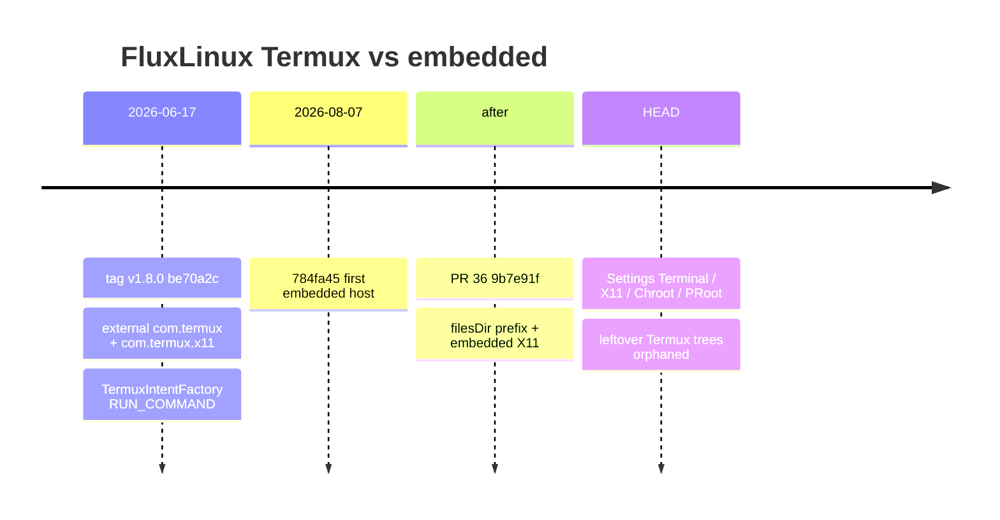
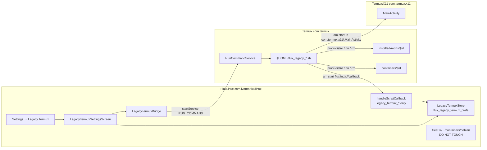

# Plan: Settings card + page for leftover Termux-era PRoot distros

| Field | Value |
| --- | --- |
| **Author** | FluxLinux |
| **Date** | 2026-08-16 |
| **Updated** | 2026-08-16 (review-1: 14 issues) |
| **Status** | **Draft** |
| **Repo** | `/home/abhaybyte/repos/fluxlinux` |
| **Audience** | Implementers of Settings leftover-Termux cleanup (scripts, bridge, page) |
| **Flavor / package** | Ivarna (`com.ivarna.fluxlinux`) |
| **APK policy** | `:app:assembleIvarnaRelease` + `adb install -r` only. Do **not** uninstall the existing APK. |
| **Scope lock** | Additive Settings surface only. Do **not** re-add Termux as an installable Distros card, do **not** install into `com.termux`, do **not** mutate embedded `start_gui.sh` / `stop_gui.sh` / `HostScriptDeployer` / Settings → Chroot / Settings → PRoot. |

**How to use this file:** this is the implementation contract. Reconstruct the **v1.8.0** (`be70a2c`, 2026-06-17) Termux `RUN_COMMAND` protocol, ship it as a **new** isolated bridge + asset tree, and expose **only** leftover-management actions on a new Settings page. Working tree already has uncommitted multi-distro Chroot/PRoot storage work (`docs/plans/chroot-proot-multi-distro-storage.md`) plus Home session-card / X11 chrome work. This plan is **additive**. It must not collide with Settings App list order beyond one new card, navigation back-stack conventions, `GlassSettingCard`, `storageTargetId`, or the KDE residual `TermuxIntentFactory` callers.

**Reviews:**
1. Plan review (design-doc loop) — `/tmp/grok-1000/grok-design-review-3b513b26.md`. 10 major / 3 minor / 1 nit. This revision addresses all 14.

**Historical correction (read first):**
The informal claim “in and after v1.8.0 FluxLinux uses the embedded host” is **false**.

| Ref | SHA | Date | Fact |
| --- | --- | --- | --- |
| Tag `v1.8.0` | `be70a2cbfc3fd95d5b9c7b473a1f1f734bec74d0` | 2026-06-17 | Still **external** Termux (`com.termux`) + external Termux:X11 (`com.termux.x11`) via `com.termux.RUN_COMMAND`. |
| First embedded host | `784fa450d13468c093a67a1971e10bfb36cecdcb` | 2026-08-07 | `feat: embed host bootstrap terminal (proot/chroot) and track host debs` |
| PR #36 | `9b7e91f` | after 2026-08-07 | Merge of the embedded-terminal workstream |

Implementers must `git show v1.8.0:<path>` for protocol SSOT. Do **not** target HEAD `debian/proot/start/start_gui.sh` (embedded shebang + `fluxlinux-host.env` + `TERMUX_X11_OVERRIDE_PACKAGE`).

**References:**
[`SettingsScreen.kt`](../../app/src/main/kotlin/com/ivarna/fluxlinux/ui/screens/SettingsScreen.kt), [`MainActivity.kt`](../../app/src/main/kotlin/com/ivarna/fluxlinux/MainActivity.kt), [`TermuxIntentFactory.kt`](../../app/src/main/kotlin/com/ivarna/fluxlinux/core/data/TermuxIntentFactory.kt), [`TerminalLauncher.kt`](../../app/src/main/kotlin/com/ivarna/fluxlinux/core/terminal/TerminalLauncher.kt), [`UninstallSessionFactory.kt`](../../app/src/main/kotlin/com/ivarna/fluxlinux/core/terminal/UninstallSessionFactory.kt), [`DesktopLauncher.kt`](../../app/src/main/kotlin/com/ivarna/fluxlinux/core/desktop/DesktopLauncher.kt), [`HostScriptDeployer.kt`](../../app/src/main/kotlin/com/ivarna/fluxlinux/core/terminal/HostScriptDeployer.kt), [`TermuxHostPaths.kt`](../../app/src/main/kotlin/com/ivarna/fluxlinux/core/terminal/TermuxHostPaths.kt), [`StateManager.kt`](../../app/src/main/kotlin/com/ivarna/fluxlinux/core/utils/StateManager.kt), [`PrerequisitesScreen.kt`](../../app/src/main/kotlin/com/ivarna/fluxlinux/ui/screens/PrerequisitesScreen.kt), [`ScriptManager.kt`](../../app/src/main/kotlin/com/ivarna/fluxlinux/core/data/ScriptManager.kt), [`AndroidManifest.xml`](../../app/src/main/AndroidManifest.xml), [`docs/plans/chroot-proot-multi-distro-storage.md`](./chroot-proot-multi-distro-storage.md), [`docs/plans/embedded-terminal-bootstrap-proot-chroot.md`](./embedded-terminal-bootstrap-proot-chroot.md), [`docs/releases/v1.8.md`](../releases/v1.8.md), [`docs/script_execution_workflow.md`](../script_execution_workflow.md). Tag-era SSOT: `git show v1.8.0:app/src/main/kotlin/com/ivarna/fluxlinux/core/data/TermuxIntentFactory.kt` (914 lines), `git show v1.8.0:app/src/main/assets/scripts/debian/proot/start/start_gui.sh`, `git show v1.8.0:app/src/main/assets/scripts/debian/proot/stop/stop_gui.sh`, `git show v1.8.0:app/src/main/kotlin/com/ivarna/fluxlinux/core/data/DistroRepository.kt`.

---

## Overview

Through tag `v1.8.0` FluxLinux installed Debian PRoot **into the user’s external Termux app** (`/data/data/com.termux/files/…`) and launched the desktop by asking Termux to run `$HOME/start_gui.sh`, which started **external** `com.termux.x11`. After that tag (first code `784fa45`, then PR #36) FluxLinux switched to an **embedded** host under `filesDir` (`com.ivarna.fluxlinux` / `com.zenithblue.fluxlinux`) and an **embedded** X11 activity. Home, Distros, Settings → PRoot, `TerminalLauncher`, and `DesktopLauncher` now speak only to the embedded prefix.

Users who installed Debian (and optionally extra `proot-distro` containers) with FluxLinux ≤ v1.8.0 still have leftover rootfs trees **inside Termux**. The current app cannot see, launch, or delete them: FluxLinux and Termux are different UIDs, and the embedded uninstall/GUI paths would touch the **wrong** container or do nothing.

This plan adds one Settings App card (**Legacy Termux**) and one Settings page that, using a **new** `LegacyTermuxBridge` and a **new** `scripts/legacy-termux/` asset tree, talks to Termux the way v1.8.0 did — `com.termux.RUN_COMMAND` → `com.termux.app.RunCommandService` → `/data/data/com.termux/files/usr/bin/bash` — and offers only:

1. Uninstall a leftover Termux-hosted PRoot container
2. Open a terminal **in Termux** for that container
3. Start / stop display for that container in **external Termux:X11**

No new installs into Termux. No Distros card. No mutation of embedded start/stop/uninstall.

---

## Background & Motivation

### Why this change is needed

A user who upgraded from ≤ v1.8.0 still has (typically) `debian` under Termux’s `proot-distro` tree. That tree is **not** the same object as Settings → PRoot’s `filesDir/usr/var/lib/proot-distro/containers/debian`. Embedded uninstall (`UninstallSessionFactory.openUninstallSession`) runs `proot-distro remove` against **FluxLinux’s** `$PREFIX`. Calling it from a leftover page would delete the embedded debian (or no-op if only the Termux leftover exists). The reverse is also true: v1.8-era `$HOME/start_gui.sh` in Termux, if it still exists, is the old protocol; HEAD’s `start_gui.sh` is the embedded protocol and must never be copied into Termux.

### Pain points (today)

1. Settings hub comment is explicit: “Legacy Termux environment / prerequisites / connection-fix cards removed.” (`SettingsScreen.kt` 62–64.) There is no leftover manager.
2. `StateManager.isTermuxX11Installed` always returns `true` because X11 is embedded (`StateManager.kt` 67–72). Using that helper would falsely report that **external** Termux:X11 is present.
3. `handleScriptCallback` treats `name=distro_uninstall_$id` as an **embedded** uninstall and calls `TerminalLauncher.refreshInstalledAfterUninstall` (`MainActivity.kt` 159–163) → `StateManager.clearDistroState` (`TerminalLauncher.kt` 97–114). That **does not** delete files and **does not** clear `flux_proot_prefs`. Home (`HomeScreen.kt` 144–151) and Distros filter `isDistroInstalledOnFs` (filesDir); Settings → PRoot is `isDistroInstalledOnFs || ProotInfoStore.cachedInstalled`. Catalog cards stay installed. What **does** drop is `fluxlinux_state`: `distro_${id}_installed`, `distro_${id}_gui_running`, and every `distro_${id}_component_*` flag — so the **Home session card / KDE residual flags** disappear. `InstallationQueueManager.enqueue` has **zero** remaining callers; `processNextInstallTask()` (`MainActivity.kt` 450–452) is a no-op `clear()` of stale queue UI. Early-return is still required to prevent those toasts / `setScriptStatus("legacy_termux_list")` / session-pref wipe. It is **not** “delete embedded debian” and **not** “abort a live rootfs install.”
4. FluxLinux **cannot** `stat` `/data/data/com.termux/` (different UID, SELinux). Any “scan leftovers” that walks `filesDir` is wrong.

### Current state (inspected 2026-08-16)

#### Timeline (do not target the wrong tree)



#### v1.8.0 catalog (what the old app could install)

`git show v1.8.0:…/DistroRepository.kt`: the only `comingSoon = false` cards were:

| id | Kind | In this feature? |
| --- | --- | --- |
| `debian` | Termux-hosted **proot-distro** | **Yes** (primary leftover) |
| `termux` | Termux Native (XFCE/KDE **pkgs in the Termux host**, not a container) | **No** (follow-up) |
| `debian13_chroot` | chroot at `/data/local/tmp/chrootDebian13` | **No** (Settings → Chroot) |

Across tags v1.0–v1.8.0 the only **app-installable Termux proot name** was `debian`. Discovery must still be filesystem / `proot-distro` inside Termux because users may have extra containers (`ubuntu`, …) from a manual `proot-distro install`.

HEAD `DistroRepository` has **no** `termux` card. `debian` is now “ALWAYS termux-flux-terminal (proot)” under the **embedded** prefix (`DistroRepository.kt` 240–248).

#### v1.8.0 protocol SSOT (`TermuxIntentFactory.kt`, 914 lines)

`buildRunCommandIntent` (tag lines 23–36):

```kotlin
fun buildRunCommandIntent(scriptContent: String, runInBackground: Boolean = false): Intent {
    return Intent(ACTION_RUN_COMMAND).apply {
        setClassName("com.termux", "com.termux.app.RunCommandService")
        putExtra(EXTRA_COMMAND_PATH, TERMUX_BASH_PATH)          // /data/data/com.termux/files/usr/bin/bash
        putExtra(EXTRA_ARGUMENTS, arrayOf("-c", scriptContent))
        putExtra(EXTRA_WORKDIR, TERMUX_HOME_DIR)                // /data/data/com.termux/files/home
        putExtra(EXTRA_BACKGROUND, runInBackground)
    }
}
```

`EXTRA_SESSION_ACTION` was declared and **never set**. Do the same.

Quoted product commands at v1.8.0:

| Action | Exact command / body |
| --- | --- |
| CLI | `proot-distro login $distroId --user flux` (tag 361–363). No root fallback. |
| GUI start (proot) | `bash $TERMUX_HOME_DIR/start_gui.sh $distroId` (tag 457–460). Assumed `$HOME/start_gui.sh` already deployed at install. |
| GUI stop (proot) | `bash $TERMUX_HOME_DIR/stop_gui.sh $distroId` (tag 494–496). |
| Uninstall (proot `else`) | `proot-distro remove $id` → retry → `rm -rf $PREFIX/var/lib/proot-distro/installed-rootfs/$id` then `am start … name=distro_uninstall_$id` (tag 148–167). |
| Deploy pattern (install / KDE) | `echo 'B64' \| base64 -d > $HOME/<script>; chmod +x; bash $HOME/<script>` (tag 64–71, 737–741). |

v1.8.0 `start_gui.sh` (tag, 63 lines) — **copy this**, not HEAD:

- Shebang: `#!/data/data/com.termux/files/usr/bin/bash`
- Kill `termux.x11` + VirGL; PulseAudio TCP; `virgl_test_server_android &`
- `termux-x11 :0` then `am start --user 0 -n com.termux.x11/com.termux.x11.MainActivity`
- `proot-distro login $DISTRO --shared-tmp -- /bin/bash -c '… su - flux -c "… dbus-launch --exit-with-session startxfce4"'`
- Native branch `if [ "$DISTRO" == "termux" ]` exists in the script; this page **never** passes `id=termux`.

v1.8.0 `stop_gui.sh` (tag, 33 lines) — **copy this**, not HEAD:

- `proot-distro login $DISTRO -- bash -c 'killall -9 xfce4-session …'`
- `am broadcast -a com.termux.x11.ACTION_STOP -p com.termux.x11`
- `killall -9 Xwayland termux-x11`; `kill -9 $(pgrep -f "termux.x11")`
- `pulseaudio --kill`

HEAD `app/src/main/assets/scripts/debian/proot/start/start_gui.sh` line 1 is `#!/data/data/com.ivarna.fluxlinux/files/usr/bin/bash`, sources `fluxlinux-host.env`, sets `TERMUX_X11_OVERRIDE_PACKAGE`. HEAD `stop_gui.sh` broadcasts `-p "$PKG"` where `$PKG` is FluxLinux. **MUST NOT** be reused.

#### HEAD surfaces this page must not call

| Surface | Why it is the wrong leftover target |
| --- | --- |
| `TerminalLauncher.isProotInstalled` / `isDistroInstalledOnFs` | `isProotInstalled` (`TerminalLauncher.kt` 46–49) probes `ctx.filesDir/usr/var/lib/proot-distro/containers/$name/rootfs`. `isDistroInstalledOnFs` (`TerminalLauncher.kt` 139–146) dispatches chroot vs that proot probe. |
| `UninstallSessionFactory.openUninstallSession` | Host session: `proot-distro remove` + `rm -rf $PREFIX/…/containers/$NAME` under **embedded** PREFIX (`UninstallSessionFactory.kt` 68–87). Callback `distro_uninstall_${distro.id}`. |
| `DesktopLauncher.start/stop` | Embedded `start_gui.sh` / `stop_gui.sh` via `HostScriptDeployer` + `TermuxHostPaths.HOME`; `ACTION_STOP` `setPackage(app.packageName)` (`DesktopLauncher.kt` 286–307). |
| Settings → PRoot | `ProotStorageListScreen` + `ProotInfoStore` (`flux_proot_prefs`) + `GuestStorageCatalog.installableProots()`. |
| Settings → Chroot | `/data/local/tmp/chroot*` via `ChrootDetection`. |
| `HostScriptDeployer.HOST_SCRIPTS` | Deploys into **FluxLinux** `$HOME`, including HEAD `start_gui.sh` / `stop_gui.sh` (lines 119–120). Do not add leftover scripts here. |
| `TermuxIntentFactory.buildInstallIntent` / `getBaseInstallScript` / `buildUninstallIntent` | Product comment (`TermuxIntentFactory.kt` 7–17): install/run/uninstall/component for debian* **MUST NOT** use this factory. Remaining live callers: KDE start/stop on Home + DistroSettings, Prerequisites tweaks, BusyBox tests. |

#### What already exists that we **reuse**

- Manifest: `com.termux.permission.RUN_COMMAND` (`AndroidManifest.xml` 7); `<queries>` for `com.termux` and `com.termux.x11` (17–20); `fluxlinux://callback` VIEW filter (52–58); `launchMode="singleTask"` (45).
- `ScriptManager.getScriptContent` reads `assets/scripts/$fileName`.
- `SettingsNavCard` (`SettingsScreen.kt` 406–418, private to the hub). `GlassSettingCard` (`GlassCard.kt` 434–459) is the glass wrapper only.
- Cream contrast: `colorScheme.secondary` for titles/buttons (same as Settings hub / X11 / storage pages).
- `rememberPermissionState("com.termux.permission.RUN_COMMAND")` already lifted in `MainActivity.kt` 466–468.
- `onStartServiceStub` already swallows `startService` exceptions (`MainActivity.kt` 550–551).
- v1.8 Settings / `PrerequisitesScreen` copy-paste: `mkdir -p ~/.termux && echo "allow-external-apps = true" >> ~/.termux/termux.properties && termux-reload-settings` (`PrerequisitesScreen.kt` 602).
- Termux min version compare: `isVersionOlderThan` vs `0.118.3` (`PrerequisitesScreen.kt` 65–77, 885). F-Droid Termux ≥ 0.118.3 is the RUN_COMMAND extras contract FluxLinux 1.8 documented.

---

## Goals & Non-Goals

### Goals

1. Settings App card **below PRoot**, visually distinct subtitle, titled **Legacy Termux**.
2. One Settings page (`Screen.SETTINGS_LEGACY_TERMUX`) with BackHandler page → Settings → Home (mirror Terminal / X11).
3. Prerequisite strip: **five** checks, **four** rows. Termux installed **and** ≥ 0.118.3 share one row; then external Termux:X11; `RUN_COMMAND`; `allow-external-apps` (list-as-ping). Fix CTAs. Never crash on `startService`.
4. Discover leftover **proot-distro containers inside `com.termux`** via `RUN_COMMAND` + `fluxlinux://callback` (FluxLinux cannot read Termux’s data dir).
5. Per leftover: Open terminal (Termux), Start display (external X11), Stop display, Uninstall (confirm).
6. New scripts under `assets/scripts/legacy-termux/`. Always redeploy to Termux `$HOME/flux_legacy_*.sh` via the v1.8 base64 pattern. Never trust leftover `$HOME/start_gui.sh`.
7. New `LegacyTermuxBridge`. Do not resurrect dead factory install/uninstall as product paths.
8. Distinct callback name prefix so leftover uninstall **cannot** wipe Home session / component prefs or write `setScriptStatus("legacy_termux_*")`.

### Non-goals (hard lock)

- Re-add Termux as an installable Distros card.
- Re-add “Copy & Open Termux” onboarding / Prerequisites as the **primary** path (the leftover page may show the `allow-external-apps` one-liner as a **fix**, not as setup).
- Install new distros into Termux.
- Manage `/data/local/tmp/chroot*` (Settings → Chroot).
- Manage embedded PRoot under FluxLinux `filesDir` (Settings → PRoot).
- Change Home session card, embedded Terminal tab, embedded X11 settings, `DesktopLauncher`, `EmbeddedX11`.
- Mutate current `start_gui.sh` / `stop_gui.sh` / `flux_install.sh` / `uninstall_guest*` / `HostScriptDeployer` tables.
- Touch flavor / bootstrap / jniLibs.
- Break KDE residual `TermuxIntentFactory.buildLaunchKdeGui*` on Home / DistroSettings.
- Collide with `GlassSettingCard`, Settings App list (beyond one appended card), or BackHandler conventions.
- Termux Native (`id=termux`) desktop pkg uninstall (xfce4/kde). **Follow-up**, not v1. Do not confuse “uninstall leftover debian” with “wipe Termux desktop packages”.
- KDE leftover display (v1.8 `start_gui_kde.sh`). v1 page is XFCE `start_gui.sh` logic only.

---

## Proposed Design

### Architecture



Two prefixes, two UIDs. Scripts run **as Termux**. `rm -rf` can only see Termux’s `$PREFIX`. Embedded debian is unreachable from those scripts. Kotlin must never call embedded uninstall/GUI from this page.

### Navigation

Add **one** enum value. No list → detail.

```kotlin
// MainActivity.kt Screen
SETTINGS_PROOT,
SETTINGS_PROOT_DETAIL,
SETTINGS_LEGACY_TERMUX,   // NEW — single page
TROUBLESHOOTING,
```

**Justification for no detail route:** typical leftover is one `debian`; four actions fit on a glass row/card; Settings → PRoot already owns list → detail + `storageTargetId`. A second detail stack would collide with that state and with the “mirror Terminal/X11” back contract.

`BackHandler` (`MainActivity.kt` 498–509) — add `SETTINGS_LEGACY_TERMUX` to the same arm as `SETTINGS_TERMINAL` / `SETTINGS_X11`:

```
SETTINGS_CHROOT_DETAIL → SETTINGS_CHROOT
SETTINGS_PROOT_DETAIL  → SETTINGS_PROOT
SETTINGS_TERMINAL | SETTINGS_X11 | SETTINGS_CHROOT | SETTINGS_PROOT
  | SETTINGS_LEGACY_TERMUX | TROUBLESHOOTING | ROOT_ACCESS → SETTINGS
SETTINGS | DISTRO_SETTINGS | INSTALL_WIZARD → HOME
```

`when (currentScreen)`: new branch only. Do not rewrite Terminal / X11 / Chroot / PRoot branches.

`SettingsScreen`: add `onNavigateToLegacyTermuxSettings: (() -> Unit)? = null`. Call site sets `currentScreen = Screen.SETTINGS_LEGACY_TERMUX`.

Update the hub file comment to: leftover manager lives on this new page; connection-fix / Prerequisites cards stay **removed** from the hub.

### Settings hub card

Insert **below PRoot**, **above** the Help heading (`SettingsScreen.kt` 158–165). Reuse `SettingsNavCard` as-is.

| Field | Value |
| --- | --- |
| Title | `Legacy Termux` |
| Subtitle | `Leftover PRoot installs from FluxLinux ≤ v1.8.0 live in the Termux app` |
| Icon | `Icons.Default.History` (not `Folder` / `Storage` — those are PRoot / Chroot) |

Do not change `GlassSettingCard`. Accent = `colorScheme.secondary` (cream). No new color tokens.

### Page contents (`LegacyTermuxSettingsScreen`)

Single scroll column. Cream contrast. Reuse `GlassSettingCard`. `StatusBadge` / `MetaRow` are generic enough to reuse for “IN TERMUX” / path line; **do not** import chroot kill UI or `ChrootSettingsModel.confirmKillCopy`.

```
┌ Settings  ← Legacy Termux                          ┐
│ // Leftovers live in com.termux — not app storage  │
│ These are containers inside the Termux app,        │
│ not Settings → PRoot.                              │
│                                                    │
│ ┌ Prerequisites ─────────────────────────────────┐ │
│ │ Termux            v0.118.3 / missing / old     │ │
│ │ Termux:X11        com.termux.x11 pkg           │ │
│ │ RUN_COMMAND       grant / granted              │ │
│ │ allow-external-apps  ok / unknown / fix        │ │
│ └────────────────────────────────────────────────┘ │
│                                                    │
│ ┌ debian                          IN TERMUX      ┐ │
│ │ /data/data/com.termux/files/usr/var/lib/       │ │
│ │   proot-distro/installed-rootfs/debian         │ │
│ │ ~2.1 GB                                        │ │
│ │ [ Open terminal ] [ Start display ]            │ │
│ │   Start: XFCE in Termux:X11 (v1.8).            │ │
│ │   KDE leftovers are not supported.             │ │
│ │ [ Stop display ]  [ Uninstall ]                │ │
│ └────────────────────────────────────────────────┘ │
│                                                    │
│ [ Scan leftovers ]                                 │
└────────────────────────────────────────────────────┘
```

1. **Prerequisite strip** (always visible). **Five** checks on **four** rows (version is folded into the Termux row). Missing → how to fix; actions disabled per the state table.
2. **Scan / list** leftover containers discovered **inside Termux**.
3. **Per-row actions:** Open terminal, Start display, Stop display, Uninstall (confirm).
4. **Empty states** (see below).

**Page warning** (one line under the subtitle, always):

> These are containers inside the Termux app, not Settings → PRoot.

**Row chrome (required — do not reuse the Distro catalog):**

- Title = **raw proot id** (`debian`, `ubuntu`, …). Never `Distro.name`.
- Leading glyph = `Icons.Default.History` (or a Termux mark). Never `Distro.iconRes` / `R.drawable.distro_debian`.
- Subtitle line 1 = **absolute Termux path**, e.g. `/data/data/com.termux/files/usr/var/lib/proot-distro/installed-rootfs/debian` or `…/containers/debian` from the scan `layouts` token. Helper: `LegacyTermuxBridge.hostPath(id, layout)`.
- Subtitle line 2 = size if known.
- Start-display button caption/subtitle: **“XFCE in Termux:X11 (v1.8 protocol). KDE leftovers are not supported.”**

Discovery lists **every** `proot-distro` dir in Termux, including ones the user installed themselves. The row must look like a Termux path, not like Home / Settings → PRoot Debian.

Uninstall confirm (`AlertDialog`, same cream/error pattern as storage pages, **not** chroot kill copy):

> Delete **any** Termux `proot-distro` container named **`$id`**, including ones you installed in Termux yourself?  
> Path: `/data/data/com.termux/files/usr/var/lib/proot-distro/{installed-rootfs|containers}/$id`  
> This does **not** touch FluxLinux `filesDir/usr/var/lib/proot-distro/containers/$id` (Settings → PRoot).

### Prerequisite gates (exact)

| Gate | How to measure | Fix CTA | Block actions? |
| --- | --- | --- | --- |
| Termux installed | `packageManager.getPackageInfo("com.termux", 0)` via `StateManager.isPackageInstalled` / `LegacyTermuxBridge.isTermuxInstalled`. **Not** `canRunCommands` (that is true when the **embedded** host is ready). | Link F-Droid / GitHub Termux. Play Store Termux will not work (same copy as `PrerequisitesScreen.kt` 885). | Yes |
| Termux ≥ 0.118.3 | `StateManager.getTermuxVersion` + the existing `isVersionOlderThan` algorithm. Lift that helper to `LegacyTermuxBridge` or a tiny shared function; do not fork a third comparer. | Same “Download v0.118.3” CTA. | Yes (RUN_COMMAND extras not reliable) |
| External Termux:X11 | `isPackageInstalled(ctx, "com.termux.x11")`. **Never** `StateManager.isTermuxX11Installed()` (always `true`). | Link Termux:X11 GitHub releases. Do **not** open embedded `com.termux.x11.MainActivity`. | Blocks Start/Stop display only. List / terminal / uninstall still allowed. |
| `RUN_COMMAND` | `permissionState.status.isGranted` for `com.termux.permission.RUN_COMMAND`. | `permissionState.launchPermissionRequest()`. | Yes |
| `allow-external-apps=true` | **Cannot** read `~/.termux/termux.properties` (other UID). The **list script is the ping** (see Isolation). `ping_ok=true` on any `legacy_termux_list` success, including empty `ids`. Optional standalone ping **only** if the user taps the fix CTA. | Show the v1.8 one-liner + **Copy & Open Termux** as a **fix**, not onboarding. Checkbox not required. | Yes if last **list** failed or timed out. A successful list (even empty) unblocks. |

**Copy & Open Termux** is a **literal** copy of `PrerequisitesScreen.kt` 644–659. Implement exactly:

```kotlin
val clipboard = context.getSystemService(Context.CLIPBOARD_SERVICE) as ClipboardManager
clipboard.setPrimaryClip(ClipData.newPlainText("Termux Fix", fixCommand))
val launchIntent = context.packageManager.getLaunchIntentForPackage("com.termux")
if (launchIntent != null) {
    context.startActivity(launchIntent)
    Toast.makeText(context, "Command copied! Paste in Termux", Toast.LENGTH_LONG).show()
} else {
    Toast.makeText(context, "Termux not found!", Toast.LENGTH_SHORT).show()
}
```

`fixCommand` is the same one-liner as `PrerequisitesScreen.kt` 602. **Forbidden** on this page / its click handlers: `openTerminalTab`, `onOpenTerminal`, `FluxTerminalSessionManager`, `Screen.TERMINAL`, `BottomTab.TERMINAL`. Grep-gate `LegacyTermuxSettingsScreen.kt` (and leftover Kotlin) for those symbols.

`startSafely(ctx, intent): Boolean`:

```kotlin
fun startSafely(ctx: Context, intent: Intent): Boolean {
    if (!isTermuxInstalled(ctx)) {
        Log.e(TAG, "startSafely: Termux not installed"); return false
    }
    return try {
        val component = ctx.startService(intent)
        if (component == null) {
            Log.e(TAG, "startSafely: startService returned null (no RunCommandService)")
            false
        } else true
    } catch (e: SecurityException) {
        Log.e(TAG, "RUN_COMMAND denied", e); false
    } catch (e: IllegalStateException) {
        // Android 8+ background start — leftover actions only run while the Settings page is resumed
        Log.e(TAG, "startService not allowed", e); false
    } catch (e: Exception) {
        Log.e(TAG, "startService failed", e); false
    }
}
```

`Context.startService` **returns `null` and does not throw** when the target service/package does not exist. Treat that as failure. Do **not** call `startSafely` unless `isTermuxInstalled` (package gate first; S2 depends on this). Never let `startService` unwind to the composition.

On `ON_RESUME`, re-read packages + permission (same `LifecycleEventObserver` pattern as `ProotStorageListScreen.kt` 83–91).

### Isolation / discovery (critical)

FluxLinux **cannot** read `/data/data/com.termux/`. Discovery **must** run inside Termux via `RUN_COMMAND`. A one-shot script prints a machine-parseable list and `am start`s a callback. There is no other channel.

#### List command (contract)

Asset: `scripts/legacy-termux/list_proot.sh`  
Deployed: `$HOME/flux_legacy_list_proot.sh`  
Intent: `background = true` (do not steal the UI). Timeout in Kotlin: **15s** (UI-only; late callbacks are still applied).

**List is the ping.** Do not fire a separate 8s `legacy_termux_ping` on page enter. One in-flight RUN_COMMAND at a time; a second Scan tap is ignored. On `legacy_termux_list` success (including empty or **missing** `ids`), set `ping_ok=true` and `ping_ms=now`. Optional `buildPingSpec` exists only for the allow-external-apps **fix** button (user just pasted the one-liner and wants a cheap probe); it must not run in parallel with list.

Script algorithm (run as Termux, `$PREFIX` is Termux’s):

```bash
#!/data/data/com.termux/files/usr/bin/bash
set -u
PREFIX="${PREFIX:-/data/data/com.termux/files/usr}"
OLD="$PREFIX/var/lib/proot-distro/installed-rootfs"
NEW="$PREFIX/var/lib/proot-distro/containers"

# Collect unique basenames of existing directories.
# Newer proot-distro: containers/<id>/
# v1.8 fallback:     installed-rootfs/<id>
ids=""
for dir in "$OLD" "$NEW"; do
  [ -d "$dir" ] || continue
  for p in "$dir"/*; do
    [ -d "$p" ] || continue
    b=$(basename "$p")
    case "$b" in
      ''|.*|*/*) continue ;;
    esac
    # allowlist: proot-distro names
    echo "$b" | grep -Eq '^[A-Za-z0-9][A-Za-z0-9._-]*$' || continue
    case ",$ids," in *",$b,"*) ;; *) ids="${ids:+$ids,}$b" ;; esac
  done
done

bytes=""
layouts=""
IFS=',' 
for id in $ids; do
  [ -n "$id" ] || continue
  if [ -d "$NEW/$id" ]; then
    layout=containers
    path="$NEW/$id"
  else
    layout=installed-rootfs
    path="$OLD/$id"
  fi
  sz=$(du -sb "$path" 2>/dev/null | awk '{print $1}')
  sz=${sz:-0}
  bytes="${bytes:+$bytes,}$sz"
  layouts="${layouts:+$layouts,}$layout"
done

# Empty scan is success with empty ids (not an error).
am start -a android.intent.action.VIEW \
  -d "fluxlinux://callback?result=success&name=legacy_termux_list&ids=${ids}&bytes=${bytes}&layouts=${layouts}"
```

Do **not** treat `proot-distro list` as SSOT (output format drifted). Optional extra: if `command -v proot-distro` and `ids` is empty, still succeed (no leftovers). If `du` is slow on a huge tree, 15s Kotlin timeout shows last cache + “scan timed out — tap retry”. Expected size: 1 leftover debian, 2–8 GB; `du -sb` is typically < 5s.

#### Callback parse format

```
fluxlinux://callback?result=success&name=legacy_termux_list&ids=debian,ubuntu&bytes=2147483648,98765&layouts=installed-rootfs,containers
```

| Query | Rule |
| --- | --- |
| `name` | Exact `legacy_termux_list` |
| `ids` | Comma-separated. **Missing `ids` (`getQueryParameter` == null) is treated as empty** — no leftovers, success. Empty string = no leftovers. Each token must match `^[A-Za-z0-9][A-Za-z0-9._-]*$`. Reject the whole payload if any token fails (do not `rm` from a poisoned list). |
| `bytes` | Parallel comma-separated non-negative integers. Missing / length mismatch → bytes = null per row (UI shows “size unknown”). |
| `layouts` | Parallel `installed-rootfs` \| `containers`. Missing → omit. |
| URI budget | Names are short; keep payload well under 1 KiB. Do not put `du` listings or logs in the URI. |

Optional ping (fix CTA only — not on enter):

```
fluxlinux://callback?result=success&name=legacy_termux_ping
```

Uninstall success (only if both dirs are gone — see `uninstall_proot.sh`):

```
fluxlinux://callback?result=success&name=legacy_termux_uninstall_<id>
```

Uninstall / bad-id failure (scripts **do** emit this):

```
fluxlinux://callback?result=error&name=legacy_termux_uninstall_<id>&reason=unknown
fluxlinux://callback?result=error&name=legacy_termux_uninstall_<id>&reason=bad_id
```

`reason` allowlist actually emitted: `bad_id`, `unknown`. Kotlin-side timeout is **not** a URI (UI state only). Do not invent `no_termux` / `proot_missing` URIs.

**Late callbacks:** a list/uninstall URI that arrives after the Kotlin 15s/20s timer is still applied (`saveScan` / `store.remove` / `ping_ok`). The timeout only flips the page out of `scanning` / `uninstalling`. Do not drop the URI.

#### Cache

New prefs file **`flux_legacy_termux_prefs`** (`LegacyTermuxStore`). Do **not** write `fluxlinux_state`, `flux_proot_prefs`, or `flux_chroot_prefs`.

| Key | Type |
| --- | --- |
| `scan_ids` | `String` csv |
| `scan_bytes` | `String` csv |
| `scan_layouts` | `String` csv |
| `scan_ms` | `Long` |
| `scan_error` | `String` |
| `ping_ok` | `Boolean` |
| `ping_ms` | `Long` |

First paint: show cached rows (possibly stale) + “Last scan <relative>”. On page enter, if Termux installed + version ok + `RUN_COMMAND` granted + not already in-flight, fire **one** list (this is also the ping). Do **not** require `ping_ok` first. `StateManager.triggerRefresh()` after a successful parse so the page’s `collectAsState` repaints — **but** `LegacyTermuxStore` is the only writer; do not `clearDistroState`.

Store API (observe via `refreshTrigger` + `store.load()`, no extra Flow required):

```kotlin
data class Scan(val rows: List<Row>, val scannedAtMs: Long, val error: String?)
data class Row(val id: String, val bytes: Long?, val layout: String?, val hostPath: String)

fun load(ctx): Scan
fun saveScan(ctx, rows, scannedAtMs)
fun saveError(ctx, message)          // keep last good rows
fun remove(ctx, id): Boolean         // false if !isSafeProotId(id); else drop that row
fun setPingOk(ctx)
```

TTL: cache is a last-good snapshot, not an installed-state SSOT. Always rescan on enter / pull. **Uninstall** is disabled if the last successful scan is older than 30 minutes (avoid deleting a name the user already removed in Termux). Open terminal / Start / Stop stay enabled on a stale cache.

#### Page state machine

Exactly one of:

| State | How entered | Scan button | Open / Start / Stop | Uninstall |
| --- | --- | --- | --- | --- |
| `idle` | last list success, rows non-empty, no in-flight | enabled | enabled if gates; **Start** also needs external X11 **and** `!isEmbeddedDesktopActive` | enabled if scan age < 30 min |
| `empty` | last list success, no rows | enabled | n/a | n/a |
| `scanning` | list `startSafely` true | disabled (ignore tap) | disabled | disabled |
| `uninstalling` | uninstall `startSafely` true | disabled | disabled | disabled (ignore double-tap) |
| `timed_out` | 15s list or 20s uninstall with no callback yet | enabled | same as `idle` if cache has rows | same TTL rule |

`isEmbeddedDesktopActive(ctx)` (read-only — **do not** call `setGuiRunning`):

```kotlin
DesktopLauncher.isSessionActive()
    || DistroRepository.supportedDistros.any { StateManager.isGuiRunning(ctx, it.id) }
```

When true: **disable Start leftover** and show “Stop the FluxLinux desktop first. Leftover Termux:X11 and embedded XFCE should not run together (Pulse TCP 127.0.0.1:4713).” Stop / terminal / uninstall stay available.

In-flight: one RUN_COMMAND. `scanning` / `uninstalling` ignore further Scan / Uninstall taps. A late callback still applies and returns the page to `idle` / `empty`.

Uninstall 20s timeout → toast/status “Termux did not confirm removal; tap Scan.” Do not `store.remove` until a **success** callback (dirs gone).

#### Failure UX

| Situation | UI |
| --- | --- |
| Termux missing | Empty hero: “The Termux app is not installed. Leftover FluxLinux ≤ v1.8.0 containers lived there.” No Scan button. `startSafely` never called. |
| Permission denied / `startSafely` false | Banner + Grant. Do not claim “no leftovers”. Stay `idle`/`timed_out`, not `empty`. |
| List timeout (15s) | State `timed_out`. “Termux did not respond. Enable `allow-external-apps = true` and grant RUN_COMMAND.” Show one-liner + Copy & Open Termux (Prerequisites 644–659). Keep last cache dimmed. |
| Success, `ids` empty or missing | State `empty`. “No leftover PRoot containers found in Termux.” `ping_ok=true`. |
| Parse reject | “Scan returned an invalid list.” Retry. Keep last good cache. `ping_ok` unchanged. |
| Uninstall timeout (20s) | State `timed_out`. “Termux did not confirm removal; tap Scan.” Row stays until success callback or a later scan omits it. |

### Actions (v1.8 logic, new scripts)

Always: load asset → Base64.NO_WRAP → deploy to `$HOME/flux_legacy_<name>.sh` → `chmod +x` → run. **Always redeploy** (users deleted `$HOME/start_gui.sh`; leftover home scripts may be weeks old).

Pure deploy wrapper (PR1-testable, **no** `Context` / `ScriptManager`):

```kotlin
fun wrapDeploy(b64: String, destName: String, args: List<String>): String? {
    if (!destName.matches(Regex("^flux_legacy_[A-Za-z0-9_]+\\.sh$"))) return null
    if (args.any { !isSafeProotId(it) }) return null
    val tail = args.joinToString(" ")
    return """
        echo '$b64' | base64 -d > ${'$'}HOME/$destName
        chmod +x ${'$'}HOME/$destName
        bash ${'$'}HOME/$destName $tail
    """.trimIndent()
}
```

Same pattern as v1.8.0 `getInstallCommand` / `buildLaunchKdeGuiIntent`. `<id>` is interpolated only after `isSafeProotId`. Scripts re-check. Product builders that need assets: `ScriptManager.getScriptContent` → Base64 → `wrapDeploy` → `specFor`. Tests call `wrapDeploy` with a fixture b64 string.

| UI | Asset | Home name | `background` | v1.8 original |
| --- | --- | --- | --- | --- |
| Scan | `list_proot.sh` | `flux_legacy_list_proot.sh` | `true` | *(new; v1.8 had no scan; this **is** the ping)* |
| Ping (fix CTA only) | inline `am start …legacy_termux_ping` | — | `true` | `buildTestConnectionIntent` spirit; **not** on enter |
| Open terminal | `login_proot.sh` | `flux_legacy_login_proot.sh` | `false` | `proot-distro login $id --user flux` |
| Start display | `start_display.sh` | `flux_legacy_start_display.sh` | `false` | `bash $HOME/start_gui.sh $id` + tag `start_gui.sh` body |
| Stop display | `stop_display.sh` | `flux_legacy_stop_display.sh` | `false` | `bash $HOME/stop_gui.sh $id` + tag `stop_gui.sh` body |
| Uninstall | `uninstall_proot.sh` | `flux_legacy_uninstall_proot.sh` | `false` | tag `buildUninstallIntent` proot `else` + both dir names |

Do **not** name deployed files `start_gui.sh` / `stop_gui.sh` — those names in Termux `$HOME` are the user’s leftover v1.8 helpers; overwriting them with our copy is unnecessary and surprising.

#### `login_proot.sh`

v1.8 CLI had no fallback. This page adds **one** documented fallback if user `flux` is missing (broken leftover):

```bash
#!/data/data/com.termux/files/usr/bin/bash
ID="${1:-}"
echo "$ID" | grep -Eq '^[A-Za-z0-9][A-Za-z0-9._-]*$' || { echo "bad id"; exit 2; }
proot-distro login "$ID" --user flux || proot-distro login "$ID"
```

Opens a **Termux** session. Do not call `FluxTerminalSessionManager` / `openTerminalTab` / embedded Terminal tab.

After `startSafely` of the login intent succeeds, also `startActivity(packageManager.getLaunchIntentForPackage("com.termux"))` if non-null so a backgrounded Termux comes to the front. v1.8 only used RUN_COMMAND; this is a reliability add, not a protocol change. If the launcher intent is null, still consider the RUN_COMMAND the action (Termux may already be visible).

#### `start_display.sh`

**Byte-for-byte copy** of `git show v1.8.0:app/src/main/assets/scripts/debian/proot/start/start_gui.sh` (quoted here as the contract):

```bash
#!/data/data/com.termux/files/usr/bin/bash
# start_gui.sh - Launch XFCE4 Desktop Environment in PRoot Distro
# Based on LinuxDroidMaster: https://github.com/LinuxDroidMaster/Termux-Desktops

DISTRO=${1:-debian}

# Kill open X11 processes
kill -9 $(pgrep -f "termux.x11") 2>/dev/null

# Kill any stale VirGL server
pkill -f "virgl_test_server" 2>/dev/null
sleep 1

# Enable PulseAudio over Network
pulseaudio --start --load="module-native-protocol-tcp auth-ip-acl=127.0.0.1 auth-anonymous=1" --exit-idle-time=-1

# Start VirGL server (required for GPU acceleration inside PRoot)
echo "FluxLinux: Starting VirGL server..."
virgl_test_server_android &
VIRGL_PID=$!
sleep 2

# Verify VirGL socket appeared (--shared-tmp exposes Termux $TMPDIR as /tmp inside proot)
if [ -S "${TMPDIR}/.virgl_test" ]; then
    echo "FluxLinux: VirGL socket ready at /tmp/.virgl_test"
else
    echo "FluxLinux: [WARN] VirGL socket not found — GPU acceleration may not work"
fi

# Prepare termux-x11 session
export XDG_RUNTIME_DIR=${TMPDIR}
termux-x11 :0 >/dev/null &

# Wait a bit until termux-x11 gets started.
sleep 3

# Launch Termux X11 main activity
am start --user 0 -n com.termux.x11/com.termux.x11.MainActivity > /dev/null 2>&1
sleep 1

# Login in PRoot Environment
if [ "$DISTRO" == "termux" ]; then
    export PULSE_SERVER=127.0.0.1
    env DISPLAY=:0 startxfce4
else
    proot-distro login $DISTRO --shared-tmp -- /bin/bash -c '
      export DISPLAY=:0
      export PULSE_SERVER=tcp:127.0.0.1
      export XDG_RUNTIME_DIR=/tmp
      export VTEST_SOCKET_NAME=/tmp/.virgl_test
      su - flux -c "
        export DISPLAY=:0
        export PULSE_SERVER=tcp:127.0.0.1
        export XDG_RUNTIME_DIR=/tmp
        export VTEST_SOCKET_NAME=/tmp/.virgl_test
        # Disable compositor to fix black screen with Turnip GPU driver
        xfconf-query -c xfwm4 -p /general/use_compositing -s false 2>/dev/null
        dbus-launch --exit-with-session startxfce4
      "
    '
fi

exit 0
```

Hard rules:

- Shebang stays `/data/data/com.termux/files/usr/bin/bash`.
- Do **not** source `fluxlinux-host.env`.
- Do **not** set `TERMUX_X11_OVERRIDE_PACKAGE`.
- Do **not** mention `com.ivarna.fluxlinux` or `com.zenithblue.fluxlinux`.
- Activity is `com.termux.x11/com.termux.x11.MainActivity` (v1.8 used this component string).
- Kotlin never passes `id=termux`, so the native branch is dead on this page.

After `startSafely`, do **not** call `DesktopLauncher.reopenDisplay`, `EmbeddedX11.launch`, or `StateManager.setGuiRunning`. The leftover desktop is not an embedded session; Home’s session card must stay unaware.

**Exclusive desktop:** do not run leftover display and embedded XFCE at once. If `isEmbeddedDesktopActive`, the Start button is disabled (see state table). v1.8 `start_gui.sh` starts Pulse on localhost **4713** (machine-global) and `termux-x11 :0`; HEAD embedded `start_gui.sh` also starts Pulse + an X11 loader. Two Pulse daemons on `127.0.0.1:4713` is a known audio conflict ([`docs/plans/pulseaudio-host-guest-all-distros.md`](./pulseaudio-host-guest-all-distros.md)) — **not a blocker**, but reason enough to keep Start disabled while embedded GUI is up. Leftover **Stop** is UID-safe (Termux Pulse only; broadcast `-p com.termux.x11`).

#### `stop_display.sh`

**Byte-for-byte copy** of `git show v1.8.0:app/src/main/assets/scripts/debian/proot/stop/stop_gui.sh`:

```bash
#!/data/data/com.termux/files/usr/bin/bash
# stop_gui.sh - Stop XFCE4 Desktop Environment in PRoot Distro

DISTRO=${1:-debian}

echo "========================================"
echo "FluxLinux: Stopping GUI for $DISTRO"
echo "========================================"

# Step 1: Kill XFCE processes inside proot
echo "[1/3] Stopping XFCE4 processes..."
if [ "$DISTRO" == "termux" ]; then
    # Termux native
    killall -9 xfce4-session xfwm4 xfdesktop xfce4-panel dbus-launch dbus-daemon 2>/dev/null
else
    # Inside proot
    proot-distro login $DISTRO -- bash -c 'killall -9 xfce4-session xfwm4 xfdesktop xfce4-panel dbus-launch dbus-daemon' 2>/dev/null
fi

# Step 2: Stop Termux X11
echo "[2/3] Stopping Termux X11..."
am broadcast -a com.termux.x11.ACTION_STOP -p com.termux.x11 >/dev/null 2>&1
killall -9 Xwayland termux-x11 2>/dev/null
kill -9 $(pgrep -f "termux.x11") 2>/dev/null

# Step 3: Stop PulseAudio (optional - may be used by other apps)
echo "[3/3] Stopping PulseAudio..."
pulseaudio --kill 2>/dev/null

echo ""
echo "✅ GUI stopped successfully!"
echo "========================================"
exit 0
```

UID isolation: this script runs **as Termux**. `pkill` / `killall` from Termux cannot signal FluxLinux’s embedded X11 (different UID; Android hides other-app processes). The package-scoped broadcast is `-p com.termux.x11`, **not** `-p com.ivarna.fluxlinux` (HEAD `TermuxIntentFactory.buildStopKdeGuiIntent` line 945 broadcasts to the **embedded** package — do not copy that). Do not `am force-stop` FluxLinux.

#### `uninstall_proot.sh`

v1.8.0 proot branch (tag 149–167) plus **both** directory names. Newer proot-distro uses `containers/`; v1.8 fallback used `installed-rootfs/`. Never `rm -rf` anything under FluxLinux’s prefix (the script never runs there).

```bash
#!/data/data/com.termux/files/usr/bin/bash
ID="${1:-}"
if ! echo "$ID" | grep -Eq '^[A-Za-z0-9][A-Za-z0-9._-]*$'; then
    echo "bad id"
    am start -a android.intent.action.VIEW \
      -d "fluxlinux://callback?result=error&name=legacy_termux_uninstall_bad&reason=bad_id"
    exit 2
fi
PREFIX="${PREFIX:-/data/data/com.termux/files/usr}"
OLD="$PREFIX/var/lib/proot-distro/installed-rootfs/$ID"
NEW="$PREFIX/var/lib/proot-distro/containers/$ID"

echo "Attempting to remove $ID..."
if proot-distro remove "$ID" 2>/dev/null; then
    echo "FluxLinux: $ID Uninstalled."
else
    echo "First attempt failed, retrying..."
    sleep 1
    if proot-distro remove "$ID" 2>/dev/null; then
        echo "FluxLinux: $ID Uninstalled."
    else
        echo "proot-distro command failed, using manual removal..."
        rm -rf "$OLD"
        rm -rf "$NEW"
        echo "FluxLinux: $ID manually removed."
    fi
fi
# proot-distro remove can leave a dir; sweep both names (Termux PREFIX only)
rm -rf "$OLD"
rm -rf "$NEW"
sleep 2
if [ ! -e "$OLD" ] && [ ! -e "$NEW" ]; then
    am start -a android.intent.action.VIEW \
      -d "fluxlinux://callback?result=success&name=legacy_termux_uninstall_${ID}"
else
    echo "FluxLinux: $ID still present after remove."
    am start -a android.intent.action.VIEW \
      -d "fluxlinux://callback?result=error&name=legacy_termux_uninstall_${ID}&reason=unknown"
fi
```

Quoted v1.8.0 body for implementers who need the historical text:

```
echo "Attempting to remove $distroId..."
if proot-distro remove $distroId 2>/dev/null; then
    echo "FluxLinux: $distroId Uninstalled."
else
    echo "First attempt failed, retrying..."
    sleep 1
    if proot-distro remove $distroId 2>/dev/null; then
        echo "FluxLinux: $distroId Uninstalled."
    else
        echo "proot-distro command failed, using manual removal..."
        rm -rf $PREFIX/var/lib/proot-distro/installed-rootfs/$distroId
        echo "FluxLinux: $distroId manually removed."
    fi
fi
sleep 2
am start -a android.intent.action.VIEW -d "$callbackUrl"
```

Deltas vs tag (required): quoted `"$ID"`, id allowlist + `bad_id` error callback, **both** `installed-rootfs` and `containers`, callback name `legacy_termux_uninstall_$ID` (not `distro_uninstall_$ID`), **success only if both dirs are gone** (busy rootfs → `result=error&reason=unknown`, row stays until a later scan). No `/system/bin/su`.

---

## Bridge

New type. Suggested path: `app/src/main/kotlin/com/ivarna/fluxlinux/core/legacy/LegacyTermuxBridge.kt`.

**Do not** add methods onto `TermuxIntentFactory`. Do not call `buildInstallIntent`, `getBaseInstallScript`, or `buildUninstallIntent` from the leftover page.

```kotlin
object LegacyTermuxBridge {
    const val TERMUX_PACKAGE = "com.termux"
    const val TERMUX_X11_PACKAGE = "com.termux.x11"
    const val RUN_COMMAND_SERVICE = "com.termux.app.RunCommandService"
    const val ACTION_RUN_COMMAND = "com.termux.RUN_COMMAND"
    const val EXTRA_COMMAND_PATH = "com.termux.RUN_COMMAND_PATH"
    const val EXTRA_ARGUMENTS = "com.termux.RUN_COMMAND_ARGUMENTS"
    const val EXTRA_WORKDIR = "com.termux.RUN_COMMAND_WORKDIR"
    const val EXTRA_BACKGROUND = "com.termux.RUN_COMMAND_BACKGROUND"
    const val TERMUX_BASH = "/data/data/com.termux/files/usr/bin/bash"
    const val TERMUX_HOME = "/data/data/com.termux/files/home"
    const val MIN_TERMUX_VERSION = "0.118.3"
    val ID_RE = Regex("^[A-Za-z0-9][A-Za-z0-9._-]*$")

    fun isSafeProotId(id: String): Boolean = ID_RE.matches(id)

    fun isTermuxInstalled(ctx: Context): Boolean
    fun isTermuxX11Installed(ctx: Context): Boolean  // PackageManager com.termux.x11 ONLY
    fun termuxVersionName(ctx: Context): String?
    fun isTermuxVersionOk(ctx: Context): Boolean
    fun hasRunCommandPermission(ctx: Context): Boolean

    /** Pure extras — unit-testable without constructing android.content.Intent if needed. */
    data class RunCommandSpec(
        val packageName: String = TERMUX_PACKAGE,
        val className: String = RUN_COMMAND_SERVICE,
        val action: String = ACTION_RUN_COMMAND,
        val commandPath: String = TERMUX_BASH,
        val arguments: List<String>,   // ["-c", script]
        val workdir: String = TERMUX_HOME,
        val background: Boolean,
    )

    fun wrapDeploy(b64: String, destName: String, args: List<String>): String?  // null if dest/args unsafe
    fun specFor(script: String, background: Boolean): RunCommandSpec
    fun toIntent(spec: RunCommandSpec): Intent
    fun hostPath(id: String, layout: String?): String?

    /** null when !isSafeProotId(id) or dest name unsafe — never throw. */
    fun buildListSpec(scriptB64: String): RunCommandSpec
    fun buildPingSpec(): RunCommandSpec
    fun buildLoginSpec(scriptB64: String, id: String): RunCommandSpec?
    fun buildStartDisplaySpec(scriptB64: String, id: String): RunCommandSpec?
    fun buildStopDisplaySpec(scriptB64: String, id: String): RunCommandSpec?
    fun buildUninstallSpec(scriptB64: String, id: String): RunCommandSpec?

    fun startSafely(ctx: Context, intent: Intent): Boolean
}
```

UI layer loads assets via `ScriptManager.getScriptContent("legacy-termux/…")`, Base64-encodes, then calls the `*Spec` helpers. **Unsafe ids → `null`** (not exceptions — easier to test on Android types). Page treats null as a no-op + log.

`hostPath("debian", "installed-rootfs")` → `/data/data/com.termux/files/usr/var/lib/proot-distro/installed-rootfs/debian`. `hostPath("debian", "containers")` → `…/containers/debian`. Unknown layout → `null` (row still shows the raw id).

Intent extras **byte-compatible** with Termux `RunCommandService` at the versions FluxLinux 1.8 documented (F-Droid Termux ≥ 0.118.3):

| Extra | Value |
| --- | --- |
| action | `com.termux.RUN_COMMAND` |
| component | `com.termux` / `com.termux.app.RunCommandService` |
| `com.termux.RUN_COMMAND_PATH` | `/data/data/com.termux/files/usr/bin/bash` |
| `com.termux.RUN_COMMAND_ARGUMENTS` | `String[] { "-c", <script> }` |
| `com.termux.RUN_COMMAND_WORKDIR` | `/data/data/com.termux/files/home` |
| `com.termux.RUN_COMMAND_BACKGROUND` | boolean as above |

Do **not** set `RUN_COMMAND_SESSION_ACTION`, `RUN_COMMAND_STDIN`, or result-directory extras. v1.8 did not. Adding them risks breaking older 0.118.3 builds.

`arguments[1]` (the `-c` script) must contain the distro id for login/start/stop/uninstall, must contain `flux_legacy_`, and must **not** contain `com.ivarna.fluxlinux`, `com.zenithblue.fluxlinux`, `fluxlinux-host.env`, or `TERMUX_X11_OVERRIDE_PACKAGE`.

### Callback handler (MainActivity)

`handleScriptCallback` today (`MainActivity.kt` 93–179):

- Only invoked from `onNewIntent` (line 73). Cold start of a VIEW intent does **not** run it.
- Success + `name.startsWith("distro_uninstall_")` → `TerminalLauncher.refreshInstalledAfterUninstall`.
- Unmatched success → `StateManager.setScriptStatus`.
- **Every** success path calls `processNextInstallTask()` → `InstallationQueueManager.clear()` (450–452). That `clear()` is stale-queue UI only (`enqueue` has zero callers). A leftover list URI that is **not** early-returned still toasts *“Script 'legacy_termux_list' details saved.”* and writes `fluxlinux_state`.

Required changes (additive, leftover-scoped):

```kotlin
// handleScriptCallback — FIRST branch after parsing result + scriptName,
// BEFORE InstallationQueueManager, BEFORE distro_uninstall_, BEFORE processNextInstallTask:
if (scriptName.startsWith("legacy_termux_")) {
    LegacyTermuxCallbacks.handle(this, result, scriptName, uri)
    consumeCallbackIntent()
    return
}

// onCreate — leftover only, and only on a fresh process start:
if (savedInstanceState == null) {
    dispatchLegacyTermuxCallback(intent)  // no-op unless name starts with legacy_termux_
}

// onNewIntent — unchanged owner of ALL fluxlinux://callback names (including distro_uninstall_*)
handleScriptCallback(intent)

private fun consumeCallbackIntent() {
    setIntent(Intent(this, MainActivity::class.java).apply { action = Intent.ACTION_MAIN })
}
```

`dispatchLegacyTermuxCallback` is the same `legacy_termux_*` early-return body as `handleScriptCallback`, **without** routing `distro_uninstall_*` / `distro_install_*` / generic names. Process-death during leftover uninstall still works (`singleTask` + Termux in front → `onCreate` with the VIEW). Rotation with `savedInstanceState != null` does **not** re-run. Pre-existing callback names stay on `onNewIntent` only (embedded uninstall process-death is a **separate** bug; do not change that body).

`LegacyTermuxCallbacks.handle`:

| name | result | Effect |
| --- | --- | --- |
| `legacy_termux_list` | success | Parse ids/bytes/layouts (`ids` missing == empty) → `saveScan` → `setPingOk` → `triggerRefresh`. Quiet. |
| `legacy_termux_list` | error | `saveError`, keep last good scan. |
| `legacy_termux_ping` | success | `setPingOk`. |
| `legacy_termux_uninstall_$id` | success | `store.remove(id)` (no-op if `!isSafeProotId`) → `triggerRefresh`. Toast “Leftover $id removed from Termux”. |
| `legacy_termux_uninstall_$id` | error | Toast “Termux did not remove $id”; do **not** `store.remove`. |
| other `legacy_termux_*` | * | Log + ignore. |

**Never** call `TerminalLauncher.refreshInstalledAfterUninstall`, `StateManager.clearDistroState`, `StateManager.setDistroInstalled`, or `ChrootDetection.invalidate` from this path.

Land the `legacy_termux_*` early-return + leftover-only `onCreate` dispatch in **PR1** (scripts are then fire-safe if a callback arrives before the Settings page exists). PR2 adds the page **and** `LegacyTermuxMainActivityContractTest`.

---

## API / Interface Changes

### `SettingsScreen`

```kotlin
// add param, default null, same unused-param style as onNavigateToProotSettings
onNavigateToLegacyTermuxSettings: (() -> Unit)? = null
```

New `SettingsNavCard` after PRoot. Do not reorder Terminal / X11 / Chroot / PRoot.

### `MainActivity.Screen` + BackHandler + `when`

One new value, one new composable branch, one BackHandler token. Do not rewrite sibling pages.

### New `LegacyTermuxSettingsScreen`

```kotlin
@Composable
fun LegacyTermuxSettingsScreen(
    onBack: () -> Unit,
    permissionState: PermissionState,
)
```

Uses `LocalContext` + `LegacyTermuxBridge.startSafely`. May take `onStartService` if you prefer the existing stub; either way exceptions must be caught.

### `TermuxIntentFactory`

**No product API change.** Do not re-wire install/run/uninstall through it. KDE / Prerequisites callers stay.

---

## Data Model Changes

No Room / no catalog change. No `DistroRepository` row.

`LegacyTermuxStore` (`flux_legacy_termux_prefs`) as specified above.

Migration: none. First launch of the page starts with empty cache and a scan.

Display: **raw proot id** + History glyph + absolute Termux `hostPath`. Do **not** look up `DistroRepository` for name/`iconRes`. Never navigate to Install wizard from this page.

---

## Do-not-break matrix

| Surface | Why this change cannot affect it |
| --- | --- |
| Embedded proot install / uninstall (`TerminalLauncher` / `UninstallSessionFactory.openUninstallSession`) | Leftover page never calls these. Uninstall is RUN_COMMAND into `com.termux` only. Callback prefix is `legacy_termux_uninstall_*`, not `distro_uninstall_*`. |
| Embedded XFCE (`DesktopLauncher`) | Start leftover is **disabled** while `isSessionActive()` / any `isGuiRunning`. Start/stop leftover does not call `DesktopLauncher.start/stop`, `reopenDisplay`, does not deploy HEAD `start_gui.sh`, does not `setGuiRunning`. |
| Embedded X11 settings page | No writes to `TermuxX11Preferences`. External activity is `com.termux.x11/.MainActivity`. Stop broadcast is `-p com.termux.x11`. |
| Settings → Chroot / PRoot storage (in-progress) | No edits to those composables, `GuestStorageCatalog`, `ProotInfoStore`, `ChrootInfoStore`, `storageTargetId` semantics. One new hub card only. |
| Home KDE Termux residual | `HomeScreen.kt` 683–737 and DistroSettings `buildLaunchKdeGui*` / `buildStopKdeGui*` stay on `TermuxIntentFactory`. New bridge is unused there. |
| `PrerequisitesScreen` | Untouched. Leftover page may **copy** the allow-external-apps one-liner as a fix CTA; it does not restore Prerequisites as the primary path. Tweaks button still uses `TermuxIntentFactory.buildRunCommandIntent`. |
| `fluxlinux://callback` `distro_uninstall_*` handler | Early-return for `legacy_termux_*` **before** that branch. Body of `distro_uninstall_*` unchanged. |
| Flavor PREFIX / `TermuxHostPaths` | Scripts hardcode Termux paths only. Grep gate forbids flavor package + `fluxlinux-host.env`. `TermuxHostPaths.PACKAGE` stays `BuildConfig.APPLICATION_ID`. |
| `HostScriptDeployer.HOST_SCRIPTS` | Leftover assets are **not** added. Embedded `$HOME` must not receive `flux_legacy_*.sh`. |
| Home session card / Terminal tab | No `setGuiRunning`, no `openSessionAfterHost`, no `openTerminalTab` / `BottomTab.TERMINAL`. Copy & Open uses `getLaunchIntentForPackage("com.termux")`. |

---

## Alternatives Considered

### A. Re-wire leftover actions through `TermuxIntentFactory`

Reuse `buildLaunchCliIntent` / `buildLaunchGuiIntent` / `buildStopGuiIntent` / `buildUninstallIntent`.

- **Pros:** Less new Kotlin; v1.8 commands already live there.
- **Cons:** Product comment forbids re-wiring debian uninstall/run through this factory. HEAD `buildUninstallIntent` still emits `name=distro_uninstall_$id` (line 113) — that **will** flip embedded state. HEAD `buildLaunchGuiIntent` still runs **pre-deployed** `$HOME/start_gui.sh` (may be missing or stale). HEAD KDE stop already broadcasts to `com.ivarna.fluxlinux` (line 945). Mixing leftover and residual KDE in one object invites the next caller to “just use the factory”.
- **Decision:** reject. New `LegacyTermuxBridge` copies only the three v1.8 actions (+ list-as-ping).

### B. Walk `/data/data/com.termux/…` from FluxLinux (or `run-as`)

- **Pros:** no RUN_COMMAND, no allow-external-apps.
- **Cons:** Different UID + SELinux. `run-as com.termux` is not available to a third-party app. Would fail closed on every production device.
- **Decision:** reject.

### C. Shared world-readable listing file (`/sdcard/…`)

- **Pros:** simple parse.
- **Cons:** leftover names + sizes on shared storage; scoped-storage pain; not the v1.8 protocol.
- **Decision:** reject. Stay on `am start fluxlinux://callback`.

### D. List → detail like Settings → PRoot

- **Pros:** matches storage pages.
- **Cons:** extra `Screen` + `storageTargetId` collision; overkill for 0–2 leftovers; user asked to mirror Terminal/X11 unless detail is justified.
- **Decision:** single page.

### E. Hide the card unless a scan finds leftovers

- **Pros:** cleaner hub for new users.
- **Cons:** scan requires Termux + RUN_COMMAND; chicken-and-egg; users with leftovers but Termux uninstalled would never see the empty/explanation state.
- **Decision:** always show the card. Subtitle makes the audience obvious.

---

## Security & Privacy Considerations

| Threat | Severity | Mitigation |
| --- | --- | --- |
| Embedded debian deleted because leftover Uninstall called `openUninstallSession` | **High** | Code review + tests: leftover page / bridge never reference `UninstallSessionFactory` / `FluxTerminalSessionManager.openUninstallSession`. |
| Leftover uninstall callback named `distro_uninstall_debian` wipes session/component prefs | **High** | Prefix `legacy_termux_uninstall_`; early-return before existing handler. `LegacyTermuxMainActivityContractTest` + `LegacyTermuxCallbackTest`. FS-backed cards stay. |
| Command injection via forged `ids=` callback | **High** | Allowlist ids on parse and in every script. Reject the payload on first bad token. |
| `rm -rf` with unsanitized id | **High** | Scripts grep-allowlist; quoted paths; only under Termux `$PREFIX/var/lib/proot-distro/{installed-rootfs,containers}/$ID`. |
| `startService` `SecurityException` crash | **Med** | `startSafely`. |
| Play Store Termux / old Termux silently no-ops | **Med** | Version gate ≥ 0.118.3; same warning copy as Prerequisites. |
| `allow-external-apps` false looks like “no leftovers” | **Med** | Timeout ≠ empty. Distinct copy. |
| List callback writes `setScriptStatus` / toasts / `clear()` stale queue UI | **Med** | Early-return **before** `processNextInstallTask`. Queue `enqueue` has zero callers — not a live-install abort. |
| Privacy: leftover names in prefs / logcat | **Low** | Prefs are app-private. Do not log full callback URIs at info. Names are distro ids, not PII. |
| Stop leftover kills embedded X11 | **Low** (UID isolation) | Scripts run as Termux; cannot signal FluxLinux. Broadcast `-p com.termux.x11` only. Device smoke S6. |
| Start leftover while embedded XFCE is up (Pulse 4713 + two X11 UIs) | **Med** | Disable Start when `isEmbeddedDesktopActive`. S8. Known audio conflict, not a blocker. |

Auth: leftover actions are local IPC to Termux, gated by the user-granted `com.termux.permission.RUN_COMMAND` and Termux’s `allow-external-apps`. No network. No new manifest permission.

---

## Observability

| Channel | What |
| --- | --- |
| Log tag | `LegacyTermux` |
| Logs | gate snapshot (termux=true/x11=false/perm=false/ver=0.118.0); `startSafely ok/fail`; scan parse (`n=` + ids, not paths); uninstall requested / callback received. No base64 dumps. |
| Metrics (none shipped) | If adding debug overlays later: scan latency, timeout rate. Not required for v1. |
| User-visible | Toasts only for uninstall success/fail and startService failure. Scan is in-page status, not a toast storm. |
| Alerting | N/A (client app). |

---

## Rollout Plan

- **Feature flag:** none. Page is inert without Termux leftovers; card subtitle is self-selecting.
- **Flavor:** Ivarna first (`:app:assembleIvarnaRelease` + `adb install -r`). Scripts contain no flavor package, so Zenithblue does not need a second asset tree.
- **Staged rollout:** PR1 scripts+bridge+pure `wrapDeploy`+leftover early-return → PR2 UI+nav+MainActivity grep tests → PR3 device smoke.
- **Rollback:** revert the three PRs. No data migration. `flux_legacy_termux_prefs` is unused after revert. Termux leftovers remain as they were. Embedded prefix untouched.

---

## Tests

No Robolectric in this repo. Follow `UkpaHostDispatchContractTest` / `BusyBoxPathsTest` (read files) plus pure JVM parse tests.

### `LegacyTermuxScriptsContractTest`

Walk `app/src/main/assets/scripts/legacy-termux/**`.

| Assert | Detail |
| --- | --- |
| No `com.ivarna.fluxlinux` | grep |
| No `com.zenithblue.fluxlinux` | grep |
| No `fluxlinux-host.env` | grep |
| No `TERMUX_X11_OVERRIDE_PACKAGE` | grep |
| Shebang | every `.sh` starts with `#!/data/data/com.termux/files/usr/bin/bash` |
| `start_display.sh` | **must** contain `com.termux.x11/com.termux.x11.MainActivity`, `virgl_test_server_android`, `proot-distro login`, `su - flux`, `startxfce4`. **must not** contain `TERMUX_X11_OVERRIDE`, `fluxlinux-host.env`, flavor packages. Prefer byte-identical to `git show v1.8.0:…/start/start_gui.sh` (optional `diff`). No “equals **or** contains” fallback that would pass a HEAD copy. |
| `stop_display.sh` | contains `ACTION_STOP -p com.termux.x11` and does **not** contain `-p com.ivarna.fluxlinux` |
| `uninstall_proot.sh` | `proot-distro remove`, `installed-rootfs`, `containers`, `legacy_termux_uninstall_`, success gated on `! -e` both dirs, `reason=unknown` / `reason=bad_id`. **No** `/system/bin/su`. |
| `login_proot.sh` | `proot-distro login` and `--user flux`. **No** `/system/bin/su`. |
| `list_proot.sh` | `legacy_termux_list`, both directory names, `du -sb`. **No** `/system/bin/su`. |

`su - flux` is allowed **only** inside `start_display.sh` (v1.8 guest login).

### `LegacyTermuxBridgeTest`

Assert `RunCommandSpec` for each builder:

- `packageName == "com.termux"`
- `className == "com.termux.app.RunCommandService"`
- `commandPath == "/data/data/com.termux/files/usr/bin/bash"`
- `workdir == "/data/data/com.termux/files/home"`
- `arguments[0] == "-c"`
- `arguments[1]` contains the distro id (`debian`)
- `arguments[1]` contains `flux_legacy_`
- `arguments[1]` does **not** contain `com.ivarna.fluxlinux`, `fluxlinux-host.env`, `TERMUX_X11_OVERRIDE_PACKAGE`
- Unsafe ids (`debian;rm`, `../etc`, empty) → `buildLoginSpec` / `buildStartDisplaySpec` / `buildStopDisplaySpec` / `buildUninstallSpec` / `wrapDeploy` return **`null`**. **Never** interpolates them.
- `wrapDeploy` is pure (no `Context`).

Source-grep the bridge file: `setClassName("com.termux", "com.termux.app.RunCommandService")` present; no `TermuxHostPaths.PREFIX` in extras.

### `LegacyTermuxCallbackTest`

Pure parse + dispatcher fake:

- `ids=debian,ubuntu` + matching bytes → two rows.
- **Missing `ids` == empty success.**
- Bad token in `ids` → reject.
- `legacy_termux_uninstall_debian` does **not** invoke a fake `refreshInstalledAfterUninstall`.
- `distro_uninstall_debian` is **not** handled by `LegacyTermuxCallbacks` (existing MainActivity branch remains the owner).
- `store.remove("debian;rm")` is false and does not mutate prefs.

### `LegacyTermuxKotlinGrepTest` (PR1 assets/bridge; extend in PR2 to the page)

Read leftover Kotlin (`core/legacy/**`) and, in PR2, `LegacyTermuxSettingsScreen.kt`. **Must not** contain:

`DesktopLauncher`, `EmbeddedX11`, `setGuiRunning`, `reopenDisplay`, `UninstallSessionFactory`, `TermuxHostPaths`, `openSessionAfterHost`, `HostScriptDeployer`, `openTerminalTab`, `FluxTerminalSessionManager`, `onOpenTerminal`, `Screen.TERMINAL`, `BottomTab.TERMINAL`, `openUninstallSession`, `isDistroInstalledOnFs`.

Allowed read-only in the **page only** (not the bridge): `DesktopLauncher.isSessionActive` and `StateManager.isGuiRunning` for the exclusive-desktop gate. If the grep is whole-file, assert those two symbols appear only as reads (or split the gate helper into a tiny file the grep allowlists). Simplest: put `isEmbeddedDesktopActive` in the page file and allow `isSessionActive` / `isGuiRunning` **only** there.

### `LegacyTermuxMainActivityContractTest` (PR2)

Ukpa-style file read of `MainActivity.kt`:

1. `legacy_termux_` early-return appears **before** `distro_uninstall_` and **before** `processNextInstallTask`.
2. `onCreate` calls `dispatchLegacyTermuxCallback` (or equivalent leftover-only helper) guarded by `savedInstanceState == null`.
3. `onCreate` does **not** call `handleScriptCallback` on the full dispatcher (embedded names stay on `onNewIntent`).
4. `refreshInstalledAfterUninstall` is not referenced from `core/legacy/**` or `LegacyTermuxSettingsScreen.kt`.

Grep gate (scripts):

```
rg -n 'com\.ivarna\.fluxlinux|fluxlinux-host\.env|TERMUX_X11_OVERRIDE' app/src/main/assets/scripts/legacy-termux
# expect 0
rg -n '/system/bin/su' app/src/main/assets/scripts/legacy-termux
# expect 0 (su - flux only in start_display.sh)
```

---

## Device smoke

Ivarna release, `adb install -r`. Serial / APK size recorded in the PR3 notes, same style as the storage plan.

| ID | Setup | Expect |
| --- | --- | --- |
| **S1** | Termux present with leftover `debian` (v1.8-era or `proot-distro install debian`). External Termux:X11 installed. RUN_COMMAND granted. `allow-external-apps=true`. | Scan lists `debian`. Open terminal → Termux session `proot-distro login debian --user flux` (or root fallback). Start display → **external** Termux:X11 + XFCE, not embedded X11. Stop display → Termux:X11 stops. Uninstall confirm → Termux removes the leftover; page empties. |
| **S2** | Termux **absent** | Card visible. Page explains leftover location. No crash. Scan disabled. |
| **S3** | Termux present, RUN_COMMAND **denied** | Grant CTA. `startSafely` failure does not crash. No “no leftovers” claim. |
| **S4** | Embedded debian **kept**. Leftover is a **throwaway** Termux name (`ubuntu` or `alpine` via `proot-distro install` in Termux — **not** the embedded `debian` identity). | Uninstall the throwaway leftover. `adb shell run-as com.ivarna.fluxlinux ls files/usr/var/lib/proot-distro/containers/debian` still exists. Home/Distros still show embedded debian installed. Settings → PRoot size unchanged (order of magnitude). **Do not skip S4** when both prefixes exist; never make embedded debian the victim. |
| **S5** | `allow-external-apps` false | 15s list timeout copy (not empty-success). After user pastes the one-liner via Copy & Open (`getLaunchIntentForPackage("com.termux")`), scan works. |
| **S6** | Embedded XFCE running, then **Stop leftover** | Embedded X11 / `DesktopLauncher` session still up (UID isolation). |
| **S7** | Termux installed, no proot leftovers | Empty success copy. `ping_ok` becomes true. |
| **S8** | Embedded XFCE running | Start leftover is **disabled**. Must not call `reopenDisplay` / `EmbeddedX11` / `setGuiRunning`. Must not stop embedded X11. If a leftover start were issued anyway, the intent still targets `com.termux.x11/com.termux.x11.MainActivity`. Pulse 4713 conflict is expected/known. |

S4 uses a throwaway leftover name so the only cross-delete proof is “we did not `proot-distro remove` the embedded prefix.” Do not skip S4 when both prefixes exist.

---

## Implementation-ready file list

### New

| Path | Role |
| --- | --- |
| `app/src/main/assets/scripts/legacy-termux/list_proot.sh` | Discovery |
| `app/src/main/assets/scripts/legacy-termux/uninstall_proot.sh` | v1.8 uninstall + both dirs |
| `app/src/main/assets/scripts/legacy-termux/login_proot.sh` | CLI |
| `app/src/main/assets/scripts/legacy-termux/start_display.sh` | copy of v1.8.0 `start_gui.sh` |
| `app/src/main/assets/scripts/legacy-termux/stop_display.sh` | copy of v1.8.0 `stop_gui.sh` |
| `app/src/main/kotlin/com/ivarna/fluxlinux/core/legacy/LegacyTermuxBridge.kt` | Intents + gates |
| `app/src/main/kotlin/com/ivarna/fluxlinux/core/legacy/LegacyTermuxStore.kt` | Prefs cache |
| `app/src/main/kotlin/com/ivarna/fluxlinux/core/legacy/LegacyTermuxCallbacks.kt` | Parse + handle |
| `app/src/main/kotlin/com/ivarna/fluxlinux/ui/screens/LegacyTermuxSettingsScreen.kt` | Page |
| `app/src/test/java/com/ivarna/fluxlinux/core/legacy/LegacyTermuxScriptsContractTest.kt` | Grep / shebang / v1.8 quotes |
| `app/src/test/java/com/ivarna/fluxlinux/core/legacy/LegacyTermuxBridgeTest.kt` | `wrapDeploy` + spec extras + null-on-unsafe |
| `app/src/test/java/com/ivarna/fluxlinux/core/legacy/LegacyTermuxCallbackTest.kt` | Parse + isolation + missing `ids` |
| `app/src/test/java/com/ivarna/fluxlinux/core/legacy/LegacyTermuxKotlinGrepTest.kt` | Bridge/page must not copy Home KDE / DesktopLauncher |
| `app/src/test/java/com/ivarna/fluxlinux/core/legacy/LegacyTermuxMainActivityContractTest.kt` | PR2 file-read of `MainActivity.kt` early-return |

### Edit (minimal)

| Path | Change |
| --- | --- |
| `app/src/main/kotlin/com/ivarna/fluxlinux/ui/screens/SettingsScreen.kt` | Card below PRoot + nav lambda + comment |
| `app/src/main/kotlin/com/ivarna/fluxlinux/MainActivity.kt` | **PR1:** leftover-only early-return + leftover-only `onCreate` dispatch (`savedInstanceState == null`). **PR2:** `Screen` value, BackHandler, `when`. |
| `docs/plans/README.md` | One DRAFT row |

### Do not edit

`debian/proot/start/start_gui.sh`, `debian/proot/stop/stop_gui.sh`, `flux_install.sh`, `HostScriptDeployer.kt`, `TermuxIntentFactory.kt`, `TerminalLauncher.kt`, `UninstallSessionFactory.kt`, `DesktopLauncher.kt`, `TermuxHostPaths.kt`, `DistroRepository.kt`, `ProotStorage*.kt`, `ChrootStorage*.kt`, flavor / bootstrap / jniLibs, `PrerequisitesScreen.kt` (except if extracting `isVersionOlderThan` to a shared util — optional, not required).

---

## Risks

| ID | Risk | Severity | Mitigation |
| --- | --- | --- | --- |
| R1 | Implementer copies HEAD `start_gui.sh` into Termux | **High** | Contract test + “copy from `git show v1.8.0`” in PR1 checklist |
| R2 | Callback name collision wipes session/component prefs | **High** | Distinct prefix + early-return + MainActivity contract test |
| R3 | Leftover URI hits `setScriptStatus` / stale `clear()` | **Low** | Early-return before queue logic. Not a live-install abort (`enqueue` unused). |
| R4 | `StateManager.isTermuxX11Installed` used by mistake | **Med** | Bridge method documented; review checklist |
| R5 | `proot-distro` missing in Termux (user `pkg uninstall`’d it) | **Low** | FS scan still lists dirs; uninstall falls through to `rm -rf` both names |
| R6 | User `flux` missing | **Low** | login fallback; GUI still uses v1.8 `su - flux` (may fail — same as v1.8) |
| R7 | Extra containers with unexpected names | **Low** | Allowlist + show raw id |
| R8 | Concurrent KDE residual RUN_COMMAND | **Low** | Same as v1.8: one Termux session at a time; no new lock |
| R9 | URI too long | **Low** | ids only; typical n≤3 |
| R10 | Colliding with uncommitted storage PRs (`MainActivity.kt` / `SettingsScreen.kt` already dirty) | **Med** | PR1 leftover hook is a small isolated insert at the top of `handleScriptCallback`. PR2 hub card is append-only below PRoot. Rebase-friendly; do not rewrite storage branches. |
| R11 | Implementer Copy & Open calls `openTerminalTab` | **High** | Literal Prerequisites 644–659 + Kotlin grep gate |
| R12 | Leftover `debian` row uses catalog art | **High** | Raw id + History + absolute Termux path; confirm names **any** Termux container |
| R13 | Start leftover + embedded XFCE (Pulse 4713) | **Med** | Disable Start when `isEmbeddedDesktopActive`; S8 |

---

## Open Questions

None that block v1. Decisions that could have been questions are recorded in **Key Decisions**.

Follow-ups (not this plan): Termux Native pkg uninstall; leftover KDE start (`start_gui_kde.sh`); hiding the hub card when a successful scan is empty **and** Termux is absent for N days.

---

## Key Decisions

1. **v1.8.0 is still external Termux.** Embedded landed after the tag (`784fa45` / PR #36). Protocol SSOT is the tag, not HEAD scripts.
2. **New `LegacyTermuxBridge`, not a factory resurrection.** Leaves KDE / Prerequisites callers on `TermuxIntentFactory` untouched. Avoids `distro_uninstall_*` and pre-deployed `$HOME/start_gui.sh`.
3. **Callback prefix `legacy_termux_*` + early-return in PR1.** Protects session/component prefs and blocks `setScriptStatus`. Does **not** delete files or abort a live rootfs install. `onCreate` dispatches leftover names only, and only when `savedInstanceState == null`.
4. **Discovery only via RUN_COMMAND + callback.** FluxLinux cannot read Termux’s data dir. **List is the ping**; missing `ids` == empty; late callbacks apply.
5. **Always redeploy `flux_legacy_*.sh` via pure `wrapDeploy`.** Do not trust leftover v1.8 home scripts; do not overwrite `$HOME/start_gui.sh`.
6. **Copy tag `start_gui.sh` / `stop_gui.sh` into new assets.** Must contain `com.termux.x11/com.termux.x11.MainActivity`; must not contain `TERMUX_X11_OVERRIDE`. Stop only `com.termux.x11`.
7. **Uninstall: `proot-distro remove` then both dirs; success only if both gone.** Never `rm` under FluxLinux PREFIX. No `/system/bin/su`.
8. **v1 page = Termux proot-distro containers only.** Termux Native is a follow-up so “uninstall debian” ≠ “wipe Termux desktop packages”. Start display is **XFCE-only** (button disclaimer).
9. **Single Settings page, no detail route.** Mirror Terminal/X11; avoid `storageTargetId` collision.
10. **External X11 package check ≠ `StateManager.isTermuxX11Installed()`.** That helper is hardcoded `true` for embedded X11.
11. **Do not `setGuiRunning` / `reopenDisplay` / `DesktopLauncher.start` / embedded Terminal.** Copy & Open is `getLaunchIntentForPackage("com.termux")`. Exclusive desktop: disable Start leftover while embedded GUI is active (Pulse 4713).
12. **`HostScriptDeployer` table stays unchanged.** Leftover scripts are not host-readiness.
13. **Login fallback to root if `flux` is missing.** Only documented delta vs v1.8 CLI. After login RUN_COMMAND, also bring Termux to front.
14. **Always show the hub card.** Empty / Termux-missing states are part of the product.
15. **Rows use raw id + History + absolute Termux path.** Never Distro catalog `name`/`iconRes`. Confirm deletes **any** Termux container of that name.
16. **Unsafe builders return `null`.** `startSafely` treats `startService == null` as failure and requires Termux installed.
17. **PR2 locks MainActivity with a file-read contract test.** PR1 lands the hook so scripts are fire-safe. S4 uses a throwaway leftover name.

---

## PR Plan

### PR 1 — Scripts + bridge + leftover callback hook (no Settings UI)

- **PR title:** `feat(legacy-termux): v1.8 RUN_COMMAND bridge and leftover scripts`
- **Files / components:** `app/src/main/assets/scripts/legacy-termux/*`, `LegacyTermuxBridge.kt` (`wrapDeploy` + `*Spec` + `startSafely`), `LegacyTermuxStore.kt`, `LegacyTermuxCallbacks.kt`, `MainActivity.kt` (**only** the leftover-scoped early-return + leftover-only `onCreate` dispatch; do not add `Screen` / page), tests: `LegacyTermuxScriptsContractTest`, `LegacyTermuxBridgeTest`, `LegacyTermuxCallbackTest`, `LegacyTermuxKotlinGrepTest` (bridge only).
- **Dependencies:** none.
- **Description:** Land the isolated protocol and make leftover callbacks fire-safe before any UI exists. Pure `wrapDeploy` is unit-tested without `Context`. Script grep forbids flavor package, `fluxlinux-host.env`, `TERMUX_X11_OVERRIDE`, `/system/bin/su`. Uninstall success only if both dirs are gone. `TermuxIntentFactory` / `HostScriptDeployer` / embedded scripts / Settings hub untouched.

### PR 2 — Settings card + page + navigation + MainActivity contract test

- **PR title:** `feat(settings): Legacy Termux leftover manager page`
- **Files / components:** `SettingsScreen.kt` (one card + lambda, append below PRoot), `MainActivity.kt` (`Screen.SETTINGS_LEGACY_TERMUX`, BackHandler, `when` — hook already in PR1), `LegacyTermuxSettingsScreen.kt`, `LegacyTermuxMainActivityContractTest.kt`, extend `LegacyTermuxKotlinGrepTest` to the page.
- **Dependencies:** PR 1.
- **Description:** Hub card below PRoot. Single page: five checks / four rows, list-as-ping, state machine, raw-id rows + absolute Termux path, XFCE-only Start disclaimer, exclusive-desktop disable, Copy & Open = Prerequisites 644–659, uninstall confirm names **any** Termux container. File-read test locks early-return **before** `distro_uninstall_` / `processNextInstallTask`, leftover-only `onCreate` + `savedInstanceState == null`. Does not rewrite Terminal / X11 / Chroot / PRoot pages. Rebase-friendly vs dirty storage work.

### PR 3 — Device smoke + plan status

- **PR title:** `docs(legacy-termux): device smoke S1–S8 and plan status`
- **Files / components:** this plan (status → IMPLEMENTED / PARTIAL), `docs/plans/README.md` status cell, optional `docs/plans/results/` notes. No product code unless a smoke bug forces a one-line fix.
- **Dependencies:** PR 2 + Ivarna APK via `assembleIvarnaRelease` + `adb install -r`.
- **Description:** Run S1–S8. **S4 must use a throwaway leftover name** (`ubuntu`/`alpine` in Termux); never uninstall embedded debian to prove isolation. Record serial, APK size, `run-as` listing of embedded debian. Flip README row from DRAFT only after smoke is written down.

Each PR is independently reviewable. PR 1 is mergeable with zero Settings UX change and leftover callbacks already isolated. PR 2 is mergeable with PR1 tests green plus the MainActivity grep test. PR 3 does not block revert of PR 2.
