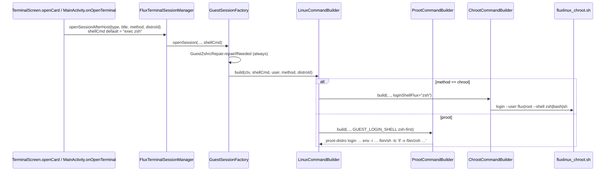
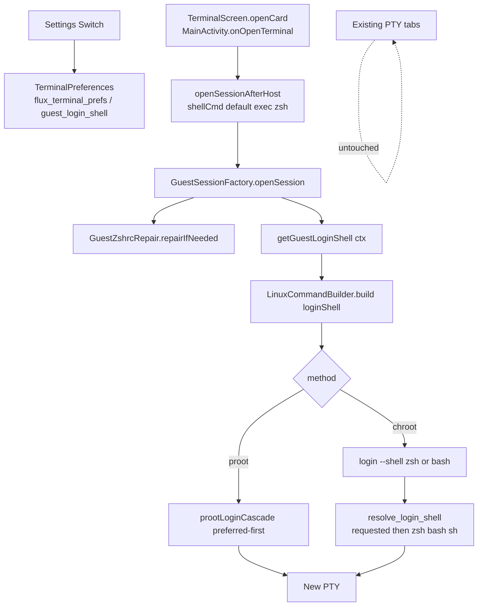

# Universal Guest Login Shell Toggle (bash / zsh)

| Field | Value |
| --- | --- |
| **Author** | TBD |
| **Date** | 2026-08-15 |
| **Updated** | 2026-08-15 (post-implement review) |
| **Status** | **IMPLEMENTED (PR1–PR3)** — comment residuals R1; chroot/minirootfs device smoke open |
| **Repo** | `/home/abhaybyte/repos/fluxlinux` |
| **Audience** | Implementers of Terminal session launch + Settings |
| **Worker prompt** | [worker-prompt-universal-guest-shell-toggle.md](./worker-prompt-universal-guest-shell-toggle.md) |
| **Code review** | local, 0 bugs / 3 suggestions / 1 nit (`/tmp/grok-1000/grok-review-aa37523c.md`) |

---

## Implementation status (2026-08-15)

Worker landed PR1–PR3 in the working tree (uncommitted). Local code review **approved** (0 bugs). Locked contracts hold: factory-only pref injection, never-null `ZSH|BASH`, proot `isLoginSentinel` vs chroot `isInteractiveLogin`, `loginShell == null` legacy mapping, `buildRootInner` defaults unchanged, helper v2.5 root `sh|ash`, Settings polarity/copy exact, test matrix present.

| PR | Title | State |
| --- | --- | --- |
| 1 | `GuestLoginShell` SSOT + `guest_login_shell` pref | **landed** |
| 2 | Builders + helper v2.5 (zero product default when `loginShell == null`) | **landed** |
| 3 | `GuestSessionFactory` injects pref + Settings switch + CHANGELOG | **landed** |

### Files shipped

- New: `GuestLoginShell.kt`, `GuestLoginShellTest.kt`, `FakePrefsContext.kt`, `TerminalPreferencesTest.kt`
- Builders: `ProotCommandBuilder.kt`, `ChrootCommandBuilder.kt`, `LinuxCommandBuilder.kt`
- Factory/UI: `GuestSessionFactory.kt`, `FluxTerminalSessionManager.kt` (KDoc), `TerminalSettingsScreen.kt`, `SettingsScreen.kt`
- Helper: `fluxlinux_chroot.sh` + `ChrootPaths.CHROOT_HELPER_VERSION` = `fluxlinux-chroot v2.5`
- Tests: `ProotCommandBuilderTest`, `ChrootCommandBuilderTest`, `LinuxCommandBuilderTest`, `ChrootPathsTest`
- `CHANGELOG.md` Unreleased: Feature (toggle + chroot-root follows pref) + Bug Fix (helper fail-open)

### Device smoke (worker)

- `:app:testIvarnaDebugUnitTest` and `:app:assembleIvarnaRelease` green; APK installed (KernelSU).
- Switch **off** → new **openSUSE proot** tab ran bash; switch **on** → new tab ran zsh; older bash tab stayed bash.
- Guest `/etc/passwd` still `/usr/bin/zsh` (not mutated; path is `/usr/bin/zsh` on this guest, not `/bin/zsh`).

**Not device-smoked:** chroot flux/root, Alpine/Chimera minirootfs `sh` fail-open, Debian and the other 11 distros. Unit tests cover those argv contracts.

### Residuals (do not block)

| ID | Sev | What |
| --- | --- | --- |
| R1 | suggestion | Strip PR-staging comments: `ChrootCommandBuilder.build` mapping table, `GuestLoginShell` “today’s ==”, unused `GUEST_LOGIN_SHELL` alias / back-compat KDoc, `ProotCommandBuilderTest` migration comment. |
| R2 | smoke | Device: Debian proot + one chroot flux/root pair; Alpine minirootfs still opens on `sh`. |
| R3 | **fixed** | Fedora chroot flux failed: helper hardcoded `/bin/su` (absent on F44+). v2.6: runuser → su → `--userspec`. Family now installs `util-linux`. |

---

## Overview

Every interactive proot/chroot session opened from the in-app Terminal page (and the Home / MainActivity guest-open paths that share `FluxTerminalSessionManager.openSessionAfterHost`) currently ends up in **zsh**. That is not because callers pick a shell — they omit `shellCmd` and inherit the default `"exec zsh"` sentinel — but because the **command builders hardcode zsh**:

- `ProotCommandBuilder.GUEST_LOGIN_SHELL` always prefers `/bin/zsh` if the binary exists (true on every customized distro).
- `ChrootCommandBuilder.build` sets `loginShellFlux = "zsh"` and only varies root (`bash`, or `sh` on Alpine paths).

Zsh + Oh My Zsh + agnosterzak + plugins is heavy under proot. Users need a **single global Settings toggle** to launch **bash** instead, without uninstalling zsh, without mutating guest `/etc/passwd`, and without changing host / install / XFCE GUI sessions.

This design introduces a **launch-time** preference (`zsh` default, `bash` opt-in) stored in the existing `TerminalPreferences` SharedPreferences file, a small **SSOT** (`GuestLoginShell`) for sentinels / cascade / `--shell` names, and wires that SSOT through `GuestSessionFactory` → `LinuxCommandBuilder` → proot/chroot builders. Live PTYs are not restarted.

Chroot **root** cards flip bash → zsh **only in PR3**, when the factory injects the pref **and** the Settings toggle exists as the escape hatch. PR2 is independently mergeable with **zero** product default change.

---

## Background & Motivation

### Current launch path (verified)



Verified call sites that **do not** pass `shellCmd` (so they are interactive login):

| Site | Function | Notes |
| --- | --- | --- |
| `ui/screens/TerminalScreen.kt` | `openCard()` | Host card branches to `openHostShellAfterReady` (out of scope). Guest cards call `openSessionAfterHost` without `shellCmd`. |
| `MainActivity.kt` ~L524–555 | `onOpenTerminal(distroId, root)` | Home-driven flux / root guest open. Same factory path. |
| `FluxTerminalSessionManager.openSessionAfterHost` | default `shellCmd = "exec zsh"` | Facade only. |
| `GuestSessionFactory.openSession` | default `shellCmd = "exec zsh"` | Also always runs `GuestZshrcRepair.repairIfNeeded`. |

Verified **non-interactive** (must stay payload / `/bin/sh`):

| Site | Why out of scope |
| --- | --- |
| `HomeScreen.kt` ~L441 | Qwen payload: `echo '…' \| base64 -d \| bash` — not a login sentinel. |
| `GuestSessionFactory.openComponentSession` | Root payload via `bash /tmp/flux_feature.sh` or `sh`. |
| `InstallSessionFactory` / uninstall | Host or root setup scripts. |
| `GuestSessionFactory.openHostShell` | `libbash -l` on the **host** prefix. |
| `start_gui.sh` / `start_guest_gui.sh` | XFCE `su -c` wrappers, not Terminal-page PTYs. |

### Why the toggle is a no-op today if we only change the UI

`ProotCommandBuilder` interactive branch **ignores** which sentinel was used. Both `"exec zsh"` and `"/bin/bash --login"` run the same `GUEST_LOGIN_SHELL`:

```29:32:app/src/main/kotlin/com/ivarna/fluxlinux/core/terminal/ProotCommandBuilder.kt
    /** Prefer zsh (customization), then bash, then ash/sh (Alpine minirootfs). */
    const val GUEST_LOGIN_SHELL =
        "/bin/sh -lc 'if [ -x /bin/zsh ]; then exec /bin/zsh -l; " +
            "elif [ -x /bin/bash ]; then exec /bin/bash -l; else exec /bin/sh -l; fi'"
```

On any customized Debian/Ubuntu/Alpine/… guest, `/bin/zsh` exists, so bash can never be selected. The cascade **must** become preference-aware.

Chroot is already `--shell`-capable (`fluxlinux_chroot.sh` v2.4 `login --shell zsh|bash`, `resolve_login_shell()`, `su -s /bin/bash` vs `su -s /bin/zsh`). The app simply never passes `--shell bash` for flux.

### Pain

- Interactive zsh is slow / RAM-heavy under proot.
- There is no Settings control; users cannot opt into bash without editing guest files.
- `"exec zsh"` is both a **sentinel** (“this is an interactive login”) and a **implied shell name**. Tests and builders conflate the two.

---

## Goals & Non-Goals

### Goals

1. One **global** preference: guest login shell is `zsh` or `bash`.
2. Applies to **every** Terminal-page proot **and** chroot card (Debian, Alpine, Fedora, Void, openSUSE, Deepin, Chimera, Manjaro, Ubuntu, Kali, Parrot, Archlinux — flux **and** root).
3. Same pref is honored by `MainActivity.onOpenTerminal` / any other `openSessionAfterHost` interactive open (same factory).
4. Settings → Terminal: one ExtraKeys-style glass Switch.
5. Default remains **zsh** (opt-in bash) for flux + proot. Chroot root stays bash until PR3 injects the pref (then zsh unless the user opted into bash).
6. Applies to **new sessions only**. Live PTYs keep their current shell.
7. Launch with explicit `exec /bin/{bash,zsh} -l` (proot) or `login --shell …` + `su -s` (chroot). **Do not** mutate `/etc/passwd` when toggling.
8. Fail-open fallback: requested shell if executable → the other of {bash, zsh} → `sh`/`ash`. Alpine/Chimera minirootfs must still open.
9. SSOT for sentinels, cascade string, and `--shell` name. Split predicates: Proot uses **sentinels only**; Chroot uses sentinels **or** the workdir form. Legacy sentinels (`exec zsh`, `exec bash`, `/bin/bash --login`, blank) remain interactive.
10. `GuestZshrcRepair` still runs when bash is selected.
11. Unit tests listed in the matrix below.

### Non-Goals (v1)

- Host shell (`openHostShell` / `libbash -l`).
- Install / uninstall / `openComponentSession` payloads.
- XFCE / X11 GUI terminals (`start_gui.sh`, `start_guest_gui.sh`).
- Uninstalling zsh, OMZ, pokemon-colorscripts, or undoing `chsh` in customization scripts.
- Per-distro or per-card shell prefs.
- Restarting or rewriting live session PTYs. No “reopen tabs” toast (optional later).
- Changing `GuestZshrcRepair.ensureFluxLoginShellZsh` (passwd stays zsh when zsh exists).
- Feature-flag framework; the pref **is** the flag.
- Tab-title suffix showing current shell.

---

## Key Decisions

| # | Decision | Rationale |
| --- | --- | --- |
| K1 | **One global pref**, not per-distro. | Product spec. **48 guest cards** (12 distros × proot/chroot × flux/root) would explode Settings. All guests share the same Flux customization (OMZ/zsh). |
| K2 | **Launch-time `-s` / `exec`, never toggle-time `chsh` or passwd rewrite.** | App uid cannot reliably write chroot `/etc/passwd` (SELinux `/data/local/tmp`). Mutating passwd surprises `su -` elsewhere, is sticky across toggle-back, and fights `ensureFluxLoginShellZsh` / `ensure_flux_zsh_profile`. `-s` already exists in the helper. |
| K3 | **Default `zsh`.** | User asked for a toggle, not a default flip. Customization + OMZ assume zsh. Existing tests hardcode `--shell zsh` / zsh-first cascade. |
| K4 | **`"exec zsh"` remains the API default `shellCmd` but becomes a *sentinel*, not a shell choice.** | Avoids touching every call site. Builders must not treat that string as “always run zsh”. |
| K5 | **SSOT object `GuestLoginShell`** (enum + helpers) + persist in `TerminalPreferences`. | Stops scattering `"exec zsh"` comparisons. Pure functions stay JVM-testable without Android. |
| K6 | **Inject pref in `GuestSessionFactory.openSession`**, pass `loginShell` down. Product `build()` default is **`null`** (legacy mapping), not `DEFAULT`. | `LinuxCommandBuilderTest` / `FakeContext` have **no** SharedPreferences. Reading prefs inside `LinuxCommandBuilder.build` would crash existing JVM tests. Factory is the only Context-aware interactive entry. `null` vs explicit enum is how PR2 stays default-preserving (`DEFAULT` **is** `ZSH`, so it cannot mean “legacy root bash”). |
| K7 | **Flux and root cards both honor the toggle once the factory injects the pref (PR3).** | Spec. Proot root already used `GUEST_LOGIN_SHELL`. Chroot root today is hardcoded `bash` (Alpine path `sh`). The bash→zsh flip for chroot root is **intentional** and ships **only in PR3**, with the Settings switch as the escape hatch. |
| K8 | **Alpine `loginShellRoot = "sh"` only on the unset (`loginShell == null`) product path.** | After customization Alpine has both zsh and bash (`setup_customization_alpine.sh` `apk add … zsh bash`). When the factory passes an explicit enum, both users get `loginShell.chrootFlag` (no Alpine special case). Minirootfs without either still fail-opens via `resolve_login_shell`. |
| K9 | **Small helper fix: root `guest_login` needs an explicit `sh\|ash` branch** (version bump v2.4 → v2.5). | Today root `case` is `zsh)` / `bash|*)` — if resolver returns `sh`, root tries `/bin/bash --login` and **fails** on Alpine minirootfs. Flux already has `sh\|ash`. Required for “Alpine-without-bash still lands on sh” on **root** cards. |
| K10 | **Do not skip `GuestZshrcRepair` when bash is selected.** | Repair is cheap; user can flip back to zsh on the next tab. |
| K11 | **UI: Settings → Terminal glass Switch**, checked = zsh. Not on the Terminal empty-state grid. | Matches ExtraKeys (A7). Grid is already dense (12 proot + 12 chroot sections + Host). Settings is the existing terminal-pref home. Copy is locked so polarity is obvious. |
| K12 | **New sessions only.** Helper text states this. No live-PTY restart. | Termux `TerminalSession` is a running pid; swapping argv requires kill + reopen. Out of scope. |
| K13 | **Proot interactive check = sentinels only.** Workdir form stays **chroot-only**. | Today Proot treats `mkdir -p DIR && cd DIR && exec zsh` as a **payload** (`/bin/sh -c` still runs mkdir/cd). Sharing `isInteractiveLogin` (which includes workdir) would drop the `cd` and open at `$HOME`. Split: `isLoginSentinel` (Proot) vs `isInteractiveLogin` (Chroot). |
| K14 | **`buildRootInner` keeps `loginShellRoot = "bash"`.** Product `build()` maps `null` vs explicit enum. | Test/legacy contract (`interactiveRoot_loginBash`) must not change. Product default flip is tested on `LinuxCommandBuilder.build` / `ChrootCommandBuilder.build`, not by changing `buildRootInner` defaults. |

---

## Proposed Design

### 1. Preference persistence (existing SSOT file)

Extend `app/src/main/kotlin/com/ivarna/fluxlinux/core/utils/TerminalPreferences.kt`.

Existing store: SharedPreferences `flux_terminal_prefs` (`font_size`, `show_extra_keys`).

Add:

```kotlin
private const val KEY_GUEST_LOGIN_SHELL = "guest_login_shell"

fun getGuestLoginShell(context: Context): GuestLoginShell =
    GuestLoginShell.fromId(
        prefs(context).getString(KEY_GUEST_LOGIN_SHELL, null)
    )

fun setGuestLoginShell(context: Context, shell: GuestLoginShell) {
    prefs(context).edit()
        .putString(KEY_GUEST_LOGIN_SHELL, shell.id)
        .apply()
}

fun preferZsh(context: Context): Boolean =
    getGuestLoginShell(context) == GuestLoginShell.ZSH
```

- Missing / unknown / empty value → `GuestLoginShell.ZSH` (default).
- Persist only `"zsh"` or `"bash"` (enum `id`).
- No migration. First launch = zsh, identical to today for flux cards.

### 2. Command SSOT: `GuestLoginShell`

New file: `app/src/main/kotlin/com/ivarna/fluxlinux/core/terminal/GuestLoginShell.kt`.

**No Android imports.** Pure JVM.

**Predicate split (locked — do not collapse):**

| Function | Matches | Used by |
| --- | --- | --- |
| `isLoginSentinel(shellCmd)` | trimmed `""`, `exec zsh`, `exec bash`, `/bin/bash --login` | **Proot only** |
| `parseInteractiveWorkdir(shellCmd)` | `mkdir -p DIR && cd DIR && exec zsh\|bash` | **Chroot only** (extract `--workdir`) |
| `isInteractiveLogin(shellCmd)` | sentinel **or** workdir | **Chroot only** |

Proot must **not** call `isInteractiveLogin`. A workdir-form `shellCmd` is a **payload** under proot today (`env -i … /bin/sh -c 'mkdir -p … && cd … && exec zsh'`). Treating it as interactive would run only `prootLoginCascade` and **drop the `cd`**. There is no production workdir caller for proot; keep that payload behavior so a future copied string still mkdir/cd.

`trim()` is **intentional** and a small contract change vs today’s untrimmed `==`. `" exec zsh "` becomes a sentinel. Documented; no production caller pads the sentinel.

```kotlin
package com.ivarna.fluxlinux.core.terminal

enum class GuestLoginShell(val id: String) {
    ZSH("zsh"),
    BASH("bash");

    /** Value for fluxlinux_chroot.sh `login --shell`. */
    val chrootFlag: String get() = id

    companion object {
        val DEFAULT: GuestLoginShell = ZSH

        /** Legacy default `shellCmd` — means “interactive login”, not “force zsh”. */
        const val INTERACTIVE_SENTINEL = "exec zsh"

        fun fromId(raw: String?): GuestLoginShell =
            if (raw.equals(BASH.id, ignoreCase = true)) BASH else ZSH

        /**
         * Login sentinels only — **Proot** interactive check.
         * Does **not** treat the workdir form as interactive (that would drop mkdir/cd).
         * trim() is intentional: `" exec zsh "` counts (today’s `==` did not).
         */
        fun isLoginSentinel(shellCmd: String): Boolean {
            val t = shellCmd.trim()
            return t.isEmpty() ||
                t == INTERACTIVE_SENTINEL ||
                t == "exec bash" ||
                t == "/bin/bash --login"
        }

        /**
         * Chroot interactive check: sentinels **or** workspace workdir form.
         */
        fun isInteractiveLogin(shellCmd: String): Boolean =
            isLoginSentinel(shellCmd) || parseInteractiveWorkdir(shellCmd) != null

        /**
         * Workspace form (chroot-only): `mkdir -p DIR && cd DIR && exec zsh|bash`
         * (same path, no single quotes). Null if not that form.
         */
        fun parseInteractiveWorkdir(shellCmd: String): String? {
            val t = shellCmd.trim()
            val m = Regex("""^mkdir -p (.+) && cd \1 && exec (?:zsh|bash)$""").matchEntire(t)
                ?: return null
            val dir = m.groupValues[1].trim()
            return dir.takeIf { it.isNotEmpty() && !it.contains('\'') }
        }

        /**
         * Proot in-guest cascade. Preference-first, then the other of
         * {bash, zsh}, then sh. Checks `/bin/*` only (today’s contract).
         */
        fun prootLoginCascade(preferred: GuestLoginShell): String {
            val first = preferred.id
            val second = if (preferred == ZSH) "bash" else "zsh"
            return "/bin/sh -lc 'if [ -x /bin/$first ]; then exec /bin/$first -l; " +
                "elif [ -x /bin/$second ]; then exec /bin/$second -l; else exec /bin/sh -l; fi'"
        }
    }
}
```

**Fallback (must be fail-open):**

```text
requested executable?  →  exec that -l
else the other of {bash, zsh} executable?  →  exec that -l
else  →  exec /bin/sh -l     (ash/busybox on Alpine/Chimera minirootfs)
```

Zsh-pref cascade (default, **byte-equivalent** to today’s `GUEST_LOGIN_SHELL`):

```sh
if [ -x /bin/zsh ]; then exec /bin/zsh -l
elif [ -x /bin/bash ]; then exec /bin/bash -l
else exec /bin/sh -l
fi
```

Bash-pref cascade (**this is the whole point of the feature**):

```sh
if [ -x /bin/bash ]; then exec /bin/bash -l
elif [ -x /bin/zsh ]; then exec /bin/zsh -l
else exec /bin/sh -l
fi
```

Without the swap, bash toggle is a no-op on every customized rootfs.

`/bin/` only: matches current `GUEST_LOGIN_SHELL`. Customized guests and `usr/bin`→`/bin` distros (Chimera) already satisfy this. Do not expand to `/usr/bin` in v1 (behavior change / test noise).

### 3. Builder changes

#### `ProotCommandBuilder`

- Change `const val GUEST_LOGIN_SHELL` to a **`val`** alias of `GuestLoginShell.prootLoginCascade(DEFAULT)` (cannot stay `const val` once it calls a function). Grep leftover refs first.
- `buildArgs(..., loginShell: GuestLoginShell = GuestLoginShell.DEFAULT)`.
- Interactive test is **`GuestLoginShell.isLoginSentinel(shellCmd)`** — **not** `isInteractiveLogin`. Workdir strings stay on the payload `/bin/sh -c` branch (mkdir/cd preserved).
- Interactive argv uses `GuestLoginShell.prootLoginCascade(loginShell)` instead of the zsh-first const.
- Non-interactive branch **unchanged**: `env -i … /bin/sh -c 'payload'`.
- `build(ctx, …)` forwards `loginShell` defaulting to `DEFAULT` (does **not** read prefs). `"exec bash"` is now a sentinel (today it is a payload) — add a unit test.

#### `ChrootCommandBuilder`

`buildRootInner` **defaults stay exactly as today** (test/legacy contract):

```kotlin
fun buildRootInner(
    shellCmd: String,
    user: String = "flux",
    helper: String = ChrootPaths.CHROOT_HELPER,
    loginShellFlux: String = "zsh",
    loginShellRoot: String = "bash"   // DO NOT change to "zsh"
): String
```

`interactiveRoot_loginBash` stays: `buildRootInner("", user = "root")` → `--shell bash`.

Product `build(ctx, …, loginShell: GuestLoginShell? = null)` — **nullable**. `DEFAULT` (`ZSH`) cannot mean “legacy root bash”.

```kotlin
// Product mapping (locked).
//
//   loginShell == null  → today's defaults (PR2-safe, zero flip)
//     flux → zsh
//     root → bash, except Alpine path → sh
//   loginShell != null  → both users get loginShell.chrootFlag
//     (PR3 factory always passes ZSH or BASH from prefs)

val isAlpine = chrootPath.contains("Alpine", ignoreCase = true)
val fluxFlag = loginShell?.chrootFlag ?: "zsh"
val rootFlag = when {
    loginShell != null -> loginShell.chrootFlag
    isAlpine -> "sh"
    else -> "bash"
}
val rootInner = buildRootInner(
    shellCmd, user,
    loginShellFlux = fluxFlag,
    loginShellRoot = rootFlag
)
```

Rewrite the stale `build()` comments (“Always request zsh for flux”, Alpine `File.exists()` probe). New comment: **shell comes from `loginShell`; helper resolves the real binary as root (app uid cannot stat `/data/local/tmp`).** Delete `isAlpine` only if it is unused after the mapping (it stays for the `null` path).

`buildRootInner` body:

- `isInteractive` via **`GuestLoginShell.isInteractiveLogin(shellCmd)`** (sentinels **or** workdir).
- Replace private `parseInteractiveWorkdir` with `GuestLoginShell.parseInteractiveWorkdir`.
- Still emit `login --user flux --shell $loginShellFlux` / `login --user root --shell $loginShellRoot`.
- Non-interactive `sh` / `b64` branches **unchanged**.

#### `LinuxCommandBuilder.build`

```kotlin
fun build(
    ctx: Context,
    shellCmd: String,
    user: String = "flux",
    useSharedTmp: Boolean = true,
    method: String = currentMethod,
    distroId: String? = null,
    loginShell: GuestLoginShell? = null   // null = legacy product defaults
): Pair<Array<String>, HashMap<String, String>>
```

Forward `loginShell` to both builders. **Do not** call `TerminalPreferences` here (FakeContext / existing tests).

Proot builder may coerce `loginShell ?: GuestLoginShell.DEFAULT` (zsh-first is already today’s proot default).

#### `GuestSessionFactory.openSession` (PR3 only)

Single injection point. `getGuestLoginShell` always returns `ZSH` or `BASH` — **never null** — so chroot flux **and** root honor the pref (this is when chroot root flips to zsh if the pref is default zsh).

```kotlin
GuestZshrcRepair.repairIfNeeded(ctx, method, distroId)   // KEEP, even if bash
GuestApkDbRepair.repairIfNeeded(ctx, method, distroId)   // unchanged
val user = LinuxCommandBuilder.sessionUserForType(type)
val loginShell = TerminalPreferences.getGuestLoginShell(ctx)  // ZSH | BASH, never null
val (args, envMap) = LinuxCommandBuilder.build(
    ctx, shellCmd, user = user, method = method, distroId = distroId,
    loginShell = loginShell
)
```

Update KDoc: default `shellCmd = "exec zsh"` means interactive login; actual binary comes from `TerminalPreferences`.

`openHostShell` / `openComponentSession`: **no change**.

`FluxTerminalSessionManager`: **no new parameters**. Defaults stay. KDoc only.

`TerminalScreen.openCard` / `MainActivity.onOpenTerminal`: **no signature change**.

`HomeScreen` Qwen payload: **no change** (not a sentinel).

### 4. Chroot helper: root `sh` fail-open (justified version bump)

File: `app/src/main/assets/scripts/chroot/fluxlinux_chroot.sh`  
Constants: `ChrootPaths.CHROOT_HELPER_VERSION` + header `fluxlinux-chroot v2.4` + `VERSION_STR`.

**Already correct (do not change):**

- CLI: `login --shell zsh|bash` (and any name `resolve_login_shell` accepts).
- `LOGIN_SHELL="${FLUX_SHELL:-zsh}"`.
- `resolve_login_shell`: if requested exists → use it; else `zsh bash sh`; last resort `sh`. `guest_bin_exists` checks `/bin` and `/usr/bin`.
- Flux `guest_login` cases: `bash` / `sh|ash` / `zsh|*` with `su -s`.
- `ensure_flux_zsh_profile` passwd rewrite to `/bin/zsh` when zsh exists — **leave it**. App sessions pass `-s`, so passwd is overridden.

**Must change (pre-existing hole, now on the critical path):**

Replace the **entire** `root)` `case "$LOGIN_SHELL"` in `guest_login` with this drop-in (flux `sh|ash` / `_cd` pattern). Do **not** change `resolve_login_shell` order.

```sh
    root)
      case "$LOGIN_SHELL" in
        zsh)
          if [ -n "$_cd" ]; then
            guest_chroot_env /bin/zsh -c "${_cd}exec /bin/zsh -l"
          else
            guest_chroot_env /bin/zsh -l
          fi
          ;;
        sh|ash)
          # Alpine/Chimera minirootfs — resolver may return sh when bash/zsh missing
          if [ -n "$_cd" ]; then
            guest_chroot_env /bin/sh -c "${_cd}exec /bin/sh -l"
          else
            guest_chroot_env /bin/sh -l
          fi
          ;;
        bash|*)
          if [ -n "$_cd" ]; then
            guest_chroot_env /bin/bash --login -c "${_cd}exec /bin/bash --login"
          else
            guest_chroot_env /bin/bash --login
          fi
          ;;
      esac
      ;;
```

Bump:

- Script header + `VERSION_STR` → `fluxlinux-chroot v2.5`
- `ChrootPaths.CHROOT_HELPER_VERSION = "fluxlinux-chroot v2.5"`

`RootShell.ensureChrootHelper` restages the asset when the version string is missing. Existing devices pick this up on next chroot session.

**Fallback order of `resolve_login_shell` does not need to become preference-aware.** The app always passes `--shell bash` or `--shell zsh`. Resolver: requested-if-present, then zsh, bash, sh. If user asked bash and bash is missing, next hit is zsh then sh — matches “other of {bash,zsh} then sh”.

### 5. Confirm Terminal-page paths never rely on passwd

| Path | How the binary is chosen | Passwd used? |
| --- | --- | --- |
| Proot interactive | `proot-distro login --user $u -- env -i … /bin/sh -lc 'exec /bin/{zsh,bash,sh} -l'` | No. Explicit `exec`. |
| Chroot flux | `su - flux -s /bin/zsh` or `-s /bin/bash` or `-s /bin/sh` | Overridden by `-s`. |
| Chroot root | `guest_chroot_env /bin/zsh -l` or `/bin/bash --login` or `/bin/sh -l` | No `su`; explicit path. |
| `ensure_flux_zsh_profile` / `ensureFluxLoginShellZsh` | Rewrite flux passwd → `/bin/zsh` | Only affects `su -` **without** `-s` (not a Terminal-page path). |

Customization `chsh -s /bin/zsh` stays. Toggle-back to zsh just execs zsh again; passwd was never flipped to bash.

### 6. Settings UI

#### `TerminalSettingsScreen.kt`

Add a third `GlassSettingCard` after ExtraKeys, same `Row` + `Column(weight=1)` + `Switch` layout as ExtraKeys (`ui/components/GlassCard.kt` `GlassSettingCard`). **One title + one subtitle** in the column (do not stack two 12sp muted lines). Optional live word sits **next to the Switch**, not under the title.

**Copy and layout (locked):**

```
GlassSettingCard {
  Row(padding 20.dp, verticalCenter) {
    Column(Modifier.weight(1f)) {
      Text title:   "Guest login shell"          // 16sp Bold, ExtraKeys title color
      Spacer 4.dp
      Text subtitle: "On = zsh, off = bash. New proot/chroot Terminal sessions only; live tabs keep their shell."
                     // 12sp, onSurface 65% alpha  — ExtraKeys subtitle style
    }
    Spacer 12.dp
    Text: if (checked) "zsh" else "bash"         // 12sp muted; optional but required here
    Switch(
      checked = (shell == GuestLoginShell.ZSH),
      onCheckedChange = { on ->
        setGuestLoginShell(if (on) ZSH else BASH)
      }
    )
  }
}
```

| Element | Locked value |
| --- | --- |
| Title | `Guest login shell` |
| Subtitle (static) | `On = zsh, off = bash. New proot/chroot Terminal sessions only; live tabs keep their shell.` |
| Live word next to Switch | `zsh` (checked) / `bash` (unchecked) |
| Switch `contentDescription` | `Guest login shell: zsh` or `Guest login shell: bash` |
| `checked` | `true` = ZSH (status quo), `false` = BASH (opt-in) |
| `onCheckedChange` | `true` → `setGuestLoginShell(ZSH)`; `false` → `setGuestLoginShell(BASH)` |

Polarity is the inverse of “turn the new thing on”: **checked = keep zsh**. The static “On = zsh, off = bash” line plus the live word make both states obvious. Segmented `zsh \| bash` was considered (A7) and rejected for ExtraKeys consistency.

State:

```kotlin
var guestShellZsh by remember {
    mutableStateOf(TerminalPreferences.preferZsh(context))
}
```

No live-session restart. No snackbar.

#### `SettingsScreen.kt` hub card

```
subtitle = "Font zoom, extra keys, and guest shell"
```

Today: `"Font zoom and extra keyboard rows"` (~L141).

### 7. Data flow after the change



### 8. Scope matrix (cards)

`TerminalShellCatalog.sections` emits **48 guest cards** (12 distros × proot/chroot × flux/root) plus Host.

| Card | Method | User | Today | After (pref=zsh) | After (pref=bash) |
| --- | --- | --- | --- | --- | --- |
| `* Shell` | proot | flux | zsh-first cascade | same cascade | **bash-first** cascade |
| `* Shell Rooted` | proot | root | same zsh-first cascade | same | **bash-first** |
| `* Chroot Shell` | chroot | flux | `--shell zsh` | `--shell zsh` | `--shell bash` |
| `* Chroot Rooted` | chroot | root | `--shell bash` (Alpine path `--shell sh`) | **`--shell zsh`** (PR3 only) | `--shell bash` |
| Host Shell | host | host | `libbash -l` | unchanged | unchanged |

Chroot root default flipping from bash → zsh is the **only** user-visible default change. It ships **in PR3** with the Settings toggle, **not** in PR2 (K7 / PR Plan). After PR3, Alpine root no longer hardcodes `sh` because the factory always passes an explicit enum.

Alpine/Chimera **minirootfs** (no bash, no zsh): both prefs resolve to `sh`. Session still opens.

---

## API / Interface Changes

### New public API

```kotlin
// GuestLoginShell.kt
enum class GuestLoginShell(val id: String) { ZSH("zsh"), BASH("bash") }

// TerminalPreferences
fun getGuestLoginShell(context: Context): GuestLoginShell
fun setGuestLoginShell(context: Context, shell: GuestLoginShell)
fun preferZsh(context: Context): Boolean
```

### Signature additions (all defaulted — existing call sites compile)

```kotlin
fun ProotCommandBuilder.buildArgs(..., loginShell: GuestLoginShell = DEFAULT)
fun ProotCommandBuilder.build(..., loginShell: GuestLoginShell = DEFAULT)

// Product path: null = legacy defaults (flux zsh, root bash / Alpine sh).
fun ChrootCommandBuilder.build(..., loginShell: GuestLoginShell? = null)
fun LinuxCommandBuilder.build(..., loginShell: GuestLoginShell? = null)

// Test/legacy contract — DO NOT change these String defaults:
fun ChrootCommandBuilder.buildRootInner(
    ...,
    loginShellFlux: String = "zsh",
    loginShellRoot: String = "bash"
)
```

### Unchanged signatures

- `FluxTerminalSessionManager.openSessionAfterHost` / `openSession` (`shellCmd` default stays `"exec zsh"`).
- `GuestSessionFactory.openSession` default `shellCmd`.
- `openHostShell`, `openComponentSession`, install/uninstall.

### Semantic change

`shellCmd == "exec zsh"` no longer means “run zsh”. It means “interactive login; use `loginShell`”.

---

## Data Model Changes

| Store | Key | Type | Default | Migration |
| --- | --- | --- | --- | --- |
| `flux_terminal_prefs` | `guest_login_shell` | String `zsh` \| `bash` | absent → zsh | None. Treat unknown as zsh. |

No Room / files / guest disk schema. No passwd / `chsh` writes from the toggle.

Guest on-disk remains:

- `/etc/passwd` flux shell = `/bin/zsh` after customization / `ensureFluxLoginShellZsh` / `ensure_flux_zsh_profile`.
- OMZ + plugins installed.

---

## Alternatives Considered

### A1. Per-distro shell vs one global toggle

| | Per-distro | Global (chosen) |
| --- | --- | --- |
| UX | 12+ switches or a picker on every card | One Settings switch |
| Storage | map distroId → shell | one string |
| Product | User asked global | Matches spec |
| Cost | Catalog + Settings + tests explode | One pref, one factory read |

Rejected per-distro. If a later distro truly cannot run bash (none today after customization), fallback already lands on zsh then sh.

### A2. Mutating `/etc/passwd` vs launch-time `-s` / `exec`

| | Mutate passwd / `chsh` | Launch-time (chosen) |
| --- | --- | --- |
| Chroot writability | App uid cannot stat/write `/data/local/tmp` (SELinux). Today’s `File.exists()` comment in `ChrootCommandBuilder` exists for this reason. | Helper runs as root; `-s` already implemented. |
| Toggle-back | Must rewrite again; races with `ensureFluxLoginShellZsh` | Pref flip; next session execs the other binary |
| Side effects | `su - flux` inside guest / cron / GUI helpers change unexpectedly | Only Terminal-page interactive logins |
| Alpine minirootfs | `chsh` may fail (no zsh in `/etc/shells`) | Resolver fail-opens to sh |

### A3. Default bash vs default zsh

Default bash would instantly speed up proot for everyone but:

- Breaks the configured OMZ first-run experience.
- Forces a silent behavior change on existing users who did not ask for it.
- Invalidates `ChrootCommandBuilderTest.interactiveFlux_loginZsh` and every `"exec zsh"` mental model.

Chosen: **default zsh, bash opt-in**.

### A4. Toggle on Terminal empty-state vs Settings → Terminal

Empty-state is a 2-column grid of **12 proot + 12 chroot sections + Host** (`TerminalShellCatalog`, 48 guest cards). A global control there would be easy to miss or look per-card. Settings → Terminal already owns font zoom + ExtraKeys (`TerminalPreferences`). Chosen: Settings.

### A5. Changing only `GUEST_LOGIN_SHELL` (proot) and forgetting chroot `--shell`

Would leave every chroot flux card on zsh and chroot root on bash. Incomplete vs “universal”. Both builders must consume `loginShell`.

### A6. `chsh` at toggle time via a guest command

Would require opening a root payload session (or silent `LinuxCommandBuilder.build` exec) against **every installed** proot + chroot rootfs when the user flips a switch. Slow, partial (uninstalled distros), SELinux-fragile on chroot, and still loses to `ensureFluxLoginShellZsh` on next open. Rejected.

### A7. ExtraKeys Switch vs segmented `zsh | bash`

| | Switch (chosen) | Segmented / two-value picker |
| --- | --- | --- |
| Polarity | Weak: checked = zsh (status quo), unchecked = bash (the new opt-in). Inverse of “turn the new thing on”. | Both names visible; no on/off metaphor. |
| Consistency | Same control as ExtraKeys on the same screen. | New control type on an otherwise Switch/stepper page. |
| Cost | One `Switch` + locked copy. | Extra Compose + a11y. |

Chosen: **Switch**, with Issue-4 locked copy (`On = zsh, off = bash` + live `zsh`/`bash` word + `contentDescription`). Segmented control is nicer polarity but not worth a one-off widget in v1.

---

## Security & Privacy Considerations

| Topic | Assessment |
| --- | --- |
| Threat model | Preference is a local UI choice of which **already installed** guest binary to `exec`. No new network, no new privileges. |
| Auth | Unchanged. Chroot still requires device root via `RootShell`; proot is app-uid. |
| Command injection | `loginShell.chrootFlag` is only `"zsh"` or `"bash"` (enum). Never interpolate raw pref strings into `buildRootInner`. Workdir quoting stays `shellSingleQuote` + reject `'`. |
| Passwd / SELinux | We deliberately do **not** write chroot passwd from the app. Helper may still rewrite flux → zsh as today. |
| Data handling | One string in app-private SharedPreferences. Not logged at info with PII. |
| Privacy | No analytics. Optional `Log.d("GuestSessionFactory", "loginShell=$id method=$method")` only. |

---

## Observability

The app has no product metrics pipeline for terminal opens. Use existing `Log` style (`GuestZshrcRepair`, `TerminalLauncher`).

| Signal | Where | Level |
| --- | --- | --- |
| Chosen shell at open | `GuestSessionFactory.openSession` | `Log.d` tag `GuestSessionFactory`: `loginShell=zsh|bash method=proot|chroot distroId=…` |
| Session open failure | existing `SessionOpenResult.OPEN_FAILED` toasts | unchanged |
| Helper restage | `RootShell.ensureChrootHelper` version grep | existing |

**Alerting:** none. Device smoke (manual): Debian proot flux/root × both prefs; Alpine chroot minirootfs (if available) still opens on bash pref.

**Latency / load:** no extra process. Bash login is expected to be lighter than zsh+OMZ (qualitative; no SLA). Pref read is one SharedPreferences get on session open (same as ExtraKeys).

---

## Rollout Plan

1. **No feature flag.** The pref **is** the flag.
2. **PR2 is independently mergeable with zero product default change.** Unset `loginShell` keeps flux zsh, chroot root bash (Alpine root `sh`). Helper v2.5 only fail-opens minirootfs root to `sh` (bugfix). Changelog: helper fail-open only.
3. **PR3 is the user-visible flip + escape hatch.** Factory injects `ZSH`/`BASH`; chroot root becomes zsh when the pref is default zsh; Settings switch lets users pick bash. Call this out in the **PR3** description and root `CHANGELOG.md` (Features + note under the current unreleased / next version heading).
4. Ship helper v2.5 with PR2. `ensureChrootHelper` restages on next chroot open.
5. **Staged verification:** unit tests → device: Debian proot bash tab, Debian chroot bash tab, Alpine proot bash (customized has bash), flip back to zsh, confirm live tab still zsh.
6. **Rollback:** revert PR3 to restore chroot-root bash without the toggle; or users flip the switch to bash. Pref key can remain (harmless). Helper v2.5 is backward compatible for `--shell zsh|bash`.

---

## Risks

| Risk | Sev | Mitigation |
| --- | --- | --- |
| Alpine/Chimera minirootfs has neither bash nor zsh | High if we `exec` a missing binary | Cascade + `resolve_login_shell` end on `sh`. Helper root `sh\|ash` branch (K9). |
| `resolve_login_shell` fallback list starts with zsh when requested is missing | Low | Correct: “other of {bash,zsh}”. If bash requested and missing → zsh → sh. |
| `ensure_flux_zsh_profile` rewrites passwd; a future path using `su -` without `-s` ignores bash pref | Med | Documented. All Terminal-page paths use `-s` / explicit exec. Do not add a passwd-only login later. |
| Existing tests hardcode `exec zsh` / `--shell zsh` / chroot root `--shell bash` | Med | Keep `interactiveRoot_loginBash`. Add product-path `LinuxCommandBuilder.build` cases for default/`ZSH`/`BASH`. |
| Helper asset not restaged | Low | Version string bump; `RootShell.ensureChrootHelper` already greps `CHROOT_HELPER_VERSION`. |
| Proot cascade only checks `/bin/bash` not `/usr/bin/bash` | Low | Same as today. Customization installs `/bin/bash` or a `/bin` symlink. |
| Chroot root default changes to zsh | Low/Med | Intentional (K7). **PR3 only**, with Settings escape hatch. Changelog. |
| `"exec zsh"` default param confuses future readers | Low | KDoc + `GuestLoginShell.INTERACTIVE_SENTINEL`. |
| FakeContext + `getGuestLoginShell` if someone reads prefs in `LinuxCommandBuilder` | High | **Forbidden.** Injection only in `GuestSessionFactory`. Tests pass `loginShell` explicitly. |

---

## Open Questions

None blocking implementation. Deferred (non-v1):

1. Optional later: toast “Reopen a tab to apply guest shell” — rejected for v1.
2. Whether chroot root should stay bash when pref is zsh — **decided no** (K7). Flip ships in PR3 with the toggle.
3. Host shell toggle — out of scope (host is `libbash`, not a guest).

---

## Worker Implementation Notes

Enough detail for a later worker prompt. Do **not** implement in the design pass.

### File-by-file

#### New: `app/src/main/kotlin/com/ivarna/fluxlinux/core/terminal/GuestLoginShell.kt`

- Enum `ZSH` / `BASH`, `DEFAULT = ZSH`, `INTERACTIVE_SENTINEL = "exec zsh"`.
- `fromId`, **`isLoginSentinel`**, **`isInteractiveLogin`**, `parseInteractiveWorkdir`, `prootLoginCascade`.
- No Android imports. Do **not** collapse the two predicates.

#### `core/utils/TerminalPreferences.kt`

- `KEY_GUEST_LOGIN_SHELL = "guest_login_shell"`.
- `getGuestLoginShell` / `setGuestLoginShell` / `preferZsh`.
- Update file KDoc: “font zoom + ExtraKeys + guest login shell”.

#### `core/terminal/ProotCommandBuilder.kt`

- `buildArgs`: add `loginShell: GuestLoginShell = DEFAULT`.
- Replace interactive `if (shellCmd == "exec zsh" || …)` with **`GuestLoginShell.isLoginSentinel(shellCmd)`**. **Do not** use `isInteractiveLogin` (that includes workdir and would drop mkdir/cd).
- Use `GuestLoginShell.prootLoginCascade(loginShell)` in the interactive `exec python … -- $env …` string.
- Change `const val GUEST_LOGIN_SHELL` to a **`val`** alias of `prootLoginCascade(DEFAULT)` (grep refs). Do not leave a `const val` that calls a function.
- `build`: thread `loginShell`.
- Non-interactive `/bin/sh -c` untouched (workdir-form strings stay here).

#### `core/terminal/ChrootCommandBuilder.kt`

- `build(..., loginShell: GuestLoginShell? = null)` using the **locked mapping** in §3 (`null` → flux zsh / root bash / Alpine root sh; non-null → both `loginShell.chrootFlag`).
- **Do not** change `buildRootInner` String defaults (`loginShellFlux = "zsh"`, `loginShellRoot = "bash"`).
- `buildRootInner`: use **`GuestLoginShell.isInteractiveLogin`** + `GuestLoginShell.parseInteractiveWorkdir`. Delete private `parseInteractiveWorkdir`.
- Delete unused Alpine comments. Rewrite the SELinux/`File.exists()` comment to: **shell comes from `loginShell`; helper resolves the real binary as root (app uid cannot stat `/data/local/tmp`).** Keep `isAlpine` only for the `loginShell == null` root mapping.

#### `core/terminal/LinuxCommandBuilder.kt`

- `build(..., loginShell: GuestLoginShell? = null)` forwarded to both builders. Null = legacy product defaults.

#### `core/terminal/GuestSessionFactory.kt`

- After repairs, `val loginShell = TerminalPreferences.getGuestLoginShell(ctx)` and pass into `LinuxCommandBuilder.build`. Never pass `null` from the factory (that would keep legacy chroot-root bash).
- KDoc: sentinel vs pref.
- **Do not** skip `GuestZshrcRepair` when bash.
- `openHostShell` / `openComponentSession` untouched.

#### `core/terminal/FluxTerminalSessionManager.kt`

- KDoc only on `openSessionAfterHost` / `openSession`: shellCmd default is interactive sentinel; shell binary from prefs.

#### `ui/screens/TerminalSettingsScreen.kt`

- ExtraKeys-style `Row` + `Switch` card. **Locked copy and layout in §6** (one subtitle, live `zsh`/`bash` word next to the Switch, `contentDescription`).
- `remember { TerminalPreferences.preferZsh(context) }`.

#### `ui/screens/SettingsScreen.kt`

- Terminal nav subtitle → `Font zoom, extra keys, and guest shell`.

#### `assets/scripts/chroot/fluxlinux_chroot.sh` + `core/root/ChrootPaths.kt`

- Replace the root `case "$LOGIN_SHELL"` with the **full drop-in in §4** (zsh / sh|ash / bash|*, each with and without `$_cd`).
- Version `v2.4` → `v2.5` in header, `VERSION_STR`, **and** `ChrootPaths.CHROOT_HELPER_VERSION` in the **same PR**. Add `ChrootPathsTest` one-liner so they cannot drift.
- Do **not** change `ensure_flux_zsh_profile`, flux `su -s` cases, or `resolve_login_shell` order.

#### Do **not** touch

- `setup_customization_debian.sh` / `_xfce.sh` / `_alpine.sh` / KDE `chsh`.
- `GuestZshrcRepair.ensureFluxLoginShellZsh`.
- `TerminalScreen.openCard` argv (except it automatically picks up factory).
- `MainActivity.onOpenTerminal`, `HomeScreen` Qwen payload.
- `openHostShell`, install/uninstall factories, GUI scripts.

### Test infrastructure for prefs

There is **no Robolectric** and `FakeContext` does not implement `getSharedPreferences`. Do **not** add Robolectric.

1. **`GuestLoginShellTest`** covers all pure logic (default, parse, cascade, sentinels, workdir).
2. **`TerminalPreferencesTest`**: add a tiny in-memory `SharedPreferences` + a `FakePrefsContext` (or extend `FakeContext`) that implements `getApplicationContext()` + `getSharedPreferences(name, mode)`. Assert:
   - unset → `ZSH`
   - `setGuestLoginShell(BASH)` → `getGuestLoginShell() == BASH`
   - `setGuestLoginShell(ZSH)` → `ZSH`
   - garbage stored string → `ZSH`

### Unit-test matrix

| Test class | Case | Expect |
| --- | --- | --- |
| `GuestLoginShellTest` | `fromId(null/"" /"zsh"/"ZSH")` | `ZSH` |
| | `fromId("bash"/"BASH")` | `BASH` |
| | `fromId("fish")` | `ZSH` |
| | `isLoginSentinel("")` / `"exec zsh"` / `"exec bash"` / `"/bin/bash --login"` / `" exec zsh "` (trim) | true |
| | `isLoginSentinel("echo hi")` | false |
| | workdir form is **not** a login sentinel | `isLoginSentinel("mkdir -p /home/flux/p && cd /home/flux/p && exec zsh")` → **false** |
| | `isInteractiveLogin` on that workdir form | **true** |
| | `isInteractiveLogin("echo hi")` | false |
| | Qwen-shaped payload `echo '…' \| base64 -d \| bash` | `isLoginSentinel` **and** `isInteractiveLogin` both **false** |
| | `parseInteractiveWorkdir("mkdir -p /home/flux/p && cd /home/flux/p && exec zsh")` | `/home/flux/p` |
| | same with `exec bash` | `/home/flux/p` |
| | quote in path / non-matching | null |
| | `prootLoginCascade(ZSH)` | contains `if [ -x /bin/zsh ]` **before** `/bin/bash` |
| | `prootLoginCascade(BASH)` | contains `if [ -x /bin/bash ]` **before** `/bin/zsh`; still ends `exec /bin/sh -l` |
| `TerminalPreferencesTest` | persist default / set bash / set zsh / garbage | as above |
| `ProotCommandBuilderTest` | existing debian/alpine login + `exec zsh` | still `login debian/alpine`, `env -i`; **and** joined args contain zsh-first cascade (`-x /bin/zsh` before `-x /bin/bash`) |
| | `loginShell = BASH`, `shellCmd = "exec zsh"` | args contain bash-first cascade even though sentinel says zsh |
| | `shellCmd = "exec bash"` | **interactive** (new: today this is a payload) + default zsh cascade |
| | `shellCmd = "echo hi"` | still `/bin/sh -c`, **no** login cascade |
| | Qwen-shaped `echo 'x' \| base64 -d \| bash` | `/bin/sh -c` payload, **not** `prootLoginCascade` |
| | workdir-form `mkdir -p /home/flux/p && cd /home/flux/p && exec zsh` | **payload** `/bin/sh -c` containing `mkdir` and `cd` (not stripped to cascade) |
| | blank `shellCmd` | interactive + default zsh cascade |
| `ChrootCommandBuilderTest` | `interactiveFlux_loginZsh` | **keep** `--shell zsh` |
| | `interactiveRoot_loginBash` | **keep as-is**: `buildRootInner("", user = "root")` → `--shell bash` |
| | new `interactiveRoot_explicitZshPref` | `buildRootInner("", user = "root", loginShellRoot = GuestLoginShell.DEFAULT.chrootFlag)` → `--shell zsh` |
| | new `interactiveFlux_loginBash` | `buildRootInner(..., loginShellFlux="bash")` → `--shell bash` |
| | new `interactiveRoot_honorsBashPref` | `loginShellRoot="bash"` → `--shell bash` |
| | `interactiveAlpine_loginSh` | **keep** as explicit `loginShellFlux="sh"` override |
| | `workdir` with `exec zsh` | keep |
| | new workdir with `exec bash` | `--workdir '…'` + `--shell` from params |
| | simple / b64 / winch / env | unchanged |
| `LinuxCommandBuilderTest` (seeded su) | existing `exec zsh` dispatch | still libbash / system sh |
| | `build(..., user="root", method="chroot")` **no** `loginShell` | argv contains `--shell bash` (PR2-safe product default) |
| | `build(..., user="root", method="chroot", loginShell=ZSH)` | `--shell zsh` |
| | `build(..., user="root", method="chroot", loginShell=BASH)` | `--shell bash` |
| | `build(..., user="flux", method="chroot")` no `loginShell` | `--shell zsh` |
| | `build(..., user="flux", method="chroot", loginShell=BASH)` | `--shell bash` |
| `ChrootPathsTest` | **always** add | `assertEquals("fluxlinux-chroot v2.5", ChrootPaths.CHROOT_HELPER_VERSION)` |

Do **not** try to unit-test the Android `Switch` or `GuestSessionFactory` (needs `TerminalSession` / native). Factory wiring is covered by: prefs + builders + the one-line pass-through.

### Acceptance criteria

1. Fresh install: Settings → Terminal switch is **on** (zsh). Opening Debian Shell still lands in zsh (OMZ prompt if customized).
2. Flip switch **off**: new Debian proot flux tab runs bash (`echo $0` → `bash`). Existing zsh tab unchanged.
3. Flip switch **on**: new tab is zsh again.
4. Same pref applies to Debian/Alpine/… proot **and** chroot, flux **and** root.
5. Host card still `libbash`. Qwen / component / install sessions unchanged.
6. Alpine minirootfs (no zsh, no bash): session opens on `sh` for either pref.
7. Guest `/etc/passwd` flux line still `/bin/zsh` after toggling to bash.
8. `GuestZshrcRepair` still runs (log / existing tests).
9. `./gradlew :app:testIvarnaDebugUnitTest` (or project-standard unit test task) green for the classes above.

### Implementation order (for the worker)

Implement PR1 → PR2 → PR3 below. Do not start UI before builders accept `loginShell`.

---

## References

- `app/src/main/kotlin/com/ivarna/fluxlinux/core/terminal/ProotCommandBuilder.kt`
- `app/src/main/kotlin/com/ivarna/fluxlinux/core/terminal/ChrootCommandBuilder.kt`
- `app/src/main/kotlin/com/ivarna/fluxlinux/core/terminal/LinuxCommandBuilder.kt`
- `app/src/main/kotlin/com/ivarna/fluxlinux/core/terminal/GuestSessionFactory.kt`
- `app/src/main/kotlin/com/ivarna/fluxlinux/core/terminal/FluxTerminalSessionManager.kt`
- `app/src/main/kotlin/com/ivarna/fluxlinux/core/terminal/TerminalShellCatalog.kt`
- `app/src/main/kotlin/com/ivarna/fluxlinux/core/terminal/GuestZshrcRepair.kt` (`ensureFluxLoginShellZsh`)
- `app/src/main/kotlin/com/ivarna/fluxlinux/core/utils/TerminalPreferences.kt`
- `app/src/main/kotlin/com/ivarna/fluxlinux/ui/screens/TerminalSettingsScreen.kt`
- `app/src/main/kotlin/com/ivarna/fluxlinux/ui/screens/SettingsScreen.kt`
- `app/src/main/kotlin/com/ivarna/fluxlinux/ui/screens/TerminalScreen.kt` (`openCard`)
- `app/src/main/kotlin/com/ivarna/fluxlinux/MainActivity.kt` (`onOpenTerminal`)
- `app/src/main/assets/scripts/chroot/fluxlinux_chroot.sh` (v2.4 → v2.5)
- `app/src/main/kotlin/com/ivarna/fluxlinux/core/root/ChrootPaths.kt` (`CHROOT_HELPER_VERSION`)
- Tests: `ProotCommandBuilderTest.kt`, `ChrootCommandBuilderTest.kt`, `LinuxCommandBuilderTest.kt`
- Customization `chsh` (do not edit): `setup_customization_debian.sh`, `setup_customization_xfce.sh`, `setup_customization_alpine.sh`, `setup_customization_kde_debian.sh`
- Plan background: `docs/plans/terminal-grid-extrakeys-interactive.md`
- Architecture: `docs/architecture.md`

---

## PR Plan

### PR 1 — Guest login shell SSOT + preference storage

- **Title:** `feat(terminal): GuestLoginShell SSOT and persist bash/zsh pref`
- **Files:**
  - `app/src/main/kotlin/com/ivarna/fluxlinux/core/terminal/GuestLoginShell.kt` (new)
  - `app/src/main/kotlin/com/ivarna/fluxlinux/core/utils/TerminalPreferences.kt`
  - `app/src/test/java/com/ivarna/fluxlinux/core/terminal/GuestLoginShellTest.kt` (new)
  - `app/src/test/java/com/ivarna/fluxlinux/core/utils/TerminalPreferencesTest.kt` (new)
  - `app/src/test/java/com/ivarna/fluxlinux/core/terminal/FakeContext.kt` (only if SharedPreferences stub lives here)
- **Depends on:** none
- **Description:** Add the enum, **`isLoginSentinel` vs `isInteractiveLogin` split**, cascade/workdir helpers, and SharedPreferences key. **No builder or UI behavior change.** Default remains zsh. Independently reviewable: pure functions + persist round-trip.

### PR 2 — Preference-aware builders + helper fail-open (**zero product default change**)

- **Title:** `feat(terminal): honor GuestLoginShell in proot cascade and chroot --shell`
- **Files:**
  - `app/src/main/kotlin/com/ivarna/fluxlinux/core/terminal/ProotCommandBuilder.kt`
  - `app/src/main/kotlin/com/ivarna/fluxlinux/core/terminal/ChrootCommandBuilder.kt`
  - `app/src/main/kotlin/com/ivarna/fluxlinux/core/terminal/LinuxCommandBuilder.kt`
  - `app/src/main/assets/scripts/chroot/fluxlinux_chroot.sh`
  - `app/src/main/kotlin/com/ivarna/fluxlinux/core/root/ChrootPaths.kt`
  - `app/src/test/java/com/ivarna/fluxlinux/core/terminal/ProotCommandBuilderTest.kt`
  - `app/src/test/java/com/ivarna/fluxlinux/core/terminal/ChrootCommandBuilderTest.kt`
  - `app/src/test/java/com/ivarna/fluxlinux/core/terminal/LinuxCommandBuilderTest.kt`
  - `app/src/test/java/com/ivarna/fluxlinux/core/root/ChrootPathsTest.kt` (**always** add version assert)
  - `CHANGELOG.md` (helper v2.5 fail-open only — not a chroot-root default flip)
- **Depends on:** PR 1
- **Description:** Thread nullable `loginShell` through product `build()` (`null` = legacy: flux zsh, root bash, Alpine root sh). Explicit `ZSH`/`BASH` sets **both** flux and root to that flag. Proot uses `isLoginSentinel` + preference-first cascade. Keep `buildRootInner(..., loginShellRoot = "bash")` and `interactiveRoot_loginBash`. Add product-path `LinuxCommandBuilder.build` tests (unset root → `--shell bash`; `loginShell=ZSH` root → `--shell zsh`; flux/root `BASH`). Helper root `sh|ash` drop-in + bump v2.4 → v2.5. **Do not merge a silent chroot-root flip.** UI unused.

### PR 3 — Factory injection + Settings toggle (**only user-visible default change**)

- **Title:** `feat(settings): guest login shell toggle for Terminal sessions`
- **Files:**
  - `app/src/main/kotlin/com/ivarna/fluxlinux/core/terminal/GuestSessionFactory.kt`
  - `app/src/main/kotlin/com/ivarna/fluxlinux/core/terminal/FluxTerminalSessionManager.kt` (KDoc)
  - `app/src/main/kotlin/com/ivarna/fluxlinux/ui/screens/TerminalSettingsScreen.kt`
  - `app/src/main/kotlin/com/ivarna/fluxlinux/ui/screens/SettingsScreen.kt`
  - `CHANGELOG.md` (root `CHANGELOG.md`, Features: guest login shell toggle; note chroot root now follows the pref, default zsh)
- **Depends on:** PR 2
- **Description:** `openSession` reads `getGuestLoginShell` (always `ZSH` or `BASH`, never null) and passes it down — this is when chroot root becomes zsh if the pref is default zsh. ExtraKeys-style Switch with **§6 locked copy**. Hub subtitle update. No live-tab restart. Host / component / install untouched. Device-smoke in PR description.

Each PR is independently mergeable: PR 1 is inert, **PR 2 has zero product default change** (explicit `loginShell` is opt-in for tests), PR 3 is the toggle **and** the chroot-root flip with an escape hatch.

**Post-implement (2026-08-15):** all three PRs landed in the working tree as one uncommitted stack. See [Implementation status](#implementation-status-2026-08-15).
